# 0 技术方案

`Springboot`+`Spring` + `SpringMVC` + `MyBatis` + `MyBatisPlus`：主流web框架；

`Shiro`：认证与鉴权（一大部分工作量在这里）；

`Redis`：缓存（例如：jedis/Lettuce....，本项目采用Lettuce作为Redis的后端实现）；

`RabbitMq`：消息中间件；

`ElasticSearch`：搜索模块；

`quartz`：定时任务框架，定时发送文章（**此功能不一定实现**），定时清除OSS上的无效图片，将云存储上逻辑删除的资源间隔指定时间彻底清除，相当于完成回收站的类似功能（**此功能不一定实现**）；

`MySql` + `Druid`：数据库 + 连接池；

`Swagger`：RESTful风格的API框架（方便与前端人员即时沟通；也可进行测试发送请求，实现postman类似的功能）；

`Spring`：启用缓存（提升IO性能）+  hibernate-validator 参数校验（基于JSR的参数校验规范，降低代码冗余度） + XSS过滤；

工具：Git（版本管理）+ 七牛云 （云存储）+  lombok（简化代码 + 日志记录） + Kaptcha（验证码工具）+ MyBatisPlus（通用Mapper + 代码生成器）+ MyBatisX（生成mapper的xml插件）+ Jasypt （加密与解密） + 阿里云短信服务。

> 后续改进：使用SpringCloud进行微服务构建（或者使用Zookeeper + Dubbo 将项目变成一个RPC应用，方便进行水平伸缩拓展）。

# 1 创建数据库

## 1.1 数据库不使用外键

使用外键的优点：

- 降低开发成本，借助数据库产品自身的触发器可以实现表与关联表之间的数据一致性和更新。
- 可以做到开发人员和数据库设计人员的分工，可以为程序员承担更多的工作量。

使用外键的缺点：

- 互联网行业应用一般用户量大、并发度高，外键的存在很容易使数据库服务器成为性能瓶颈，易受IO限制。

  外键为何会带来性能问题？

  - 数据库维护管理外键带来的系统开销。
  - 外键等于把数据的一致性事务实现，全部交给数据库服务器完成；这同时会使数据的可操作性受限。
  - 当做一些涉及外键字段的增，删，更新操作之后，需要触发相关操作去检查，而不得不消耗系统资源。
  - 外键因需要请求对其他表内部加锁而容易出现死锁情况。

- 数据库服务器的水平扩展性差，而应用服务器的水平可伸缩性强，数据库外键的功能可以通过应用服务器的业务操作来实现。
- 数据库服务器的价格比应用服务器的价格高。

> 综上：一般互联网行业（并发量高）应用的数据库不推荐使用外键；本项目遵循不使用外键这一原则。

## 1.2 创建数据库

创建数据库`zcblog`，字符集采用`utf8`，校对规则为`utf8_unicode_ci`。

```mysql
CREATE DATABASE IF NOT EXISTS zcblog DEFAULT CHARACTER SET utf8 DEFAULT COLLATE utf8_unicode_ci;
```

## 1.3 创建数据表

### 1.3.1 article表

`article`表主要用于存储博客文章相关内容：

```mysql
CREATE TABLE `article` (
  `id` int(11) NOT NULL AUTO_INCREMENT COMMENT '主键',
  `title` varchar(50) COLLATE utf8_unicode_ci NOT NULL COMMENT '文章标题',
  `description` text COLLATE utf8_unicode_ci DEFAULT NULL COMMENT '文章描述',
  `author` varchar(50) COLLATE utf8_unicode_ci DEFAULT NULL COMMENT '文章作者',
  `content` longtext COLLATE utf8_unicode_ci DEFAULT NULL COMMENT '文章内容',
  `content_format` longtext COLLATE utf8_unicode_ci DEFAULT NULL COMMENT 'html的content',
  `read_num` int(11) DEFAULT '0' COMMENT '阅读量',
  `like_num` int(11) DEFAULT '0' COMMENT '点赞量',
  `recommend` tinyint(1) NOT NULL DEFAULT '0' COMMENT '是否推荐文章：0-不推荐，1-推荐',
  `publish` tinyint(1) DEFAULT '0' COMMENT '是否发布：0-不发布，1-发布',
  `top` tinyint(1) DEFAULT '0' COMMENT '是否置顶：0-不置顶，1-置顶',
  `need_encrypt` tinyint(1) DEFAULT '0' COMMENT '是否加密：0-不加密，1-加密',
  `create_time` timestamp NOT NULL DEFAULT CURRENT_TIMESTAMP COMMENT '自动填充：创建时间',
  `update_time` timestamp NOT NULL DEFAULT CURRENT_TIMESTAMP COMMENT '自动填充：更新时间',
  `version` int(11) NOT NULL DEFAULT '1' COMMENT '乐观锁',
  `deleted` tinyint(4) NOT NULL DEFAULT '0' COMMENT '逻辑删除：0-未删除，1-已删除',
  PRIMARY KEY (`id`)
) ENGINE=InnoDB AUTO_INCREMENT=7 DEFAULT CHARSET=utf8 COLLATE=utf8_unicode_ci COMMENT='文章'
```

关于数据库中的数据类型：

- `TIMESTAMP`和`DATETIME`的区别：

  - **默认值不同**：`DATETIME`的默认值为null，`TIMESTAMP`的默认值为当前时间（`CURRENT_TIMESTAMP`）。
  - **存储空间不同**：`DATETIME`使用8字节的存储空间，`TIMESTAMP`的存储空间为4字节，`TIMESTAMP`比`DATETIME`的空间利用率更高。
  - **存储方式不同**：对于`TIMESTAMP`，它把客户端插入的时间从当前时区转化为UTC（世界标准时间）进行存储，查询时，将其又转化为客户端当前时区进行返回；对于DATETIME，不做任何改变，基本上是原样输入和输出。
  - **储存范围不同**：`TIMESTAMP`的存储范围为`1970-01-01 00:00:01.000000`到 `2038-01-19 03:14:07.999999`；`DATETIME`的存储范围为`1000-01-01 00:00:00.000000`到`9999-12-31 23:59:59.999999`

  > 总结：在mysql 5.6之前的版本，CURRENT_TIMESTAMP只能用于`TIMESTAMP`类型；5.6版本之后，CURRENT_TIMESTAMP也能用于`DATETIME`类型。考虑到兼容性问题和存储空间利用率问题，这里采用`TIMESTAMP`数据类型。

- `text`和`longtext`：均是用于存储字符串数据。
  - `tinyblob\blob\mediumblob\longblob`：最大分别可存储255个字节(2^8-1)、65535个字节(2^16-1)、(2^24-1)个字节、(2^32-1)个字节。
  - `tinytext\text\mediumtext\longtext`：最大分别可存储255个字节(2^8-1)、65535个字节(2^16-1)、(2^24-1)个字节、(2^32-1)个字节。
  - `text`和`blob`的本质区别：`text`用于存储非二进制字符串（字符字符串）、`blob`用于存储二进制字符串（字节字符串）。

- `tinyint(1)`和`tinyint(4)`的区别：
  - `tinyint(1)`和`tinyint(4)`中的1和4并不表示存储长度，二者均占用1个字节，取值范围为-128~127。
  - `tinyint(4)`：当字段指定了`zerofill`时，若实际值为2，则查询结果为0002，左边用0来填充。
  - `tinyint(1)`：由于MySQL中没有提供boolean数据类型，当tinyint(1)的值为0时表示false、非0表示true。从数据库中取出数据到Java时会自动转换为boolean类型。

### 1.3.2 encrypt表

`encrypt`表主要存储文章加密的密码和盐：

```mysql
CREATE TABLE `encrypt` (
  `id` int(11) NOT NULL AUTO_INCREMENT COMMENT '主键',
  `article_id` int(11) NOT NULL COMMENT '加密文章的id',
  `password` varchar(255) COLLATE utf8_unicode_ci DEFAULT NULL COMMENT '加密密码',
  `salt` tinytext COLLATE utf8_unicode_ci COMMENT '加密盐',
  `create_time` timestamp NOT NULL DEFAULT CURRENT_TIMESTAMP COMMENT '自动填充：创建时间',
  `update_time` timestamp NOT NULL DEFAULT CURRENT_TIMESTAMP COMMENT '自动填充：更新时间',
  `version` int(11) NOT NULL DEFAULT '1' COMMENT '乐观锁',
  `deleted` tinyint(4) NOT NULL DEFAULT '0' COMMENT '逻辑删除：0-未删除，1-已删除',
  PRIMARY KEY (`id`)
) ENGINE=InnoDB AUTO_INCREMENT=7 DEFAULT CHARSET=utf8 COLLATE=utf8_unicode_ci COMMENT='文章加密'
```

### 1.3.3 gallery表

`gallery`表主要存储博客相册内容：

```mysql
CREATE TABLE `gallery` (
  `id` int(11) NOT NULL AUTO_INCREMENT COMMENT '主键',
  `srl_url` varchar(500) COLLATE utf8_unicode_ci DEFAULT NULL COMMENT '图片源文件链接地址',
  `thumb_url` varchar(500) COLLATE utf8_unicode_ci DEFAULT NULL COMMENT '图片缩略图链接地址',
  `description` text COLLATE utf8_unicode_ci DEFAULT NULL COMMENT '图片描述',
  `create_time` timestamp NOT NULL DEFAULT CURRENT_TIMESTAMP COMMENT '自动填充：创建时间',
  `update_time` timestamp NOT NULL DEFAULT CURRENT_TIMESTAMP COMMENT '自动填充：更新时间',
  `version` int(11) NOT NULL DEFAULT '1' COMMENT '乐观锁',
  `deleted` tinyint(4) NOT NULL DEFAULT '0' COMMENT '逻辑删除：0-未删除，1-已删除',
  PRIMARY KEY (`id`)
) ENGINE=InnoDB AUTO_INCREMENT=7 DEFAULT CHARSET=utf8 COLLATE=utf8_unicode_ci COMMENT='相册'
```

### 1.3.4 tag表

`tag`表主要用于存储标签内容（**标签可以用来对相册内容和文章内容做标识**）：

```mysql
CREATE TABLE `tag` (
  `id` int(11) NOT NULL AUTO_INCREMENT COMMENT '主键',
  `name` varchar(50) COLLATE utf8_unicode_ci DEFAULT NULL COMMENT '标签名字',
  `create_time` timestamp NOT NULL DEFAULT CURRENT_TIMESTAMP COMMENT '自动填充：创建时间',
  `update_time` timestamp NOT NULL DEFAULT CURRENT_TIMESTAMP COMMENT '自动填充：更新时间',
  `version` int(11) NOT NULL DEFAULT '1' COMMENT '乐观锁',
  `deleted` tinyint(4) NOT NULL DEFAULT '0' COMMENT '逻辑删除：0-未删除，1-已删除',
  PRIMARY KEY (`id`)
) ENGINE=InnoDB AUTO_INCREMENT=11 DEFAULT CHARSET=utf8 COLLATE=utf8_unicode_ci COMMENT='标签'
```

### 1.3.5 tag_link表

之所以起名为`tag_link`表而不是`tag_article`表是为了方便后期进行拓展（**标签不仅可以用来对文章内容进行标识还可以对相册进行标识**）：

```mysql
CREATE TABLE `tag_link` (
  `id` int(11) NOT NULL AUTO_INCREMENT COMMENT '主键',
  `tag_id` int(11) DEFAULT NULL COMMENT '标签Id',
  `link_id` int(11) DEFAULT NULL COMMENT '关联Id',
  `type` int(4) DEFAULT NULL COMMENT '所属类别：0-文章，1-相册',
  `create_time` timestamp NOT NULL DEFAULT CURRENT_TIMESTAMP COMMENT '自动填充：创建时间',
  `update_time` timestamp NOT NULL DEFAULT CURRENT_TIMESTAMP COMMENT '自动填充：更新时间',
  `version` int(11) NOT NULL DEFAULT '1' COMMENT '乐观锁',
  `deleted` tinyint(4) NOT NULL DEFAULT '0' COMMENT '逻辑删除：0-未删除，1-已删除',
  PRIMARY KEY (`id`)
) ENGINE=InnoDB AUTO_INCREMENT=100 DEFAULT CHARSET=utf8 COLLATE=utf8_unicode_ci COMMENT='标签多对多维护表'
```

### 1.3.6 log_like表

`log_like`表主要记录游客点赞日志：

```mysql
CREATE TABLE `log_like` (
  `id` bigint(20) NOT NULL AUTO_INCREMENT,
  `type` varchar(50) COLLATE utf8_unicode_ci DEFAULT NULL COMMENT '点赞类型',
  `params` varchar(5000) COLLATE utf8_unicode_ci DEFAULT NULL COMMENT '请求参数',
  `time` bigint(20) NOT NULL COMMENT '执行时长(毫秒)',
  `ip` varchar(64) COLLATE utf8_unicode_ci DEFAULT NULL COMMENT 'IP地址',
  `create_time` timestamp NOT NULL DEFAULT CURRENT_TIMESTAMP COMMENT '自动填充：创建时间',
  PRIMARY KEY (`id`)
) ENGINE=InnoDB DEFAULT CHARSET=utf8 COLLATE=utf8_unicode_ci COMMENT='点赞日志'
```

### 1.3.7 log_view表

`log_view`表主要记录游客浏览日志：

```mysql
CREATE TABLE `log_view` (
  `id` bigint(20) NOT NULL AUTO_INCREMENT,
  `type` varchar(50) COLLATE utf8_unicode_ci DEFAULT NULL COMMENT '浏览类型',
  `method` varchar(200) COLLATE utf8_unicode_ci DEFAULT NULL COMMENT '请求方法',
  `params` varchar(5000) COLLATE utf8_unicode_ci DEFAULT NULL COMMENT '请求参数',
  `time` bigint(20) NOT NULL COMMENT '执行时长(毫秒)',
  `ip` varchar(64) COLLATE utf8_unicode_ci DEFAULT NULL COMMENT 'IP地址',
  `create_time` timestamp NOT NULL DEFAULT CURRENT_TIMESTAMP COMMENT '自动填充：创建时间',
  PRIMARY KEY (`id`)
) ENGINE=InnoDB AUTO_INCREMENT=3 DEFAULT CHARSET=utf8 COLLATE=utf8_unicode_ci COMMENT='阅读日志'
```

### 1.3.8 oss_resource表

`oss_resource`表主要用来统计云存储资源（记录写博客文章时产生的图片链接地址以及相册图片）。

> **注意事项**：对于相册图片而言，一般比较重要，因此需要实现逻辑删除功能；但是对于写博客文章时产生的图片，需要定时删除图片缓存，以免占用云储存空间。

```mysql
CREATE TABLE `oss_resource` (
  `id` int(11) NOT NULL AUTO_INCREMENT COMMENT '主键',
  `name` varchar(255) COLLATE utf8_unicode_ci DEFAULT NULL COMMENT '名称',
  `url` varchar(500) COLLATE utf8_unicode_ci DEFAULT NULL COMMENT '资源链接',
  `create_time` timestamp NOT NULL DEFAULT CURRENT_TIMESTAMP COMMENT '自动填充：创建时间',
  `update_time` timestamp NOT NULL DEFAULT CURRENT_TIMESTAMP COMMENT '自动填充：更新时间',
  `version` int(11) NOT NULL DEFAULT '1' COMMENT '乐观锁',
  `deleted` tinyint(4) NOT NULL DEFAULT '0' COMMENT '逻辑删除：0-未删除，1-已删除',
  PRIMARY KEY (`id`)
) ENGINE=InnoDB DEFAULT CHARSET=utf8 COLLAeTE=utf8_unicode_ci COMMENT='云存储资源表'
```

### 1.3.9 sys_user表

`sys_user`表主要用来记录用户信息：

```mysql
CREATE TABLE `sys_user` (
  `user_id` bigint(20) NOT NULL AUTO_INCREMENT COMMENT '主键',
  `username` tinytext COLLATE utf8_unicode_ci COMMENT '用户名',
  `password` varchar(255) COLLATE utf8_unicode_ci DEFAULT NULL COMMENT '用户密码',
  `email` tinytext COLLATE utf8_unicode_ci COMMENT '用户邮箱',
  `salt` tinytext COLLATE utf8_unicode_ci COMMENT '盐',
  `create_user_id` tinytext COLLATE utf8_unicode_ci COMMENT '创建者的user_id',
  `status` tinyint(1) DEFAULT NULL COMMENT '用户状态：0-禁用，1-正常',
  `create_time` timestamp NOT NULL DEFAULT CURRENT_TIMESTAMP ON UPDATE CURRENT_TIMESTAMP COMMENT '用户创建时间',
  PRIMARY KEY (`user_id`)
) ENGINE=InnoDB AUTO_INCREMENT=3 DEFAULT CHARSET=utf8 COLLATE=utf8_unicode_ci COMMENT '用户'
```

### 1.3.10 sys_role表

`sys_role` 表主要用来记录用户角色：

```mysql
CREATE TABLE `sys_role` (
  `role_id` bigint(20) NOT NULL AUTO_INCREMENT COMMENT '主键',
  `role_name` varchar(100) COLLATE utf8_unicode_ci DEFAULT NULL COMMENT '角色名称',
  `remark` varchar(100) COLLATE utf8_unicode_ci DEFAULT NULL COMMENT '备注',
  `create_user_id` bigint(20) DEFAULT NULL COMMENT '创建者ID',
  `create_time` timestamp NOT NULL DEFAULT CURRENT_TIMESTAMP ON UPDATE CURRENT_TIMESTAMP COMMENT '用户创建时间',
  PRIMARY KEY (`role_id`)
) ENGINE=InnoDB AUTO_INCREMENT=2 DEFAULT CHARSET=utf8 COLLATE=utf8_unicode_ci COMMENT='角色'
```

### 1.3.11 sys_user_role表

`sys_user_role`表主要作为`sys_user`和`sys_role`之间的中间表：

```mysql
CREATE TABLE `sys_user_role` (
  `id` bigint(20) NOT NULL AUTO_INCREMENT COMMENT '主键',
  `user_id` bigint(20) DEFAULT NULL COMMENT '用户ID',
  `role_id` bigint(20) DEFAULT NULL COMMENT '角色ID',
  PRIMARY KEY (`id`)
) ENGINE=InnoDB AUTO_INCREMENT=2 DEFAULT CHARSET=utf8 COLLATE=utf8_unicode_ci COMMENT='用户与角色对应关系'
```

### 1.3.12 sys_menu表

`sys_menu`表主要作为系统菜单表、记录权限：

```mysql
CREATE TABLE `sys_menu` (
  `menu_id` bigint(20) NOT NULL AUTO_INCREMENT COMMENT '主键,菜单id',
  `parent_id` bigint(20) DEFAULT NULL COMMENT '父级菜单id',
  `name` tinytext COLLATE utf8_unicode_ci COMMENT '菜单名称',
  `url` varchar(200) COLLATE utf8_unicode_ci DEFAULT NULL COMMENT '路由地址',
  `perms` varchar(500) COLLATE utf8_unicode_ci DEFAULT NULL COMMENT '权限',
  `type` tinyint(4) DEFAULT NULL COMMENT '菜单类型：0-目录，1-菜单，2-按钮',
  `icon` tinytext COLLATE utf8_unicode_ci COMMENT '菜单图标',
  `order_num` int(11) DEFAULT NULL COMMENT '同级菜单排序',
  PRIMARY KEY (`menu_id`)
) ENGINE=InnoDB AUTO_INCREMENT=85 DEFAULT CHARSET=utf8 COLLATE=utf8_unicode_ci COMMENT='菜单管理'
```

### 1.3.13 sys_role_menu表

`sys_role_menu`表主要用作`sys_role`表和`sys_menu`表之间的中间表：

```mysql
CREATE TABLE `sys_role_menu` (
  `id` bigint(20) NOT NULL AUTO_INCREMENT COMMENT '主键',
  `role_id` bigint(20) DEFAULT NULL COMMENT '角色id',
  `menu_id` bigint(20) DEFAULT NULL COMMENT '菜单id',
  PRIMARY KEY (`id`)
) ENGINE=InnoDB AUTO_INCREMENT=83 DEFAULT CHARSET=utf8 COLLATE=utf8_unicode_ci COMMENT='角色与菜单对应关系'
```

## 1.4 几点说明

### 1.4.1 自动填充/逻辑删除/乐观锁

自动填充/逻辑删除/乐观锁是MyBatisPlus提供的功能。

- 自动填充可以由插件自动生成值插入到数据库中，表中的`create_time`和`update_time`字段可以采用自动填充。
- 对于一些重要的数据，希望用户在操作的时候并不会真正的删除，采取一种逻辑删除的方式，既不影响业务逻辑功能，后期也可以针对一些危险操作进行数据恢复；弊端是可能会带来一些脏数据。
- 对于多线程操作，需要用到乐观锁，保证准确的增删改查；弊端是会带来性能损耗。

### 1.4.2 本项目中的表策略

根据数据的安全性，不同的表采用的策略不同。

- 同时需要添加`自动填充/逻辑删除/乐观锁`功能的数据表有`article`、`encrypt`、`gallery`、`tag`、`tag_link`、`oss_resource`。
- 需要添加`自动填充`功能的数据表有`log_like`、`log_view`、`sys_user`、`sys_role`。

### 1.4.3 关于权限管理

本项目中采用了5张表来完成权限的管理：`sys_user`、`sys_role`、`sys_user_role`、`sys_menu`、`sys_role_menu`。其中`sys_menu`表中包含了权限相关的内容。

> 主流的权限管理表应该至少需要10张表，包括`权限表`、`角色表`、`组表`、`用户表`4张主表；`用户权限表`、`用户角色表`、`用户组表`、`角色权限表`、`组角色表`、`组权限表`6张中间表。本项目相当于做了一定的简化。关于"用户·角色·权限·表"的设计可以参见相关博客文章：**[用户·角色·权限·表的设计](https://blog.csdn.net/weixin_42476601/article/details/82346740)**

# 2 项目搭建

## 2.1 项目模块结构(基于功能)

使用mavon搭建工程，项目目录如下：

```yaml
zcblog-backend         # 父模块
|————zcblog-core       # 核心基础类：yml配置、Entity、工具类、xss过滤等
|		|————pom.xml   # 引入依赖
|		|————src
|————zcblog-authorize  # 登录与鉴权：Shiro
|		|————pom.xml   # 依赖zcblog-core
|		|————src
|————zcblog-manage     # 博客后台管理系统的服务请求
|		|————pom.xml   # 依赖zcblog-authorize
|		|————src
|————zcblog-client     # 博客前台系统的服务请求
|		|————pom.xml   # 依赖zcblog-manage
|		|————src
|————zcblog-search     # 搜索模块 + 消息中间件：Elasticsearch、RabbitMq
|		|————pom.xml   # 依赖zcblog-client
|		|————src       # 项目启动入口：com.progzc.blog.BlogRunApplication
|————pom.xml           # 引入SpringBoot启动依赖；管理jar包，统一使所有子模块依赖项的版本。
```

几点说明：

- 整个项目使用Mavon进行构建，利用Git进行版本管理。

- zcblog-backend为父模块，父模块有三个作用：引入SpringBoot启动依赖；管理jar包，统一所有子模块依赖项的版本、统一编译所有子模块。

- 父模块下按照项目的功能划分有5个子模块，子模块之间的依赖关系为：

  > `zcblog-core`-->`zcblog-authorize`-->`zcblog-manage`-->`zcblog-client`-->`zcblog-search`

- 启动类放置在`zcblog-search`模块中，入口文件为`com.progzc.blog.BlogRunApplication`。

## 2.2 项目模块结构新构思(基于服务)

在设计之初，考虑到后续进行水平扩展的另一种模块结构的设计（**即时将灵感记录下来，预计本项目完成之后，再对项目进行改进**）。如下所示：

```yaml
zcblog-backend         # 父模块
|————zcblog-core       # 核心基础类：Entity、工具类、xss过滤等
|		|————pom.xml   # 引入依赖
|		|————src
|————zcblog-interface  # 存放服务接口
|		|————pom.xml   # 依赖zcblog-core
|		|————src
|————zcblog-authorize  # 登录与鉴权：Shiro
|		|————pom.xml   # 依赖zcblog-interface
|		|————src
|————zcblog-consumer   # 服务消费者：controller
|		|————pom.xml   # 依赖zcblog-authorize，单独部署应用
|		|————src       # 应用启动入口：com.progzc.blog.ConsumerRunApplication
|————zcblog-provider   # 服务消费者：serviceImpl、do层、*Mapper.xml
|		|————pom.xml   # 依赖zcblog-interface，单独部署应用
|		|————src       # 应用启动入口：com.progzc.blog.ProviderRunApplication
|————zcblog-timer      # 定时器，进行任务调度
|		|————pom.xml   # 依赖zcblog-interface，单独部署应用
|		|————src	   # 应用启动入口：com.progzc.blog.TimerRunApplication
|————pom.xml           # 管理jar包，统一使所有子模块依赖项的版本。
```

> **特别说明**：这种模块结构的好处是可以进行水平扩展，实现分布式部署。但是考虑到本博客项目最终实际是运行到自己购买的云服务器上，而本人所购买的服务器配置较低，若在单机上模拟分布式应用，内存比较紧张。这里先将这种模块结构构思出来，待本项目完成之后，重新新建一个项目对本项目进行改进，完成项目的分布式部署。

## 2.3 项目Jar包管理

在父模块`zcblog-backend`的`pom.xml`进行jar包管理：

```xml
<?xml version="1.0" encoding="UTF-8"?>
<project xmlns="http://maven.apache.org/POM/4.0.0"
         xmlns:xsi="http://www.w3.org/2001/XMLSchema-instance"
         xsi:schemaLocation="http://maven.apache.org/POM/4.0.0 http://maven.apache.org/xsd/maven-4.0.0.xsd">
    <modelVersion>4.0.0</modelVersion>

    <!--项目相关信息-->
    <groupId>com.progzc</groupId>
    <artifactId>blog</artifactId>
    <packaging>pom</packaging>
    <version>1.0-SNAPSHOT</version>
    <name>zcblog-backend</name>
    <description>Clouds' Blog</description>

    <!--项目子模块-->
    <modules>
        <module>zcblog-core</module>
        <module>zcblog-authorize</module>
        <module>zcblog-manage</module>
        <module>zcblog-client</module>
        <module>zcblog-search</module>
    </modules>

    <!--引入SpringBoot启动依赖-->
    <parent>
        <groupId>org.springframework.boot</groupId>
        <artifactId>spring-boot-starter-parent</artifactId>
        <version>2.1.6.RELEASE</version>
        <relativePath/><!-- lookup parent from repository -->
    </parent>

    <!--定义所需各种框架的版本-->
    <properties>
        <project.build.sourceEncoding>UTF-8</project.build.sourceEncoding><!--项目采用utf-8字符集编码-->
        <project.reporting.outputEncoding>UTF-8</project.reporting.outputEncoding>
        <maven.compiler.encoding>UTF-8</maven.compiler.encoding><!--编译时的编码-->
        <java.version>1.8</java.version><!--使用java1.8版本-->
        <mybaits.version>1.3.2</mybaits.version><!--DO层使用MyBatis操作数据库-->
        <mybatisplus.version>3.0.1</mybatisplus.version><!--使用MyBatisPlus增强MyBatis的功能-->
        <druid.version>1.1.10</druid.version><!--数据库连接池使用Druid-->
        <shiro.version>1.4.0</shiro.version><!--使用Shiro进行登录与鉴权-->
        <swagger.version>2.9.2</swagger.version><!--使用Swagger UI生成接口文档-->
        <kaptcha.version>0.0.9</kaptcha.version><!--来自谷歌的验证码工具kaptcha-->
        <redis.pool.version>2.6.0</redis.pool.version><!--使用redis实现缓存-->
        <commons.lang.version>2.6</commons.lang.version><!--常用的工具包-->
        <commons.fileupload.version>[1.3.3,)</commons.fileupload.version><!--实现文件上传-->
        <commons.io.version>2.5</commons.io.version><!--IO工具包-->
        <jasypt.version>2.1.0</jasypt.version><!--加密与解密-->
        <qiniu.version>[7.2.0, 7.2.99]</qiniu.version><!--使用七牛云的OSS作为云储存-->
        <springboot.version>2.1.2.RELEASE</springboot.version><!--Spring的版本-->
        <lombok.version>1.18.4</lombok.version><!--简化代码-->
        <mysql.version>8.0.11</mysql.version><!--数据库使用MySQL-->
    </properties>

    <!--管理jar包，统一使所有子模块依赖项的版本-->
    <dependencyManagement>
        <dependencies>
            <!--lombok-->
            <dependency>
                <groupId>org.projectlombok</groupId>
                <artifactId>lombok</artifactId>
                <optional>true</optional>
                <version>${lombok.version}</version>
            </dependency>
            <!--Swagger-->
            <dependency>
                <groupId>io.springfox</groupId>
                <artifactId>springfox-swagger2</artifactId>
                <version>${swagger.version}</version>
            </dependency>
            <dependency>
                <groupId>io.springfox</groupId>
                <artifactId>springfox-swagger-ui</artifactId>
                <version>${swagger.version}</version>
            </dependency>
            <!--常用工具包-->
            <dependency>
                <groupId>commons-lang</groupId>
                <artifactId>commons-lang</artifactId>
                <version>${commons.lang.version}</version>
            </dependency>
            <!--文件上传-->
            <dependency>
                <groupId>commons-fileupload</groupId>
                <artifactId>commons-fileupload</artifactId>
                <version>${commons.fileupload.version}</version>
            </dependency>
            <!--IO工具包-->
            <dependency>
                <groupId>commons-io</groupId>
                <artifactId>commons-io</artifactId>
                <version>${commons.io.version}</version>
            </dependency>
            <!--jasypt-->
            <dependency>
                <groupId>com.github.ulisesbocchio</groupId>
                <artifactId>jasypt-spring-boot-starter</artifactId>
                <version>${jasypt.version}</version>
            </dependency>
            <!--Spring aop-->
            <dependency>
                <groupId>org.springframework.boot</groupId>
                <artifactId>spring-boot-starter-aop</artifactId>
                <version>${springboot.version}</version>
            </dependency>
            <!--Spring Web-->
            <dependency>
                <groupId>org.springframework.boot</groupId>
                <artifactId>spring-boot-starter-web</artifactId>
                <version>${springboot.version}</version>
            </dependency>
            <!--Shiro-->
            <dependency>
                <groupId>org.apache.shiro</groupId>
                <artifactId>shiro-spring</artifactId>
                <version>${shiro.version}</version>
            </dependency>
            <!--Kaptcha-->
            <dependency>
                <groupId>com.github.axet</groupId>
                <artifactId>kaptcha</artifactId>
                <version>${kaptcha.version}</version>
            </dependency>
            <!--七牛云-->
            <dependency>
                <groupId>com.qiniu</groupId>
                <artifactId>qiniu-java-sdk</artifactId>
                <version>${qiniu.version}</version>
            </dependency>
            <!--单元测试-->
            <dependency>
                <groupId>org.springframework.boot</groupId>
                <artifactId>spring-boot-starter-test</artifactId>
                <version>${springboot.version}</version>
            </dependency>
            <!--MyBatis-->
            <dependency>
                <groupId>org.mybatis.spring.boot</groupId>
                <artifactId>mybatis-spring-boot-starter</artifactId>
                <version>${mybaits.version}</version>
            </dependency>
            <!--MySQL-->
            <dependency>
                <groupId>mysql</groupId>
                <artifactId>mysql-connector-java</artifactId>
                <version>${mysql.version}</version>
            </dependency>
            <!--MyBatisPlus-->
            <dependency>
                <groupId>com.baomidou</groupId>
                <artifactId>mybatis-plus-boot-starter</artifactId>
                <version>${mybatisplus.version}</version>
            </dependency>
            <!--Druid-->
            <dependency>
                <groupId>com.alibaba</groupId>
                <artifactId>druid-spring-boot-starter</artifactId>
                <version>${druid.version}</version>
            </dependency>
            <!--Spring缓存-->
            <dependency>
                <groupId>org.springframework.boot</groupId>
                <artifactId>spring-boot-starter-cache</artifactId>
                <version>${springboot.version}</version>
            </dependency>
            <!--redis-->
            <dependency>
                <groupId>org.springframework.boot</groupId>
                <artifactId>spring-boot-starter-data-redis</artifactId>
                <version>${springboot.version}</version>
            </dependency>
            <!--连接池-->
            <dependency>
                <groupId>org.apache.commons</groupId>
                <artifactId>commons-pool2</artifactId>
                <version>${redis.pool.version}</version>
            </dependency>
            <!--Elasticsearch-->
            <dependency>
                <groupId>org.springframework.boot</groupId>
                <artifactId>spring-boot-starter-data-elasticsearch</artifactId>
                <version>${springboot.version}</version>
            </dependency>
            <!--Rabbitmq-->
            <dependency>
                <groupId>org.springframework.boot</groupId>
                <artifactId>spring-boot-starter-amqp</artifactId>
                <version>${springboot.version}</version>
            </dependency>
        </dependencies>
    </dependencyManagement>

    <build>
        <pluginManagement>
            <plugins>
                <!--添加mavon插件-->
                <plugin>
                    <groupId>org.springframework.boot</groupId>
                    <artifactId>spring-boot-maven-plugin</artifactId>
                </plugin>
            </plugins>
        </pluginManagement>
    </build>

</project>
```

## 2.4 项目配置

在`zcblog-core`模块中使用yml进行项目配置，根据开发环境的不同，分为开发环境配置文件（`application-dev.yml`）、测试环境配置文件（`application-test.yml`）和生产环境配置文件（`application-prod.yml`）。将`application-dev.yml`、`application-test.yml`和`application-prod.yml`中的相同部分抽离到`application.yml`中。

### 2.4.1 application.yml

在`application.yml`配置文件中主要进行web应用服务器（本项目使用`Tomcat`）的配置、Spring web的配置、MyBatis + MyBatisPlus的配置。

```yaml
# 配置web应用服务器
server:
  tomcat:
    uri-encoding: utf-8 # 网络请求字符集为utf-8
    max-threads: 1000 # 最多支持1000个线程
    min-spare-threads: 30 # 至少有30个空闲线程
  # 端口分配：博客前台端口8080；博客管理前台端口8081；博客后台端口8082
  port: 8082
  connection-timeout: 5000ms # 请求超时时间5s
  servlet:
    #项目映射路径，相当于网络请求为 http://localhost:8082/blog
    context-path: /blog

# Spring配置
spring:
  profiles:
    # 配置环境：开发dev,测试test,生产prod
    active: dev
  jackson:
    serialization:
      # 从数据库返回的时间戳是long型的毫秒值
      write-dates-as-timestamps: true
  servlet:
    multipart:
      max-file-size: 100MB # 单个文件上传最大100MB
      max-request-size: 100MB # 总上传文件最大100MB
  mvc:
    # restFul风格：当找不到页面时，正常抛出错误，不跳转页面
    throw-exception-if-no-handler-found: true
    # 映射static资源文件(如js/css/img...)
    static-path-pattern: /static/**
  resources:
    # 不要为资源文件建立默认映射
    add-mappings: false
  rabbitmq:
    listener:
      direct:
        acknowledge-mode: manual # 表示该监听器手动应答消息

# MyBatisPlus配置
mybatis-plus:
  mapper-locations: classpath:mapper/**/*.xml # 指定mapper文件位置
  type-aliases-package: com.progzc.blog.entity.* # 配置别名，多个package使用逗号分隔
  global-config:
    # 配置数据库
    db-config:
      id-type: auto # 主键策略：数据库自增
      field-strategy: not_empty # 字段策略：非空判断
      logic-delete-value: 1 # 1表示逻辑删除（默认值是1）
      logic-not-delete-value: 0 # 0表示未删除（默认值是0）
  # MyBatis原生配置
  configuration:
    map-underscore-to-camel-case: true # 驼峰下划线自动转换
    cache-enabled: false # 不开启二级缓存
```

下面对几个重要的配置做解释：

- **id-type**：配置主键生成策略，取值如下。
  - `auto`：数据库主键自增（**本项目这种策略**）。
  - `none`：根据雪花算法生成主键。
  - `input`：insert前自行set主键值（可以通过自己注册填充插件进行填充）。
  - `assign_id`：分配id；使用接口IdentifierGenerator的方法nextId（默认实现类为DefaultIdentifierGenerator雪花算法）。
  - `assign_uuid`：分配UUID；使用接口IdentifierGenerator的方法nextUUID（默认default方法）。

- **field-strategy**：配置字段策略，取值如下。

  - ignored：查询时会将未设置字段以null自动填充。

    ```java
    // 若设置ignored，会忽略掉null值得判断。可以为更新对象设空值！
    public void updateUserTest(){
        User user = new User();
        user.setId(1);
        user.setState((byte) 1);
        user.setAddress(null);
        userService.updateById(user);
    }
    // 输出结果
    ==> Preparing: UPDATE user SET address=?, state=? WHERE id=? 
    ==> Parameters: null, 1(Byte), 1(Integer)
    ```

  - not_null：会进行null检查；通过接口更新数据时字段为null值时将不更新进数据库。

  - not_empty：会对字段值进行null和''比较检查；通过接口更新数据时字段为null值和''值时将不更新进数据库（**本项目采用这种策略**）。

### 2.4.2 application-dev.yml

`application-dev.yml`中主要进行**开发阶段**的数据库和Druid连接池、Redis、Elasticsearch、RabbitMQ、MyBatisPlus（特定配置）、七牛云、jasypt。

```yaml
spring:
  # 配置数据库
  datasource:
    type: com.alibaba.druid.pool.DruidDataSource  # 使用Druid连接池
    driver-class-name: com.mysql.cj.jdbc.Driver  # 使用MySQL数据库
    druid:
      # 配置数据库连接地址并进行相关设置（允许进行批处理、使用utf-8字符集、不进行SSL连接、使用格林威治时间）
      url: jdbc:mysql://localhost:3306/zcblog?allowMultiQueries=true&useUnicode=true&characterEncoding=UTF-8&useSSL=false&serverTimezone=GMT
      username: root  # 数据库用户名
      password: root  # 数据库密码
      initial-size: 10  # 初始连接数10个
      max-active: 100  # 最大连接数100个
      min-idle: 10  # 最小空闲数是10个
      max-wait: 60000  # 最长等待时间为60s
      # 开启缓存preparedStatement(PSCache)，PSCache对支持游标的数据库性能提升巨大，比如说oracle;在MySQL下建议关闭。
      pool-prepared-statements: true
      # 要启用PSCache，必须配置大于0，当大于0时，poolPreparedStatements自动触发修改为true。
      # 在Druid中，不会存在Oracle下PSCache占用内存过多的问题，可以把这个数值配置大一些，比如说100
      max-pool-prepared-statement-per-connection-size: 20
      time-between-eviction-runs-millis: 60000  # Destroy线程检测连接的间隔时间为60s
      min-evictable-idle-time-millis: 300000  # 一个连接在池中最小生存的时间为300s
      test-while-idle: true  # 若空闲时间大于timeBetweenEvictionRunsMillis,则执行validationQuery检测连接是否有效;不影响性能,但可保证安全性.
      test-on-borrow: false  # 申请连接时不执行validationQuery检测连接是否有效,会提升性能
      test-on-return: false  # 归还连接时不执行validationQuery检测连接是否有效,会提升性能
      stat-view-servlet:
        enabled: true  #  启用监控页面的配置
        url-pattern: /druid/*  # 设置监控页面的url
        login-username: admin  # 设置监控页面的登录名
        login-password: admin  # 设置监控页面的登录密码
      filter:
        # 监控统计
        stat:
          db-type: mysql  # 数据库为MySQL
          log-slow-sql: true  # 记录慢SQL
          slow-sql-millis: 1000  # 定义执行时间1s以上的为慢SQL
          merge-sql: false  # 禁止合并SQL
        wall:
          db-type: mysql  # 数据库为MySQL
          enabled: true  # 防止SQL注入
          config:
            multi-statement-allow: true  # 允许进行批处理(spring.datasource.druid.url也要进行配置)
  # 配置redis
  redis:
    host: localhost  # 配置主机为本机
    port: 6379  # 配置端口号
    timeout: 6s  # 配置连接池超时时长为6s
    lettuce:
      pool:
        max-active: 1000  # 连接池最大连接数
        max-wait: -1ms  # 连接池最大阻塞等待时间（使用负值表示没有限制）
        max-idle: 10  # 连接池中的最大空闲连接数
        min-idle: 5  # 连接池中的最小空闲连接数
  # 配置Elasticsearch
  data:
    elasticsearch:
      cluster-name: zcblog-cluster  # 配置集群名称
      cluster-nodes: 127.0.0.1:9301  # 配置集群中某一节点的地址
  # 配置RabbitMQ
  rabbitmq:
    host: 192.168.175.135  # 配置主机（本项目RabbitMQ运行在虚拟机上）
    port: 5672  # 配置端口号
    username: guest  # 配置用户名
    password: guest  # 配置密码

# 配置MyBatisPlus
mybatis-plus:
  global-config:
    refresh: true  # 刷新Mapper,只在开发环境打开

# 配置七牛云（变量）
oss:
  qiniu:
    domain: http://qhnmn5y5g.hn-bkt.clouddn.com  # 七牛云外链域名
    prefix: blog # 前缀,相当于项目路径
    accessKey: ENC(加密数据源)  # 配置AccessKey（非明文）
    secretKey: ENC(加密数据源)  # 配置SecretKey（非明文）
    bucketName: progzc-blog # 配置空间名

# 配置加密和解密
jasypt:
  encryptor:
    password: 密码盐  # 配置密码盐
```

### 2.4.3 application-test.yml

`application-test.yml`配置文件中的内容与`application-dev.yml`基本一致，只需要根据实际需要稍加修改即可。

```yaml
mybatis-plus.global-config.refresh: false  # 刷新Mapper,只在开发环境打开
```

### 2.4.4 application-prod.yml

`application-prod.yml`配置文件中的内容与`application-dev.yml`基本一致，只需要根据实际需要稍加修改即可。

```yaml
mybatis-plus.global-config.refresh: false  # 刷新Mapper,只在开发环境打开
```

### 2.4.5 jasypt明文加密

为了安全，项目配置文件里的密码（以及有些重要的用户名、密钥）一般不能采用明文显示，需要进行加密处理。这里采用`jasypt`进行加密。

使用步骤：

1. 引入工具依赖包（在`zcblog-core`模块中引入）：

   ```xml
   <!--jasypt加密解密-->
   <dependency>
   	<groupId>com.github.ulisesbocchio</groupId>
   	<artifactId>jasypt-spring-boot-starter</artifactId>
   </dependency>
   ```

2. 在控制台下，直接使用jasypt工具包对数据源进行加密。采用如下命令：

   ```java
   java -cp jasypt-1.9.2.jar org.jasypt.intf.cli.JasyptPBEStringEncryptionCLI input=数据源 password=密码盐 algorithm=加密方式
   ```
数据源为yml配置文件中中需要加密的密码（或用户名、密钥等），默认的加密方式为：PBEWithMD5AndDES，密码盐为yml配置文件中`jasypt.encryptor.password`的值。

3. 将第2步生成输出的`加密数据源`填充到yml配置文件中的原明文位置，形式如下：

   ```java
   ENC(加密数据源)
   // 举例
   oss.qiniu.accessKey: ENC(hF4gC+N5O30Z5WEtKxOD1mSZsRox0MBg3YAjBtfIMvetCLWQfBKSTz3HpdMqiaTpHVxriYk0aEo=)
   ```

4. 数据源的使用：

   ```java
   // 4.1 在yml文件中配置密码盐
   jasypt.encryptor.password: 密码盐
   
   // 4.2 在yml文件中将明文用加密数据源替换
   oss.qiniu.accessKey: ENC(加密数据源)
   
   // 4.3 在Springboot中自动使用jasypt解密获取明文
   public class JasyptTest {
       @Autowired
       StringEncryptor stringEncryptor; // 密码解码器自动注入
       
       @Value("${oss.qiniu.accessKey}")
       private String accessKey; // jasypt会自动对accessKey进行解密
    
       @Test
       public void test() {
           System.out.println("密码:" + accessKey);
       }
   }
   ```

> **注意事项：**由于**加密方式**默认为`PBEWithMD5AndDES`，yml配置文件中又会暴露**密码盐**，非法分子很容易就可以拿到**加密方式**和**密码盐**对**加密数据源**进行解密得到**数据源**，这是很不安全的一种操作。
>
> **实际工作中：**会自定义一个**加密解密类**（实现`StringEncryptor`接口），然后将其注入到使用的项目中（@Autowired），在该类中可以对**加密数据源**进行解密操作得到**数据源**；**加密解密类**会存放在服务器上特定的位置（类似于RPC应用），这样就保证了密码的安全性。

> 参考博客文章：**[SpringBoot配置文件属性内容加解密](https://blog.csdn.net/cts529269539/article/details/79024436)**

### 2.4.6 log日志配置

#### 2.4.6.1 日志系统的介绍

常用的日志系统抽象层有`Slf4j`，实现层有`Log4j`、`Logback`...，SpringBoot默认的日志系统是`Slf4j(抽象层) + LogBack(实现层)`，默认的日志级别是`info`。

> **日志级别**：`trace-->debug-->info-->warn-->error-->fatal-->off（由低到高）`，SpringBoot默认日志级别为`info`，控制台默认只会打印`info`及以上的日志。

如果需要在程序中主动进行日志记录（如`log.debug("debug...")`、`log.info("info...")`、`log.error("error...")`......），可以借助与`lombok`插件简化主动进行日志记录的流程。

```yaml
# 简化主动进行日志记录的流程
# 1.安装lombok插件
# 2.在类上添加@Slf4j注解
# 3.在程序代码块中主动进行日志记录，如：log.debug("debug...");
#  3.1 程序代码块中可以使用{}占位符来拼接字符串，如：log.info("name:{} , age:{}", name, age);
```

#### 2.4.6.2 常用的日志配置项

常用的日志配置如下：

```yaml
# 日志基础配置
logging.level.root: 级别名  # 定义项目日志级别（默认是info）
logging.level.包名: 级别名  # 设置指定包的日志级别（未指定的包按照root的日志级别执行）
logging.file: springboot.log  # 配置日志输出到springboot.log文件（若未配置logging.path，则日志输出到当前项目根路径下）
logging.path: /springboot/log  # 配置日志输出到当前项目所在磁盘根路径下的/springboot/log目录下（也可以使用绝对路径）
logging.pattern.console: 日志输出格式  # 配置控制台输出的日志格式
logging.pattern.file: 日志输出格式  # 配置日志文件的日志格式

# 日志进阶配置（由于不常用，详见博客文章）
logging.config: 日志配置文件  # 可以导入.xml日志配置文件
# 日志文件按照指定格式、大小(默认按照10M)进行分割
# 控制日志的颗粒度（不同类拥有不同的日志输出格式和日志级别）
# 控制是否向上级传递日志信息（默认是true）

# 日志输出格式说明
# %d 输出日期时间，
# %thread 输出当前线程名，
# %-5level 输出日志级别，左对齐5个字符宽度
# %logger{50} 输出全类名最长50个字符，超过按照句点分割
# %msg 日志信息
# %p 输出日志信息的优先级
# %m 输出代码中指定的具体日志信息
# %n 换行符
# 实例：logging.pattern.console: %d{yyyy-MM-dd} === [%thread] === %-5level === %logger{50} === - %msg%n
# 实例：logging.pattern.file: %d{yyyy-MM-dd} === [%thread] === %-5level === %logger{50} === - %msg%n

# 一般希望日志文件的名称和日志目录不要写死，可以采用如下操作
logging.path: 日志目录  # 配置日志文件的目录
logging.file.name: ${logging.path}/${spring.application.name}.log  # 动态生成日志文件
```
#### 2.4.6.3 本项目的日志配置

本项目的日志配置在yml中进行配置。`开发及测试环境下`的日志配置如下：

```yaml
# 配置日志
logging:
  level:
    root: info # 开发测试环境根级别配置info级别日志
    com.progzc.blog: debug  # 开发测试环境项目配置debug级别日志
    com.prog.blog.mapper: trace  # 开发测试环境dao层配置trace级别日志
```

`生产环境下`的日志配置如下：

```yaml
# 配置日志
logging:
  level:
    root: error  # 生产环境根级别配置error级别日志
    com.progzc.blog: error  # 生产环境项目配置error级别日志
    com.progzc.blog.mapper: error  # 生产环境dao层配置error级别日志
  file: error.log  # 生产环境将错误日志输出到当前项目根路径下的error.log文件
```

> 参考博客文章：**[SpringBoot日志配置](https://blog.csdn.net/qq_44316726/article/details/108979727)**、[日志格式化符号解释](https://www.cnblogs.com/dong-dong-dong/p/9547136.html)、**[日志配置进阶与lombok简化主动生成日志](https://blog.csdn.net/Inke88/article/details/75007649)**、

## 2.5 关于RESTful API

### 2.5.1 RESTful API简介

**REST（Representational State Transfer）**：即表现层状态转化。它是一种互联网应用程序的**API设计理念**：可以用URL定位资源，用HTTP动词（GET、POST、DELETE、PUT）描述操作来解释什么是REST。GET用来获取资源，POST用来新建资源（也可以用于更新资源），PUT用来更新资源，DELETE用来删除资源。

**RESTful API**：基于REST构建的API就是Restful风格。优点是**可以通过一套统一的API接口为 Web，iOS和Android提供服务**，特别适合于前后端分离的系统。

### 2.5.2 RESTful API的设计细节

#### 2.5.2.1 URL设计

1. 客户端发出的数据操作指令都是**"动词 + 宾语"**的结构，如`GET /articles`。动词通常就是5种HTTP方法，对应CRUD操作。

```yaml
GET: 读取（Read）
POST: 新建（Create）
PUT: 更新（Update）
PATCH: 更新（Update），通常是部分更新
DELETE: 删除（Delete）

# 有些客户端只能使用GET和POST这两种方法。服务器必须接受POST模拟其他三个方法（PUT、PATCH、DELETE），解决方法是客户端发出的 HTTP 请求，要加上X-HTTP-Method-Override属性，告诉服务器应该使用哪一个动词，覆盖POST方法。
POST /api/Person/4 HTTP/1.1  
X-HTTP-Method-Override: PUT
```

2. 宾语（即API的URL），是HTTP动词作用的对象。**宾语应该是名词，不能是动词**。

```yaml
/articles  # URL正确
/getAllCars  # URL错误
/createNewCar  # URL错误
/deleteAllRedCars  # URL错误
```

3. 宾语（即API的URL）使用单数还是复数一般取决于实际使用场景。这里我们**建议统一使用复数URL**。

```yaml
GET /articles  # 读取所有文章，URL使用复数 
GET /articles/2  # 读取id为文章，URL使用复数（与下面的方式相比各有道理，这里建议统一使用复数URL）
GET /article/2  # 读取id为文章，URL使用单数 
```

4. **避免多级URL**。这是因为多级URL不利于扩展，语义不明确；更好的做法是：**除了第一级，其他级别都用查询字符串表达**。

```yaml
GET /authors/12/categories/2  # 获取某个作者的某一类文章；URL采用多级URL，不正确
GET /authors/12?categories=2  # 获取某个作者的某一类文章；URL采用一级URL+查询字符串表达，正确

GET /articles/published  # 查询已发布的文章；URL采用多级URL，不正确
GET /articles?published=true  # 查询已发布的文章；URL采用一级URL+查询字符串表达，正确
```

#### 2.5.2.2 状态码

**状态码必须精确**。针对客户端的每一次请求，服务器都必须给出响应。**响应包括 HTTP 状态码和数据两部分**。

```yaml
# 状态码分类
1xx: 相关信息  # API不需要1xx状态码
2xx: 操作成功
  GET: 200 OK  # 表示GET请求操作成功
  GET: 202 Accepted  # 表示服务器已经收到请求，但还未进行处理，会在未来再处理，通常用于异步操作
  POST: 201 Created  # 表示生成了新的资源
  PUT: 200 OK  # 表示更新了资源
  PATCH: 200 OK  # 表示更新了部分资源
  DELETE: 204 No Content  # 表示资源已经不存在
3xx: 重定向  # API不需要301(永久重定向)、302(暂时重定向)状态码
  # 303 See Other: 最常用，表示参考另外一个URL(浏览器不会自动跳转，让用户来抉择)
4xx: 客户端错误
  # 400 Bad Request: 服务器不理解客户端的请求，未做任何处理
  # 401 Unauthorized: 用户未提供身份验证凭据，或者没有通过身份验证
  # 403 Forbidden: 用户通过了身份验证，但是不具有访问资源所需的权限
  # 404 Not Found: 所请求的资源不存在，或不可用
  # 405 Method Not Allowed: 用户已经通过身份验证，但是所用的HTTP方法不在他的权限之内
  # 410 Gone: 所请求的资源已从这个地址转移，不再可用
  # 415 Unsupported Media Type: 客户端要求的返回格式不支持；比如：API只能返回JSON格式，但是客户端要求返回XML格式
  # 422 Unprocessable Entity: 客户端上传的附件无法处理，导致请求失败
  # 429 Too Many Requests: 客户端的请求次数超过限额
5xx: 服务器错误  # 为了安全，API不会向用户透露服务器的详细信息，只要500和503两个状态码即可
  # 500 Internal Server Error: 客户端请求有效，服务器处理时发生了意外
  # 503 Service Unavailable: 服务器无法处理请求，一般用于网站维护状态
```

#### 2.5.2.3 服务器响应

1. **不要返回纯文本**。API返回的数据格式，不能是纯文本，而应该是一个JSON对象。
   - 服务器响应的HTTP 头设置为`Content-Type: application/json`。
   - 客户端请求时，需要告知服务器，发送的是JSON格式，请求的 HTTP 头的设置为`ACCEPT: application/json`

2. 发生错误时，不要返回200状态码，要严格按照状态码的准确含义来体现。

3. **提供API连接**。让API的使用者知道，URL是如何设计的。这样，用户只需记住一个URL，就可以发现其他URL。

   ```yaml
   # 例：GitHub的API都在https://api.github.com/这个域名。访问它，就可以得到其他URL。
   ```

### 2.5.3 本项目的API设计

本项目的API设计会尽可能遵循RESTful原则。**具体体现形式**：

1. URL采用"动词+宾语"结构。可以在**SrpingMVC控制层**通过@GetMapping、@PostMapping、@PutMapping、@DeleteMapping等注解来实现。
2. URL宾语统一使用复数名词。
3. URL会尽可能避免产生多级，会尽量采用第一级+查询字符串来表达。
4. 将服务器响应封装到`Result.java`中，`Result.java`中的状态码和数据会遵循RESTful原则。
5. 服务端提供`JsonUtils.java`工具类，负责对象与JSON字符串之间的转换。
6. 本项目使用`Swagger`来实现前后端人员API设计的及时沟通，API地址：`http://主机地址:端口号/blog/v2/api-docs`。

> 参考博客文章：**[阮一峰-Restful API最佳实践](http://www.ruanyifeng.com/blog/2018/10/restful-api-best-practices.html)**、[Rest服务和Restful API](https://blog.csdn.net/shangrila_kun/article/details/89026968)、[Restful风格的API接口开发教程](https://www.imooc.com/article/28250)

## 2.6 代码规范检查插件

代码规范与质量检测插件可以很好的对不规范的代码进行提示，规范程序员的代码书写习惯。本项目中使用`Alibaba Java Coding Guidelines`和`SonarLint`两个插件。安装好插件后如下所示：

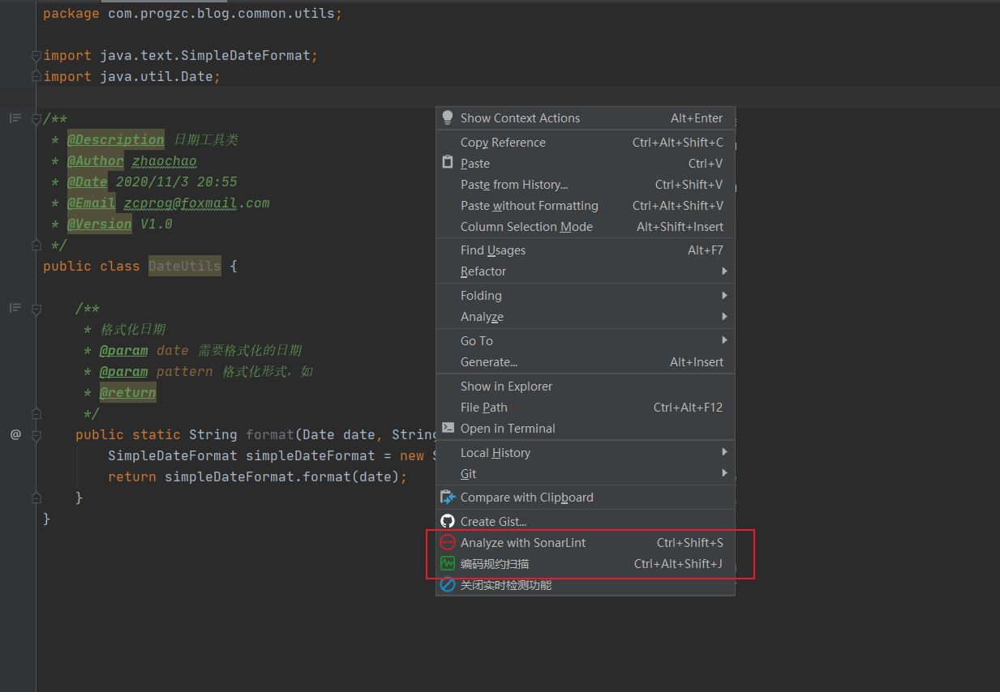

## 2.7 添加Translation插件

在IDEA中添加`Translation插件`，插件安装后，选中对象，按下`Ctrl + Shift +Y`快捷键即可实时翻译。


## 2.8 使用代码格式化插件

为了使代码风格统一，增加观赏感，使用`google-java-format`插件格式化代码。使用步骤如下：

- 第1步： 安装`google-java-foemat`插件。

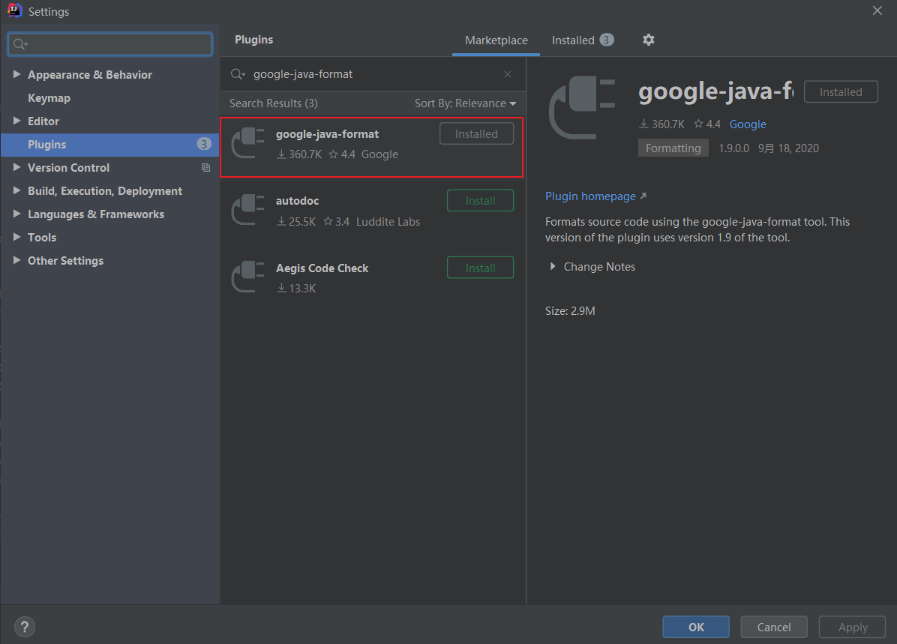

- 第2步：在Github上的[google-java-format](https://github.com/google/google-java-format)仓库下载`intellij-java-google-style.xml`文件。

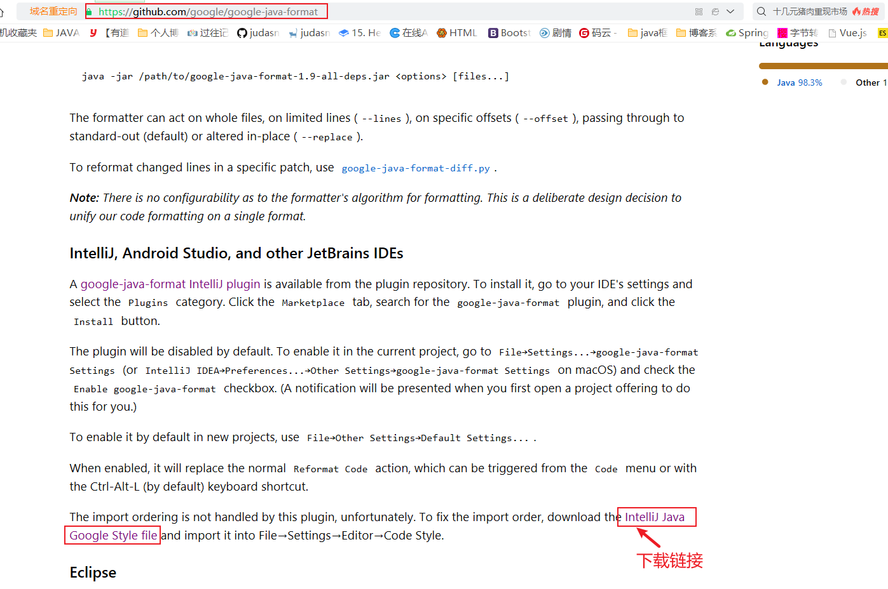

- 第3步：在Code Style中导入`intellij-java-google-style.xml`样式，Scheme命名为`GoogleStyle`，选择`GoogleStyle`作为默认的Code Style。重启IDEA，该样式即生效。使用时采用快捷键`Ctrl+Alt+L`即可；停用`google-java-format`插件并且删除`GoogleStyle` Scheme即可使该Code Style失效（**需要指出的是，本项目最终并未采用`google-java-format`来格式化代码。仍然使用的是IDEA内置的默认格式化工具**）。

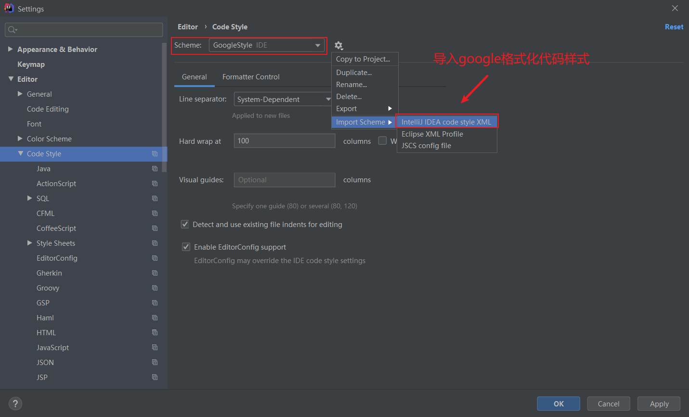

> 参考文章博客：[强推16款IDEA插件](https://blog.csdn.net/likun557/article/details/106913248/)、[IDEA代码风格为Google风格](https://blog.csdn.net/chenhao_c_h/article/details/81475896)、[google-java-format插件的使用](https://blog.csdn.net/weter_drop/article/details/109508543)

## 2.9 使用Save Action插件

在多人协作开发过程中，需要多人维护同一个项目，因此保持良好的代码规范与风格很重要。IntelliJ默认是自动保存的，因此很多时候修改后就出现：代码没有格式化、存在无用的import。`Save Action`就是这样一款可以帮助我们在保存时进行代码自动化优化的插件。使用步骤如下：

- 第1步：安装`Save Action`插件。
- 第2步：配置`Save Action`插件。

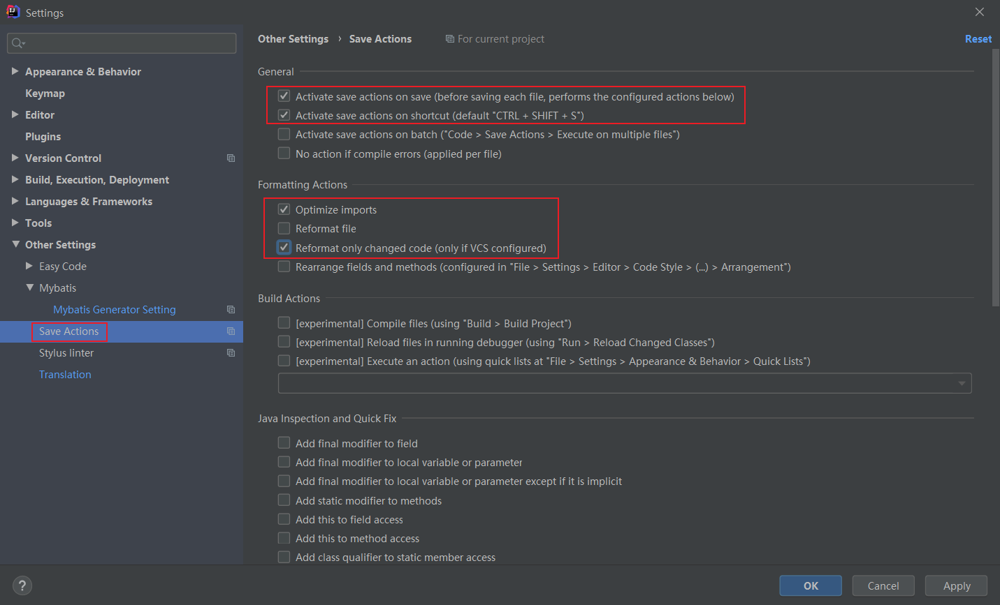

- 第3步：配置启用`Save Action`。

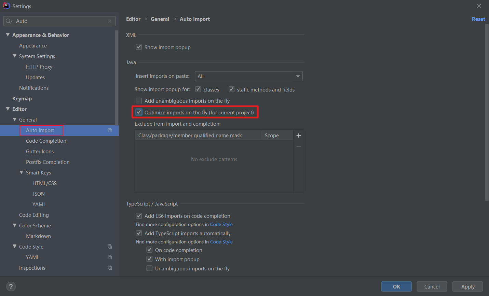

**注意事项：**格式化代码时，IDEA会默认将方法上的文字注释进行换行，显得代码不够紧凑，可以取消勾选`After description`保证在格式化代码时方法注释上不会自动换行。

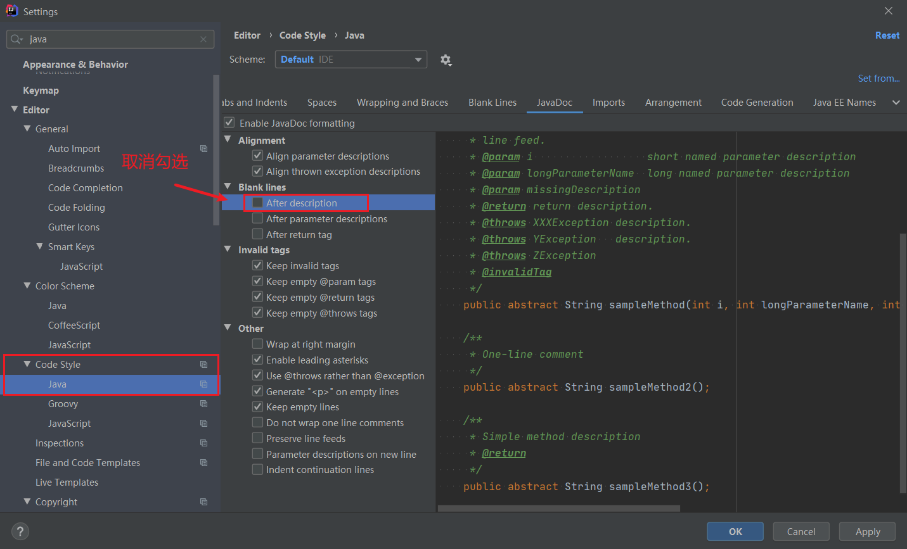

> 参考博客文章：[IntelliJ Save Action的使用](https://blog.csdn.net/hustzw07/article/details/82824713)、[IDEA格式化代码时方法上的文字注释换行的问题](https://www.cnblogs.com/cmmplb/p/11770504.html)

## 2.10 其他插件

优秀的插件可以提高工作效率，下面这些插件可以按需取用：

- **FindBugs：**帮助查找代码中隐藏的Bug。
- **PMD：**静态源代码分析器。PMD包含内置规则集，并支持编写自定义规则的功能。PMD不报告编译错误，因为它只能处理格式正确的源文件。PMD报告的问题是效率很低的代码或不良的编程习惯，如果累积这些问题，它们可能会降低程序的性能和可维护性。
- **Grep Console：**用于在输出中查找一些信息。
- **GsonFormat：**对一些json对象格式化。
- **Free mybatis plugin：**类似于MyBatisX插件（由MyBatisPlus团队开发），使Mapper文件可以直接跳转到对应的XML SQL语句。
- **Code Glance：**代码缩放图，类似于Sublime Text。
- **Mybatis Log plugin：**打印Mybatis 执行的sql语句（MyBatisPlus已集成了此功能）。
- **VisualVM Launcher：**系统调优工具。

# 3 代码生成器

## 3.1 自定义代码生成工具类

借助于MybatisPlus，可以根据数据库中的表快速帮我们生成entity、controller、service、serviceImpl、mapper、xml。这样带来了两个好处：一是节省了大量的时间；二是保证了准确性（不会出现成员变量与表中字段名对应不上的情况）。

在`CodeGeneratorUtils.java`中编写自动生成代码的逻辑，为了便于理解，代码中采用了大量的注释。

```java
public class CodeGeneratorUtils {

    public static String projectPath = System.getProperty("user.dir");
    /**
     * 根据表名自动生成代码
     * @param tableName
     * @param moduleName
     * @param category
     */
    public static void codeGenerator(String tableName, String moduleName, String category){
        // 代码生成器
        AutoGenerator mpg = new AutoGenerator();
        // 全局配置
        GlobalConfig gc = new GlobalConfig();
        gc.setOutputDir(projectPath + "\\zcblog-backend\\zcblog-core\\src\\main\\java");
        gc.setAuthor("zhaochao");
        gc.setOpen(false); // 不打开输出目录
        gc.setBaseResultMap(true); // 开启BaseResultMap
        gc.setBaseColumnList(true); // 开启baseColumnList
        gc.setSwagger2(true); // 实体属性添加Swagger2注解
        gc.setControllerName("%sController"); // controller命名方式为在末尾添加Controller
        gc.setServiceName("%sService"); // service命名方式为在末尾增加Service
        gc.setServiceImplName("%sServiceImpl"); // service实现类命名方式为在末尾添加ServiceImpl
        gc.setMapperName("%sMapper"); // mapper命名方式为在末尾增加Mapper
        gc.setIdType(IdType.AUTO); // 默认主键自增类型为数据库自增
        gc.setDateType(DateType.ONLY_DATE); // 设置日期格式
        gc.setFileOverride(false); // 不覆盖原来文件（否则会比较危险），也可在cfg.setFileCreate中进行自定义配置
        mpg.setGlobalConfig(gc); // 为代码生成器注入全局配置

        // 数据源配置
        DataSourceConfig dsc = new DataSourceConfig();
        dsc.setUrl("jdbc:mysql://localhost:3306/zcblog?allowMultiQueries=true&useUnicode=true&characterEncoding=UTF-8&useSSL=false&serverTimezone=GMT");
        dsc.setDriverName("com.mysql.cj.jdbc.Driver");
        dsc.setUsername("root");
        dsc.setPassword("root");
        dsc.setDbType(DbType.MYSQL);
        mpg.setDataSource(dsc); // 添加数据源配置

        // 包配置（后面手动单独配置）
        PackageConfig pc = new PackageConfig();
        pc.setParent("com.progzc.blog"); // 设置包名称
        pc.setModuleName(moduleName);  // 若设置后会生成com.progzc.blog/${moduleName}包
        // 生成entity文件夹,设置后会生成com.progzc.blog/${moduleName}/entity/${category}包
        pc.setEntity("entity" + "." + category); 
        // 生成mapper文件夹,设置后会生成com.progzc.blog/${moduleName}/mapper/${category}包
        pc.setMapper("mapper" + "." + category); 
        // 生成service文件夹,设置后会生成com.progzc.blog/${moduleName}/service/${category}包
        pc.setService("service" + "." + category); 
        // 生成service.impl文件夹,设置后会生成com.progzc.blog/${moduleName}/service/impl/${category}包
        pc.setServiceImpl("service.impl" + "." + category); 
        // 生成controller文件夹,设置后会生成com.progzc.blog/${moduleName}/controller/${category}包
        pc.setController("controller" + "." + category); 
        pc.setXml(null); // *Mapper.xml使用自定义配置
        mpg.setPackageInfo(pc); // 添加包配置信息

        // 自定义配置
        InjectionConfig cfg = new InjectionConfig() {
            @Override
            public void initMap() {
                // to do nothing
            }
        };
        // 当代码生成器自动生成好代码后，若后续不需再重新生成了，为了防止误操作，应修改为return false
        cfg.setFileCreate(new IFileCreate() {
            @Override
            public boolean isCreate(ConfigBuilder configBuilder, FileType fileType, String filePath) {
                return !new File(filePath).exists(); // 若文件存在，则不会重新生成
            }
        });

        // 以下可以自定义配置，但有个两个注意点：
        // 1. new FileOutConfig("/templates/mapper.xml.vm")中的模板文件一定要带后缀.vm，否则会报错。
        // 2. outputFile方法中返回的文件路径中的文件夹需要事先创建好，否则会报错。(这里我们对原程序进行改进)
        List<FileOutConfig> focList = new ArrayList<>();
        focList.add(new FileOutConfig("/templates/mapper.xml.vm") { // 这里一定要带后缀.vm告知使用Velocity进行解析
            @Override
            public String outputFile(TableInfo tableInfo) {
                StringBuilder xmlfilePath = new StringBuilder();
                xmlfilePath.append(projectPath)
                           .append("\\zcblog-backend\\zcblog-core\\src\\main\\resources/mapper\\")
                           .append(category);
                File file = new File(xmlfilePath.toString());
                if(!file.exists() || !file.isDirectory()){
                    file.mkdirs();
                }
                String xmlfileName = tableInfo.getEntityName() + "Mapper" + StringPool.DOT_XML;
                return xmlfilePath + "\\" + xmlfileName;
            }
        });
        cfg.setFileOutConfigList(focList);
        mpg.setCfg(cfg);
        mpg.setTemplateEngine(new VelocityTemplateEngine()); // 设置使用Velocity模板引擎

        // 配置模板
        TemplateConfig templateConfig = new TemplateConfig();
        // 指定自定义模板路径，注意不要带上.ftl/.vm, 会根据使用的模板引擎自动识别
        templateConfig.setEntity("templates/entity.java");
        templateConfig.setController("templates/controller.java");
        templateConfig.setService("templates/service.java");
        templateConfig.setServiceImpl("templates/serviceImpl.java");
        templateConfig.setMapper("templates/mapper.java");
        templateConfig.setXml(null); // *Mapper.xml使用自定义配置
        mpg.setTemplate(templateConfig);

        // 策略配置
        StrategyConfig strategy = new StrategyConfig();
        strategy.setNaming(NamingStrategy.underline_to_camel);
        strategy.setColumnNaming(NamingStrategy.underline_to_camel);
        strategy.setEntityLombokModel(true);
        strategy.setRestControllerStyle(true);
        strategy.setInclude(tableName); // 设置表名
        strategy.setLogicDeleteFieldName("deleted"); // 设置逻辑删除
        TableFill create_time = new TableFill("create_time", FieldFill.INSERT); // 设置自动填充
        TableFill update_time = new TableFill("update_time", FieldFill.UPDATE); // 设置逻辑删除
        List<TableFill> fillList = new ArrayList<TableFill>();
        fillList.add(create_time);
        fillList.add(update_time);
        strategy.setTableFillList(fillList);
        strategy.setVersionFieldName("version"); // 设置乐观锁
        mpg.setStrategy(strategy);
        mpg.execute();
    }

    // 自定义TableModule封装tableName、moduleName和category参数
    static class TableModule{
        private String tableName;
        private String moduleName;
        private String category;

        /**
         * 生成的文件：${outputDir}/${parent}/${moduleName}/${fileType}/${category}/文件名
         * @param tableName 表名
         * @param moduleName 模块名
         * @param category 分类
         */
        public TableModule(String tableName, String moduleName, String category){
            this.tableName = tableName;
            this.moduleName = moduleName;
            this.category = category;
        }
    }

    public static void main(String[] args) {
        List<TableModule> list = new ArrayList<TableModule>();
        list.add(new TableModule("article", null, "article"));
        list.add(new TableModule("gallery", null,  "gallery"));
        list.add(new TableModule("encrypt", null, "operation"));
        list.add(new TableModule("tag", null, "operation"));
        list.add(new TableModule("tag_link", null,  "operation"));
        list.add(new TableModule("log_like", null,  "log"));
        list.add(new TableModule("log_view", null,  "log"));
        list.add(new TableModule("oss_resource", null,  "oss"));
        list.add(new TableModule("sys_menu", null,  "sys"));
        list.add(new TableModule("sys_role", null,  "sys"));
        list.add(new TableModule("sys_role_menu", null,  "sys"));
        list.add(new TableModule("sys_user", null,  "sys"));
        list.add(new TableModule("sys_user_role", null,  "sys"));
        list.forEach( e -> codeGenerator(e.tableName, e.moduleName, e.category));
    }
}
```

## 3.2 设计细节

### 3.2.1 避免误操作覆盖源文件

若第一次使用`CodeGeneratorUtils`工具类生成了源文件后，为了避免第二次误操作运行`CodeGeneratorUtils`后覆盖源文件，代码中添加了相应的避免误操作的逻辑。

```java
// 针对entity、controller、service、serviceImpl
gc.setFileOverride(false); // 不覆盖原来文件（否则会比较危险），也可在cfg.setFileCreate中进行自定义配置

// 针对*Mapper.xml
return !new File(filePath).exists(); // 若文件存在，则不会重新生成
```

### 3.2.2 可拓展性

设计了内部类`TableModule`用来封装表名、模块名和分类名。其中表名指定用于自动生成代码的表，模块名和分类名共同结合起来生成指定的包名。结合代码生成器的全局配置，最终生成的目录为：

```html
${outputDir}/${parent}/${moduleName}/${fileType}/${category}
```

### 3.2.3 xml的生成

由于xml一般放置在src/main/resourcess目录下，需要自定义配置文件用于生成*Mapper.xml。由如下几点需要注意：

1. `new FileOutConfig("/templates/mapper.xml.vm")`中指定模板文件时一定要带后缀.vm，**否则会报错找不到模板文件**；而`templateConfig.setEntity("templates/entity.java")`中指定模板文件时不需要带后缀.vm。
2. `outputFile方法`中返回文件路径中的文件夹需要事先创建好，否则会报错（这里我们对程序进行改进，若手动未完成，则交由程序自动创建）。
3. 使用velocity模板引擎而非freemarker模板引擎。
4. 对模板文件进行适当的修改以满足我们的要求。

> 关于velocity模板和freemarker模板的下载，可以在Github或者码云下载MybatisPlus的源代码、模板文件在mybatis-plus-generator/src/main/resources/templates文件夹中。**注意两点**：
>
> - 下载的velocity模板或freemarker模板要与所使用的MyBatisPlus的版本一致。
> - 如何获取旧版本的模板文件？使用git工具将MybatisPlus源码克隆到本地，切换到指定的标签，然会就可以找到旧版本的模板文件了！

### 3.2.4 常见的错误

1. 显示使用的模板文件报错（如下图所示）。有如下几种可能：一是模板文件的语法出错（**由于是开发团队所提供，出错可能性不大**），二是模板文件与MyBatisPlus版本不一致；三是使用的模板引擎不支持该模板文件。

   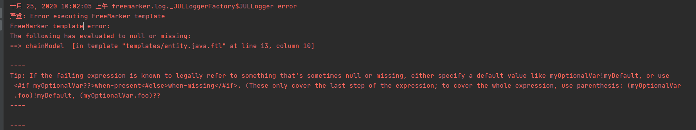
   
   该错误最终定位为模板引擎不支持模板文件。将模板引擎由freemarker更换为velocity，同时将.ftl模板文件更换为.vm模板文件后解决了问题。

2. 显示找不到指定路径。

   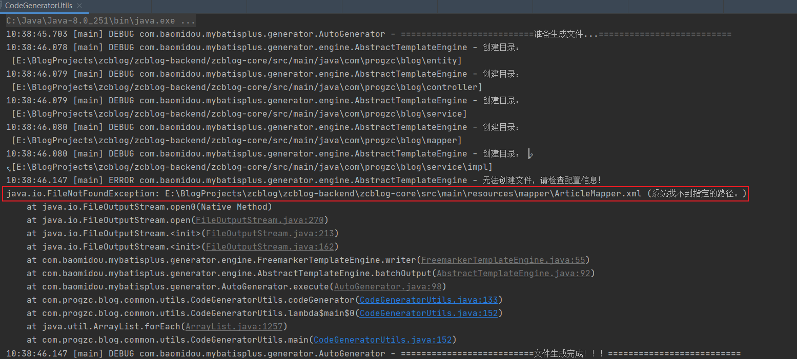
   该错误是由于既未手动创建*Mapper.xml所需的文件目录，也未在程序中自动生成该目录，导致程序在生成文件时出错。严格按照`3.2.3节`所述进行操作可解决该问题。

> 参考博客文章：[Velocity模板引擎语法](https://www.jianshu.com/p/d458d7b8d759)、[代码生成器](https://baomidou.com/guide/generator.html)

# 4 lombok的使用

lombok主要使用注解来简化代码，使代码更加简洁，其使用方法较简单。使用前需IDEA需要安装lombok插件。

## 4.1 基本使用

lombok中的常见注解：

- **@Setter：生成set方法**

> 1. 可以添加访问权限：`@Setter(AccessLevel.PROTECTED)`（默认是PUBLIC权限）。
> 2. 对于boolean类型，生成的set方法是setXxx；对于Boolean类型，生成的set方法是setXxx。

- **@Getter：生成get方法**

> 1. 可以添加访问权限，类似于@Setter。
> 2. 对于boolean类型，生成的get方法是**isXxx**；对于Boolean类型，生成的get方法是getXxx。

- **@Builder：表示该类可以通过builder（建造者模式）构建对象**（非常好用）

> 1. 对属性赋值可以实现链式操作。

- **@RequiredArgsConstructor：生成一个该类的构造函数，禁止无参构造**

> 1. 构造参数只包括**@NonNull**注解的成员变量。

- **@NoArgsConstructor：生成一个无参构造器**

> 1. 使用jackson反序列化对象时，使用无参构造函数创建对象。故而当class会用来序列化未json时，可以使用@NoArgsConstructor来添加一个无参构造函数。
> 2. 不可变类（含有final field）不要使用@NoArgsConstructor注解，否则编译会报错；若使用@NoArgsConstructor(force = true)，那么final的field会初始化为0/false/null（一般不采用这种做法）。
> 3. 当成员变量同时有**@NonNull**注解时，依然可以生成无参构造函数。

- **@AllArgsConstructor：生成包含所有成员变量作为构造参数的构造器**
- **@ToString：重写该类的toString方法**
- **@EqualsAndHashCode：重写该类的equals和hashCode方法**

> 1. equals方法只比较当前类的属性，hashCode也只根据当前类的属性生成。
> 2. 对于父类是Object且使用了`@EqualsAndHashCode(callSuper = true)`注解的类，这个类由 lombok 生成的equals方法只有在两个对象是同一个对象时，才会返回 true ，否则总为 false ，无论它们的属性是否相同。一般应设置`@EqualsAndHashCode(callSuper = false)`。
> 3. 使用@EqualsAndHashCode或@Date时最好不要有继承关系。
> 4. 若自己重写了equals方法或hashCode方法，则lombok不会对显示重写的方法进行生成。
> 5. 同时使用@EqualsAndHashCode和@Date，以@EqualsAndHashCode为准。

- **@Data：等价于@Setter + @Getter + @Builder + @RequiredArgsConstructor + @ToString + @EqualsAndHashCode**

- **@Value：生成一个不可变对象，会为成员变量添加final字段**（不太常用）

> 1. @Value等价于@Getter + @AllArgsConstructor + @ToString + @EqualsAndHashCode。

- @Accessors：存取器，用于配置getter和setter方法的生成结果。

> 1. @Accessors(chain = true)：表示setter方法返回当前对象。（**一般用于级联操作**）
> 2. @Accessors(fluent = true)：表示getter和setter方法的方法名都是基础属性名，且setter方法返回当前对象。（**一般不采用**）
> 3. 使用这个注解后，bean拷贝工具类可能会报错。

> 参考博客文章：**[Lombok中@Data的使用](https://www.cnblogs.com/death00/p/11722152.html)**、**[lombok使用基础教程](https://www.cnblogs.com/woshimrf/p/lombok-usage.html)**、[建造者模式](https://www.jianshu.com/p/3d1c9ffb0a28)

## 4.2 @Document/@Field/@Id

@Document注解是ElasticSearch的注解，可以用于指定索引库的名称、类型、分区、备份数以及刷新间隔。

- 例如：`@Document(indexName = "zcblog", type = "article")`表示索引库的名称是zcblog、类型名称是article；默认分区数量为5，备份数量为1，刷新间隔为1s。
- 需要将@Document与@Documented区分开，@Documented是用来将标记元素的注解信息包含在javadoc中。

@Field：是ElasticSearch的注解

@Id：Spring Date的注解，声明该标记属性为主键。

@JsonIclude：例如：`@JsonInclude(IsonInclude.Include.NON_NULL)`作用在类上，表示只有非空的属性才会参与实例化。

# 5 Swagger的使用

## 5.1 Swagger的介绍

**Swagger的定义**：一款流行的API框架。

**Swagger的作用**：支持自动生成可视化的RESTful API文档；可进行在线测试API，并实现商业API的管理。

**Swagger的应用场景**：主要应用于前后端分离的项目，作为前后端开发工程师进行协同工作；实现类似postman的网络请求测试。

## 5.2 Swagger的配置

### 5.2.1 Swagger的配置说明

Swagger的配置在`SwaggerConfig.java`中设置：

```java
/**
 * @Description Swagger相关配置（也可在YML中进行配置），本项目选择在配置类中进行配置。
 * @Author zhaochao
 * @Date 2020/10/26 10:42
 * @Email zcprog@foxmail.com
 * @Version V1.0
 */
@Slf4j
@Configuration
@EnableSwagger2 // 启用Swagger
public class SwaggerConfig implements WebMvcConfigurer {

    // 加载Swagger的默认UI界面
    @Override
    public void addResourceHandlers(ResourceHandlerRegistry registry) {
        registry.addResourceHandler("swagger-ui.html")
                .addResourceLocations("classpath:/META-INF/resources/");
        registry.addResourceHandler("/webjars/**")
                .addResourceLocations("classpath:/META-INF/resources/webjars/");
    }


    // 配置Swagger的Docket的Bean实例：
    // 每一个Docket的Bean实例对应于一个分组，这样可以方便协同开发
    @Bean
    public Docket createRestApiGroup1(Environment environment) {
        // 设置要显示的Swagger环境
        Profiles profiles = Profiles.of("dev", "test");
        // 获取项目的环境
        boolean isDevAndTest = environment.acceptsProfiles(profiles);

        return new Docket(DocumentationType.SWAGGER_2)
                .apiInfo(apiInfo())
                // 是否启动Swagger，若为false，则Swagger不能在浏览器中访问
                .enable(isDevAndTest) // 可以控制Swagger在开发及测试环境中使用，在生产环境不使用
                .select()
                // RequestHandlerSelectors.basePackage("包名")：扫描指定的包
                // RequestHandlerSelectors.any()：扫描全部
                // RequestHandlerSelectors.none()：不扫描
                // RequestHandlerSelectors.withMethodAnnotation(注解.class)：扫描方法上的注解
                // RequestHandlerSelectors.withClassAnnotation(注解.class)：扫描类上的注解
                .apis(RequestHandlerSelectors.withMethodAnnotation(ApiOperation.class)) // 配置要扫描接口的方式
                // PathSelectors.any()：放行所有路径
                // PathSelectors.ant("/article")：只放行/article路径
                .paths(PathSelectors.any()) // 过滤映射路径
                .build()
                .groupName("Clouds")
                // 可以由使用者设置全局token（一般登录成功后都会设置一个token作为同行证）放置到HTTP请求头中，在跨域访问时作为通行证
                .securitySchemes(Arrays.asList(securitySchemes()))
                .securityContexts(Arrays.asList(securityContexts()));
    }

    // 配置网站相关信息
    private ApiInfo apiInfo() {
        // 作者信息
        Contact contact = new Contact("Clouds", "http://blog.progzc.com", "zcprog@foxmail.com");
        return new ApiInfoBuilder()
                .title("zcblog")
                .description("zcblog的接口文档")
                .termsOfServiceUrl("http://blog.progzc.com")
                .version("v1.0")
                .contact(contact)
                .license("Apache 2.0")
                .licenseUrl("http://www.apache.org/licenses/LICENSE-2.0")
                .build();
    }

    // 设置全局token
    private SecurityScheme securitySchemes() {
        return new ApiKey("token", "token", "header");
    }

    // 设置需要携带token的请求：这里设置所有请求都需要携带token
    private SecurityContext securityContexts() {
        return SecurityContext.builder().securityReferences(securityReferences())
                .forPaths(PathSelectors.any()).build();
    }

    private List<SecurityReference> securityReferences() {
        AuthorizationScope[] authorizationScopes = new AuthorizationScope[1];
        authorizationScopes[0] = new AuthorizationScope("global", "accessEverything");
        List<SecurityReference> securityReferences = new ArrayList<>();
        securityReferences.add(new SecurityReference("token", authorizationScopes));
        return securityReferences;
    }
}
```

**注意事项：**

1. SpringBoot项目中可以通过WebMvcConfigurer对网络请求进行拦截处理、加载资源等。使用Swagger需要加载`swagger-ui.html`这一静态资源（前提是spring.resources.add-mappings设置为false，则需要这一步）。
2. 为了安全以及提高性能，需要控制Swagger在开发及测试环境中使用，但在生产环境中禁用。Docket的enable方法设置为true表示允许访问`swagger-ui.html`，设置为false表示禁止访问；
3. **若application.yml中的spring.resources.add-mappings设置为false，则需要在addResourceHandlers方法中添加指定的静态资源文件这样才能访问`swagger-ui.html`；若为false，则可以不要指定静态资源文件**。
4. 可以在请求头中设置全局token作为登录成功后的通行证，可以解决由于登录权限问题，每次进行API测试都要输入token才能访问接口API的问题。
5. **多人协同开发不同模块，可以采用分组功能。这样每个人的业务API都会在一个分组中，便于查询或与前端人员沟通。**
6. 注意Swagger的默认访问地址为：http://主机名:端口号/swagger-ui.html，**但是项目若添加了contextPath（即项目映射路径），则Swagger的访问路径是：http://主机名:端口号/${contextPath}/swagger-ui.html**。

### 5.2.2 在请求头中手动添加token

`5.2.1`节的配置中不仅设置了全局token；而且还设置了针对所有请求均需携带token。这样只需一次手动设置token值即可在全局范围内对所有请求头添加token值。

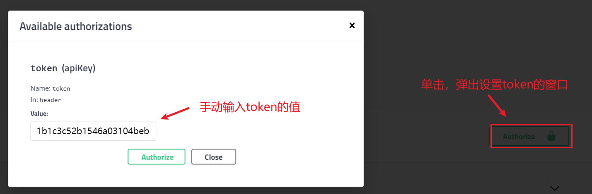

### 5.2.3 自动登录获取token值

`5.2.2`节有二个弊端：

1. 每次需要手动输入token值（登录成功后，从Redis中查询拷贝出token值），不方便。
2. 由于本项目采用`devtools工具`实现热部署，每次都该代码后都会自动重启项目，使得每次设置token值之前均需要手动进行一次登录操作（**若不登录成功，则Shiro的Subject获取不到我们的身份信息**）。

在`AutoLogin.java`中进行模拟自动登录并获取token值：

```java
@SuppressWarnings("AlibabaAvoidManuallyCreateThread")
@Service
@Slf4j
public class AutoLogin implements ApplicationListener<ContextRefreshedEvent> {

    private static final String protocol = "http";
    private static String host = "localhost";

    @Value("${server.port}")
    private String port;

    @Value("${server.servlet.context-path}")
    private String contextPath;

    @Autowired
    private RestTemplate restTemplate;

    @Autowired
    ApplicationContext applicationContext;

    @Override
    public void onApplicationEvent(ContextRefreshedEvent event) {
        if(event.getApplicationContext().getParent() == null){
            Thread thread = new Thread(() ->{
                // 请求路径
                String baseUrl = protocol + "://" + host + ":" + port + contextPath;
                // 设置请求头
                HttpHeaders httpHeaders = new HttpHeaders();
                httpHeaders.setContentType(MediaType.parseMediaType("application/json; charset=UTF-8"));
                HttpEntity<String> entity = new HttpEntity<>(httpHeaders);

                // 生成uuid
                String uuid = UUID.randomUUID().toString();
                HashMap<String, String> hashMap = new HashMap<>(16);
                hashMap.put("uuid", uuid);

                // 获取验证码
                ResponseEntity<Result> captchaResponse = restTemplate.exchange(baseUrl + "/captcha.jpg?uuid={uuid}", HttpMethod.GET, entity, Result.class, hashMap);

                // 进行登录
                if(captchaResponse.getBody().get("captchaPath") != null){
                    HashMap<String, String> formMap = new HashMap<>();
                    formMap.put("username", "admin123");
                    formMap.put("password", "admin123");
                    formMap.put("uuid", uuid);
                    formMap.put("captcha", KaptchaConstants.captcha);
                    HttpEntity<HashMap<String, String>> dataEntity = new HttpEntity<>(formMap, httpHeaders);
                    ResponseEntity<Result> loginResponse = restTemplate.postForEntity(baseUrl + "/admin/sys/login", dataEntity, Result.class);
                    String token = (String) loginResponse.getBody().get("token");
                    log.debug("-----自动登录的token-----:"+token);
                    // 利用反射设置swagger的全局token
                    ParameterBuilder tokenParam = new ParameterBuilder();
                    Parameter parameter = tokenParam.name("token").description("登录令牌").defaultValue(token)
                            .modelRef(new ModelRef("string")).parameterType("header").required(false).build();
                    Class<?> restApiGroup1 = applicationContext.getType("restApiGroup1");
                    if(Docket.class.equals(restApiGroup1)){
                        Field[] declaredFields = restApiGroup1.getDeclaredFields();
                        Object docket = applicationContext.getBean("restApiGroup1");
                        for (Field declaredField : declaredFields) {
                            if(declaredField.getName() == "globalOperationParameters"){
                                declaredField.setAccessible(true);
                                try {
                                    declaredField.set(docket, Arrays.asList(parameter));
                                } catch (IllegalAccessException e) {
                                    log.error("-----restApiGroup1属性修改失败-----");
                                }
                            }
                        }
                    }
                }
            });
            ScheduledExecutorService executorService = new ScheduledThreadPoolExecutor(2);
            Future<?> future = executorService.submit(thread);
            executorService.schedule(()->{
                log.debug("-----关闭自动登录线程-----");
                future.cancel(true);
            }, 6, TimeUnit.SECONDS);
            executorService.shutdown();
        }
    }
}
```

**几点说明：**

1. 使用多线程（单独打开一条线程）模拟登录的操作（**若不使用多线程发送请求，会报请求被拒绝的错误**）。

2. 使用RestTemplate在java程序中发送GET/POST请求，有如下两个出错点：

   - 发送请求时，属性名必须全部小写（若大写Controller会显示获取到的值为null）。

   - 若采用postForEntity发送POST请求，必须采用HashMap来封装请求体；若采用exchange发送POST请求，必须采用LinkedMultiValueMap来封装请求体。

     ```java
     // 若采用postForEntity发送POST请求，必须采用HashMap来封装请求体；若采用exchange发送POST请求，必须采用LinkedMultiValueMap来封装请求体。
     HashMap<String, String> formMap = new HashMap<>(); 
     formMap.put("username", "admin123"); // username必须为小写
     formMap.put("password", "admin123"); // password必须为小写
     formMap.put("uuid", uuid); // uuid必须为小写
     formMap.put("captcha", KaptchaConstants.captcha); // captcha必须为小写
     HttpEntity<HashMap<String, String>> dataEntity = new HttpEntity<>(formMap, httpHeaders);
     ResponseEntity<Result> loginResponse = restTemplate.postForEntity(baseUrl + "/admin/sys/login", dataEntity, Result.class);
     ```

**效果如下：**


> 参考博客文章：[RestTemplate详解](https://www.cnblogs.com/javazhiyin/p/9851775.html)、[RestTemplate发送远程请求](https://www.cnblogs.com/fantongxue/p/12443677.html)、[RestTemplate 发送post请求](https://www.cnblogs.com/leigepython/p/11319771.html)、[如何让java程序执行一段时间后停止](https://blog.csdn.net/kerongao/article/details/109576521)、[RestTemplate发送json请求@RequestBody实体类无法映射](https://blog.csdn.net/weixin_38626799/article/details/90213400)、[使用HashMap还是LinkedMultiValueMap](https://www.cnblogs.com/LX51/p/12214220.html)、[Spring使用反射动态修改bean](https://www.cnblogs.com/frankltf/p/11451917.html)、[spring 容器加载完成后执行某个方法](https://blog.csdn.net/weixin_34293911/article/details/86275569)

## 5.3 基本使用

- **@Api：一般作用在类（如Controller）上，用于标记该类作为Swagger文档资源**

> 例如：`@Api(value = "/user", description = "Operations about user")`表示映射路径和描述。

- **@ApiOperation：一般作用在类（如Controller）的方法上**
- **@ApiParam：一般作用在类（如Controller）方法的参数上**
- **@ApiModel：一般给entity类（或者PO/VO/...）添加此注解**

- **@ApiModelProperty：一般给entity类（或者PO/VO/...）的成员变量添加此注解**

> 例如：`@ApiModelProperty(value = "xxx属性说明", hidden = true)`，其中hidden默认为false，若设置为true可以隐藏该属性。

- @ApiResponse：响应配置。

> 例如：`@ApiResponse(code = 400, message = "Invalid user supplied")`表示响应状态码和响应消息。

- @ApiResponses：响应集配置。

> 例如：`@ApiResponses({ @ApiResponse(code = 400, message = "Invalid Order") })`。

- @ResponseHeader：响应头配置。

> 例如：`@ResponseHeader(name="head1",description="response head conf")`。

## 5.4 切换其他UI样式

除了Swagger官方提供的UI样式外，一些第三方也根据Swagger源码开发了其他的更美观友好的UI样式供选用。使用方法也很简单，直接使用第三方的UI Jar包替换掉Swagger官方提供的UI Jar包即可。

```xml
<!--Swagger默认的UI界面-->
<!--默认地址：http://localhost:8080/swagger-ui.html-->
<dependency>
   <groupId>io.springfox</groupId>
   <artifactId>springfox-swagger-ui</artifactId>
   <version>2.9.2</version>
</dependency>

<!--Bootstrap UI界面-->
<!--默认地址：http://localhost:8080/doc.html-->
<dependency>
   <groupId>com.github.xiaoymin</groupId>
   <artifactId>swagger-bootstrap-ui</artifactId>
   <version>1.9.1</version>
</dependency>

<!--Layui UI界面-->
<!--默认地址：http://localhost:8080/docs.html-->
<dependency>
   <groupId>com.github.caspar-chen</groupId>
   <artifactId>swagger-ui-layer</artifactId>
   <version>1.1.3</version>
</dependency>

<!--mgui UI界面-->
<!--默认地址：http://localhost:8080/document.html-->
<dependency>
   <groupId>com.zyplayer</groupId>
   <artifactId>swagger-mg-ui</artifactId>
   <version>1.0.6</version>
</dependency>
```

> 参考博客文章：**[B站Swagger视频](https://www.bilibili.com/video/BV1Y441197Lw)**、[Swagger](https://mp.weixin.qq.com/s/0-c0MAgtyOeKx6qzmdUG0w)、[Swagger yml完全注释](https://blog.csdn.net/u010466329/article/details/78522992)、[Swagger的介绍](https://blog.csdn.net/weixin_37509652/article/details/80094370)、[Swagger注解](https://blog.csdn.net/chinassj/article/details/81875038)、[添加Header全局配置](https://www.jianshu.com/p/6e5ee9dd5a61)、**[Swagger在请求头中携带Token](https://blog.csdn.net/u012702547/article/details/106633386/)**

# 6 项目热部署

在开发项目时，每次修改完代码都要重新启动项目，会导致开发效率很低。项目实现热部署可以解决这一问题。

## 6.1 项目热部署的两种方式

### 6.1.1 使用devtools工具

使用devtools工具包来进行热部署简单方便，但是有一个缺点：**这种热部署方式会重启项目，清空session中的值；如果有用户登录的话，项目重启后需要重新登录。**

具体步骤：

- 第1步：引入`spring-boot-devtools`依赖（可以在父模块引入版本号，子模块中引入依赖）。

```xml
<dependency>
	<groupId>org.springframework.boot</groupId>
    <artifactId>spring-boot-devtools</artifactId>
    <version>2.1.6.RELEASE</version>
    <scope>runtime</scope>
    <optional>true</optional>
</dependency>
```

- 第2步：在`BlogRunApplication.java`所在子模块的pom.xml中添加插件。

```xml
<build>
	<finalName>Clouds' Blog</finalName>
	<plugins>
		<plugin>
            <groupId>org.springframework.boot</groupId>
            <artifactId>spring-boot-maven-plugin</artifactId>
            <!--指定全局入口文件-->
            <configuration>
                <mainClass>com.progzc.blog.BlogRunApplication</mainClass>
                <layout>ZIP</layout>
                <fork>true</fork>
                <addResources>true</addResources>
			</configuration>
		</plugin>
	</plugins>
</build>
```

- 第3步：在application.yml中配置开启热部署。

```yaml
spring.devtools.restart.enabled: true
```

- 第4步：在IDEA中设置勾选`Build project automatically`。

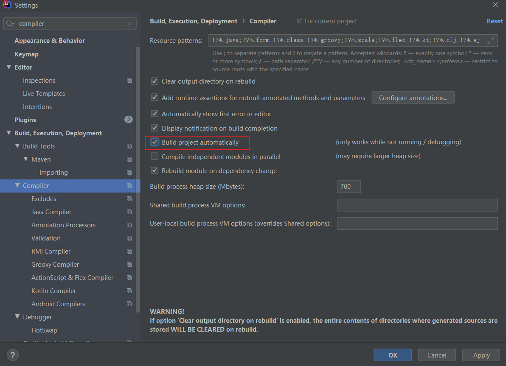

- 第5步：按住`ctrl + shift + alt + /`出现如下界面，点击Registry...，然后勾选`compiler.automake.allow.when.app.running`。

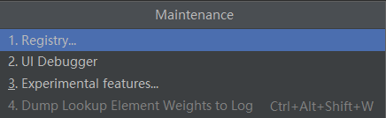

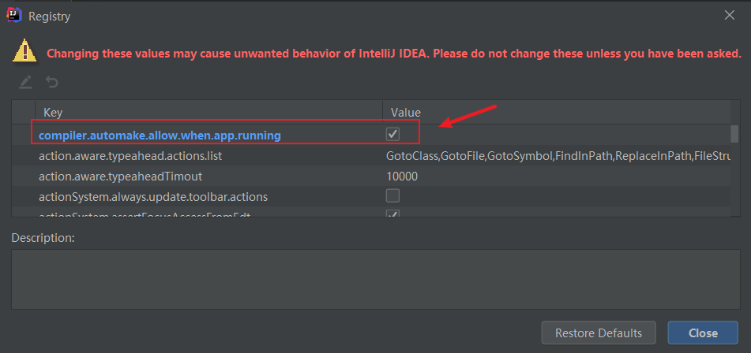

- 第6步：在IDEA中设置`Running Application Update Policies`策略为`Update classes and resources`。（**网上的教程缺这一步，不会生效**）。

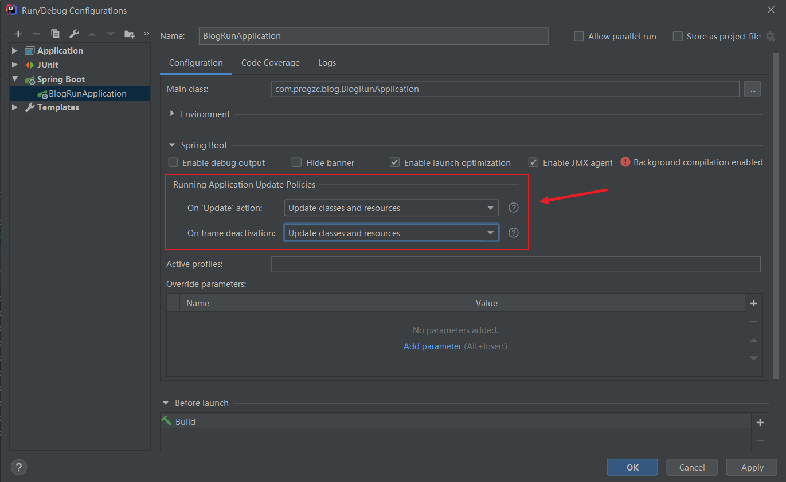

### 6.1.2 使用Springloaded

前面提到过，`devtools`实现热部署的方式是重启应用，导致会清除清空session中的值；此外，这种热部署更新的方式较慢。使用Springloaded进行热部署时不会重启应用，可以保证session中的值不会被清除，但是SpringLoaded对于方法内修改代码时热部署可以生效，**增加方法时热部署却不能生效(即使采用Debug模式启动也不行)**。

具体步骤：

- 第1步：下载`springloaded-1.2.8.RELEASE.jar`到本地（下载方式有：Mavon下载到本地仓库、mvnrepository.com网站直接下载、Github进行下载）。
- 第2步：在IDEA中进行配置，使得在启动项目时在jvm命令中增加：`-javaagent:springloaded-1.2.8.RELEASE.jar包本地绝对路径 -noverify`。

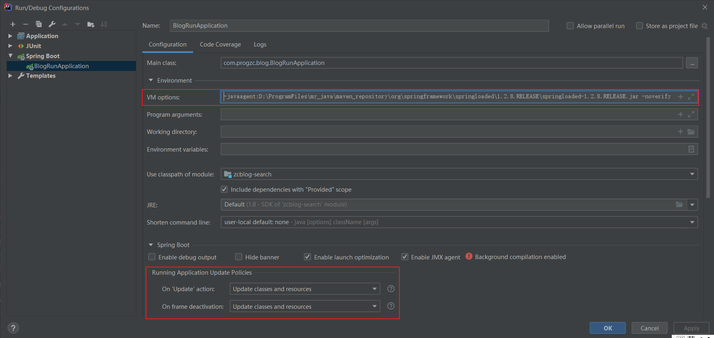

> 参考博客文章：[ spring-boot-devtools实现热部署](https://www.cnblogs.com/zhukf/p/12672180.html)、[Springloaded实现热部署](https://blog.csdn.net/tang86100/article/details/78772079)

# 7 hibernate-validator参数校验

## 7.1 来源介绍

项目开发的时候，基本上每个接口都要对参数进行校验，比如一些格式检验、非空校验。若参数比较多，代码中就会出现大量的if...else...，这样会让代码看起来很复杂，本质上处理业务逻辑的代码不容易显现处理，造成代码主次不分、冗余度过高的问题。

幸好的是Bean Validator（Java定义的一套基于注解的数据校验规范）可以帮我们解决这一难题。Bean Validator的校验规范版本有JSR 303（V1.0版本）、JSR 349（V2.0版本）、JSR 380（V3.0版本）。目前Springboot的`starter-web`中已经集成了基于JSR检验规范的`hibernate-validator`（没错，`hibernate-validator`就来自于曾经大名鼎鼎的持久层框架Hibernate）。**注意：javax.validation是一个基于JSR的接口规范，而hibernate-validator是其的一种具体实现。**

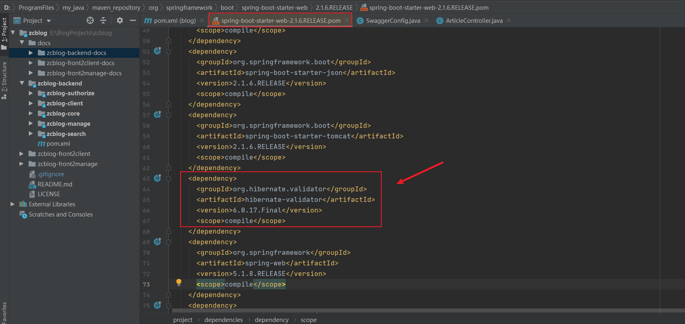

## 7.1 基本使用

### 7.1.1 使用场景

**根据项目架构选择在哪个业务层进行参数校验**：

- 针对普通的应用：一般在Controller层做检验。
- 针对RPC应用：一般在Service层做检验。
- **不仅可以对参数进行验证，还可以对返回值进行验证。**

```yaml
# 1. 在Controller层做验证
  # 1.1 首先在Controller类上添加@Validated注解。
  # 1.2 然后在COntroller类的方法参数上添加@Valid注解（可去掉1.1的@Validated注解，详见@Valid与@Validated的区别）。
  # 1.3 最后给方法参数添加指定的校验方式(如@NotNoll、@NotBlank...);若在entity类的成员变量中指定的话，则对所有使用的ServiceImpl层均生效。
  
# 2. 在ServiceImpl层做验证
  # 1.1 首先在ServiceImpl类上添加@Validated注解。
  # 1.2 然后在ServiceImpl类的方法参数上添加@Valid注（可去掉1.1的@Validated注解，详见@Valid与@Validated的区别）。
  # 1.3 最后给方法参数添加指定的校验方式(如@NotNoll、@NotBlank...);若在entity类的成员变量中指定的话，则对所有使用的ServiceImpl层均生效。
  
# 3. 在Service层（接口）做验证（这里要注意与前两者的区别）
  # 1.1 首先在Service类的方法参数上添加@Valid注解
  # 1.2 然后在ServiceImpl类上添加@Validated注解（若在Service类上添加@Validated注解，则对Service的所有实现类都生效）。
  # 1.3 最后给方法参数添加指定的校验方式(如@NotNoll、@NotBlank...);若在entity类的成员变量中指定的话，则对所有使用的Service层均生效。
  
# 4. 对返回值添加注解：与方法参数校验类似，只是作用在返回值上。
```

### 7.1.2 使用注解

- @NotBlank：不能为null，并且长度大于0（**只能用于String上面不能为null，调用trim()后，长度必须大于0**）
- @NotNull：不能为null（**适用于任何类型被注解的元素必须不能为null**）
- @NotEmpty：不能为null且@Size(min = 1)（**适用于String Map或者数组不能为null且长度必须大于0**）
- **@Valid和Validated的区别：**

> 1. @Validated是@Valid 的一次封装，是Spring提供的校验机制使用。
> 2. @Valid和@Validated均用于校验，但作用地方有区别。**@Valid作用在方法、字段、构造器和参数上；而@Validated作用在类、方法和参数上。**
> 3. @Valid可进行**级联校验（即嵌套校验）**，而@Validated却不支持级联校验。
> 4. @Valid不提供分组功能；而@Validated提供分组功能（可实现**分组检验**、**按组序列校验**、**同时校验多个参数**）。
> 5. 针对**有接口的实现类的方法参数添加校验**时，应该在接口的方法参数上添加@Valid注解，在接口的实现类的方法参数上添加注解会报错（**详见7.1.1使用场景3**）。

### 7.1.3 级联及一对多检验

级联即一对一验证。级联及一对多验证采用@Valid注解。

```java
// 举个例子
public Class Employee {
    ... 
    // 级联(一对一)验证
    @Valid 
    private Department department; // 员工与部门一对一
    // 一对多验证
    private List<@Valid Project> projects; // 员工与项目一对多
    ...
} 
```

### 7.1.4 规范异常信息

将异常信息（由**状态码+消息**组成）封装成枚举类，这样便于统一管理。**异常信息遵循RETSTful原则**。

将异常信息封装到`ErrorEnum.java`枚举类中：

```java
public enum ErrorEnum {
    // 系统错误
    UNKNOWN(500,"系统内部错误，请联系管理员"),
    PATH_NOT_FOUND(404,"路径不存在，请检查路径"),
    NO_AUTH(403,"没有权限，请联系管理员"),
    DUPLICATE_KEY(501,"数据库中已存在该记录"),
    TOKEN_GENERATOR_ERROR(502,"token生成失败"),
    NO_UUID(503,"uuid为空"),
    SQL_ILLEGAL(504,"sql非法"),

    //用户权限错误
    INVALID_TOKEN(1001,"token不合法"),

    //登录模块错误
    LOGIN_FAIL(10001,"登录失败"),
    CAPTCHA_WRONG(10002,"验证码错误"),
    USERNAME_OR_PASSWORD_WRONG(10003,"用户名或密码错误"),

    //七牛云OSS错误
    OSS_CONFIG_ERROR(10050,"七牛云配置信息错误"),
    OSS_UPLOAD_ERROR(10051,"Article图片上传失败");

    private int code;
    private String msg;
}
```

### 7.1.5 全局异常处理

为了使参数校验后返回给前端的结果更加优雅，需要自定义全局异常处理器（**这个全局处理异常不仅仅处理参数校验返回的异常，还可以对项目中出现的其他异常进行处理**）。

在`MyExceptionHandler.java`中对全局异常进行处理：

```java
// @RestControllerAdvice有三种功能：处理全局异常、绑定全局数据、预处理全局数据。（本项目用到的是第一种功能）
@RestControllerAdvice // 相当于@ResponseBody+@ControllerAdvice表示处理全局异常,且返回字符串
@Slf4j
public class MyExceptionHandler { // MyExceptionHandler用于处理全局异常
    // 处理自定义异常：包含校验异常、自定义认证异常
    @ExceptionHandler(MyException.class)
    public Result handleMyException(MyException e){
        Result result=new Result();
        result.put("code",e.getCode());
        result.put("msg",e.getMsg());
        return result;
    }
    
    // 处理Spring中的404异常
    // 需要在yml配置文件中设置：spring.mvc.throw-exception-if-no-handler-found: true  #出现错误时, 直接抛出异常
    // 需要在yml配置文件中设置：spring.resources.add-mappings: false  #关闭工程中的静态资源映射所以此时需要访问swagger-ui.html就必须要在Swagger配置文件中添加资源路径
    @ExceptionHandler(NoHandlerFoundException.class)
    public Result handlerNoFoundException(Exception e){
        log.error(e.getMessage(),e);
        return Result.exception(ErrorEnum.PATH_NOT_FOUND);
    }

    // 处理向数据库中插入数据时出现的异常
    // 继承关系：DuplicateKeyException-->DataIntegrityViolationException-->NonTransientDataAccessException-->DataAccessException-->NestedRuntimeException-->RuntimeException-->Exception
    @ExceptionHandler(DuplicateKeyException.class)
    public Result handleDuplicateKeyException(DuplicateKeyException e){
        log.error(e.getMessage(),e);
        return Result.exception(ErrorEnum.DUPLICATE_KEY);
    }

    // 处理鉴权异常以及认证中的除自定义外的异常
    @ExceptionHandler(ShiroException.class)
    public Result hanldeAuthorizationException(ShiroException e) {
        log.error(e.getMessage(), e);
        return Result.exception(ErrorEnum.NO_AUTH);
    }

    // 处理其他异常
    @ExceptionHandler(Exception.class)
    public Result handleException(Exception e){
        log.error(e.getMessage(),e);
        return Result.exception();
    }
    
   // 可以在这里直接对校验异常进行处理（但是本项目并未采用这种方式，本项目中参数校验的异常是在自定义校验工具类ValidatorUtils中进行处理，转成自定义异常然后再在MyExceptionHandler中进行处理的）
   ...
 
}
```
**注意事项：**可以在这里MyExceptionHandler.java对校验异常进行直接处理（但是本项目并未采用这种方式）；本项目中参数校验的异常是在自定义校验工具类ValidatorUtils中进行处理的），这是因为本项目并未使用@Valid或@Validated注解自动将参数校验交由Spring处理；而是主动在ValidatorUtils中进行参数校验和处理异常（转为自定义异常，这种灵活性更大）。

在`ValidatorUtils.java`中处理校验异常（校验若不通过就抛出MyException异常）：

```java
public class ValidatorUtils {
    private static Validator validator;
    static {
        validator = Validation.buildDefaultValidatorFactory().getValidator();
    }

    /**
     * 校验对象
     * @param object        待校验对象
     * @param groups        待校验的组
     * @throws MyException  校验不通过，则报MyException异常
     */
    public static void validateEntity(Object object, Class<?>... groups)
            throws MyException {
        Set<ConstraintViolation<Object>> constraintViolations = validator.validate(object, groups);
        if (!constraintViolations.isEmpty()) {
            List<String> collect = constraintViolations.stream().map(constant -> constant.getMessage()).collect(Collectors.toList());
            String msg = StringUtils.join(collect, ",");
            throw new MyException(msg);
        }
    }
}
```
自定义异常`MyException.java`：

```java
public class MyException extends RuntimeException{
    private String msg;
    private int code = 500; // 默认500异常

    public MyException(){
        super(ErrorEnum.UNKNOWN.getMsg());
        this.msg=ErrorEnum.UNKNOWN.getMsg();
    }
    
    public MyException(ErrorEnum eEnum,Throwable e){
        super(eEnum.getMsg(),e);
        this.msg=eEnum.getMsg();
        this.code=eEnum.getCode();
    }

    public MyException(ErrorEnum eEnum){
        this.msg=eEnum.getMsg();
        this.code=eEnum.getCode();
    }

    public MyException(String exception){
       this.msg=exception;
    }
}
```
本项目处理的全局异常的继承关系如下：

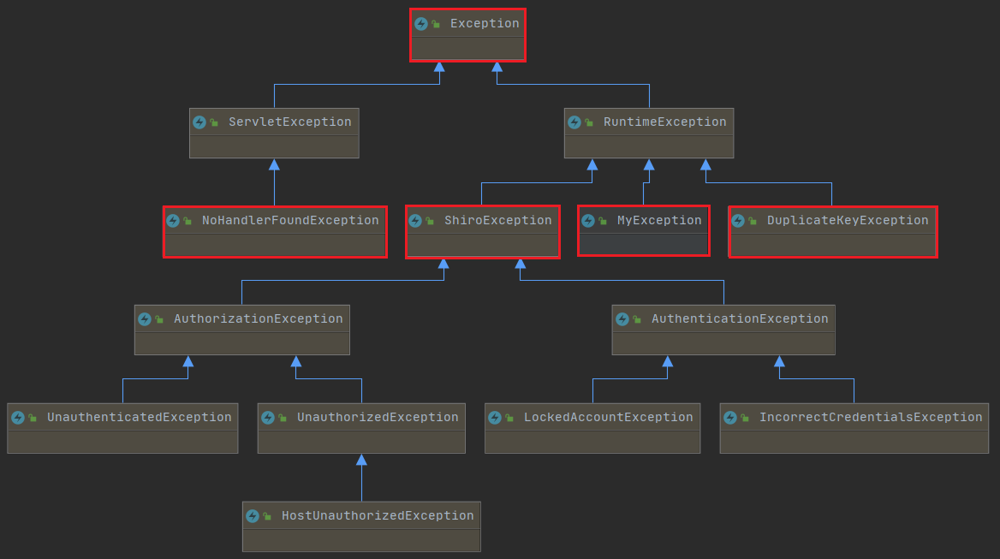

> 参考博客文章：[关于NoHandlerFoundException异常](https://blog.csdn.net/qq_36666651/article/details/81135139)

### 7.1.6 分组校验

有这样的场景：需要在插入/更新时保证某个字段不为空；查询时却没有这个要求。那么分组校验就可以很好地解决这个问题了。

分组校验的步骤：

```java
// 1. 定义两个接口类（不需要有任何内容）
public interface AddGroup {
   
}
public interface UpdateGroup {

}

// 2. 在成员变量的校验注解参数上添加指定分组
@NotBlank(message="博文内容不能为空", groups = {AddGroup.class, UpdateGroup.class})
private Employee employee  // 在entity类中

// 3. 在Controller层/Service层/ServiceImpl层做校验
@RestController
@RequestMapping("/employee")
@Validated
public class EmployeeController{
    @PutMapping("/update")
    public Result update(@RequestBody @Validated({AddGroup.class}) Employee employee){
        ...
        return new Result();
        ...
    }
}
```

**注意事项：**

- **如果指定了验证组，那么该参数只属于指定的验证组**；未指定验证组的属性属于默认组。
- 也可以自定义检验工具类控制校验的颗粒度。（**本项目采用这种方式**）

**特别提示：**关于参数校验的高级用法（如自定义注解、list中做分组检验、bean参数间的逻辑校验，本项目并未使用到。可以需要时再去学习...）

> 参考博客文章：**[B站Hibernate Validator参数校验视频](https://www.bilibili.com/video/BV1UE411t7BZ)**、**[SpringBoot参数校验](https://www.cnblogs.com/mooba/p/11276062.html)**、[@NotBlank/@NotNull/@NotEmpty](https://www.cnblogs.com/xinruyi/p/11257663.html)、[@Valid与@Validated的区别](https://blog.csdn.net/gaojp008/article/details/80583301)、[@Valid与@Validated总结](https://www.cnblogs.com/javastack/p/10297550.html)、[深入了解数据校验](https://cloud.tencent.com/developer/article/1497733)、[@ControllerAdvice的三种功能](https://www.cnblogs.com/lenve/p/10748453.html)

# 8 封装响应结果

对于网络请求，将响应数据封装到HashMap中，主要包括三个部分**状态码、消息和数据**。

在`Result.java`中封装响应结果：

```java
public class Result extends HashMap<String, Object> {

    public Result() {
        put("code", 200);
        put("msg", "success");
    }

    public static Result ok() {
        return new Result();
    }

    public static Result error() {
        return error(ErrorEnum.UNKNOWN);
    }

    public static Result error(ErrorEnum eEnum) {
        return new Result().put("code", eEnum.getCode()).put("msg", eEnum.getMsg());
    }

    public static Result error(String msg) {
        return new Result().put("msg",msg).put("code", ErrorEnum.UNKNOWN.getCode());
    }

    public static Result error(Integer code , String msg){
        return new Result().put("code",code).put("msg",msg);
    }

    public static Result exception() {
        return exception(ErrorEnum.UNKNOWN);
    }

    public static Result exception(ErrorEnum eEnum) {
        return new Result().put("code", eEnum.getCode()).put("msg", eEnum.getMsg());
    }
    
    /**
     * 封装业务数据
     *
     * @param key
     * @param value
     * @return
     */
    @Override
    public Result put(String key, Object value) {
        super.put(key, value);
        return this; 
    }
}
```

# 9 跨域配置

本博客项目采用前后端分离的形式，前端访问后端数据存在跨域访问的问题。

WebMvcConfigurer是Springboot内部的一个配置接口，用来代替传统xml的配置文件，可以自定义一些Handler、Interceptor、ViewResolver、MessageConverter。继承WebMvcConfigurer接口后常用的一些配置方法是：addInterceptors方法（配置拦截器）、addViewControllers方法（配置页面跳转）、**addResourceHandlers方法**（配置静态资源访问，例如Swagger的`swagger-ui.html`的页面访问就是在SwaggerConfig的addCorsMappings方法中进行配置的）、**addCorsMappings方法**（配置跨域）

> 跨域问题：CORS是一个W3C标准，全称是"跨域资源共享"（Cross-origin resource sharing）。它允许浏览器向跨源服务器，发出XMLHttpRequest请求，从而克服了Ajax只能同源使用的限制。

在`CorsConfig.java`中进行跨域的配置：

```java
@Configuration
public class CorsConfig implements WebMvcConfigurer {
    @Override
    public void addCorsMappings(CorsRegistry registry) {
        registry.addMapping("/**") // 表示对所有发往控制器的请求都放行
                .allowedOrigins("*") // *表示对所有的地址都可以访问
                .allowCredentials(true) //可以携带cookie，最终的结果是可以 在跨域请求的时候获取同一个 session
                .allowedMethods("GET", "POST", "PUT", "DELETE", "OPTIONS")
                .maxAge(3600);
    }
}
```

> 参考博客文章：[WebMvcConfigurer详解](https://blog.csdn.net/zhangpower1993/article/details/89016503)、[Spring官网doc](https://docs.spring.io/spring-framework/docs/5.2.9.RELEASE/spring-framework-reference/web.html#mvc-cors)、[@CrossOrigin解决跨域问题](https://blog.csdn.net/testcs_dn/article/details/86537605)

# 10 Shiro完成登录与鉴权

本项目使用Shiro完成登录与鉴权。

## 10.1 Shiro一览

### 10.1.1 Shiro框架架构

Shiro框架的组织架构如下：

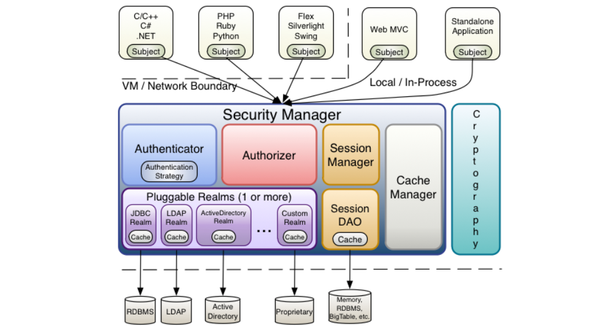

**核心概念：**

- **Subject：**与SecurityManager进行交互的主体。
- **SecurityManager：**Shiro的核心，主要进行认证/鉴权的管理、会话管理。SecurityManager是一个继承了Authenticator, Authorizer, SessionManager三个接口的接口。
- **Authenticator：**认证器，主要进行身份证。
- **Authorizer：**鉴权器，主要进行鉴权。
- **Realm：**安全实体数据源，主要用于获取**AuthenticationInfo（认证信息）**和**AuthorizationInfo（授权信息）**。
- **SessionManager：**会话管理器。
- **SessionDAO：**会话的接口，可以将session通过jdbc将会话存储到数据库。
- **CacheManager：**缓存管理。
- **Cryptography：**密码管理，提高了一套加密/解密的组件。

**其他概念：**

- **Principal：**主体进行认证的**身份信息（具有唯一性）**，例如用户名、手机号、邮箱地址等。
- **Primary Principal：**身份信息的其中一个，**主身份只能有一个**。
- **Credential：凭证信息**，例如密码、证书。

## 10.2 配置类ShiroConfig

`ShiroConfig.java`中进行Shiro的相关配置。

### 10.2.1 配置会话管理器

在`ShiroConfig.java`中配置会话管理器（SessionManager Bean）。SessionManager用于管理Shiro中的Session信息。Session也就是我们通常说的会话，会话是用户在使用应用程序一段时间内携带的数据。传统的会话一般是基于Web容器(如：Tomcat)，**Shiro提供的Session可以在任何环境中使用，不再依赖于其他容器**。相关代码如下：

```java
/**
 * 配置会话管理器
 * @return
 */
@Bean
public SessionManager sessionManager() {
    DefaultWebSessionManager sessionManager = new DefaultWebSessionManager();
    // 是否定时检查session
    sessionManager.setSessionValidationSchedulerEnabled(false);
    return sessionManager;
}
```

DefaultWebSessionManager的继承关系如下：

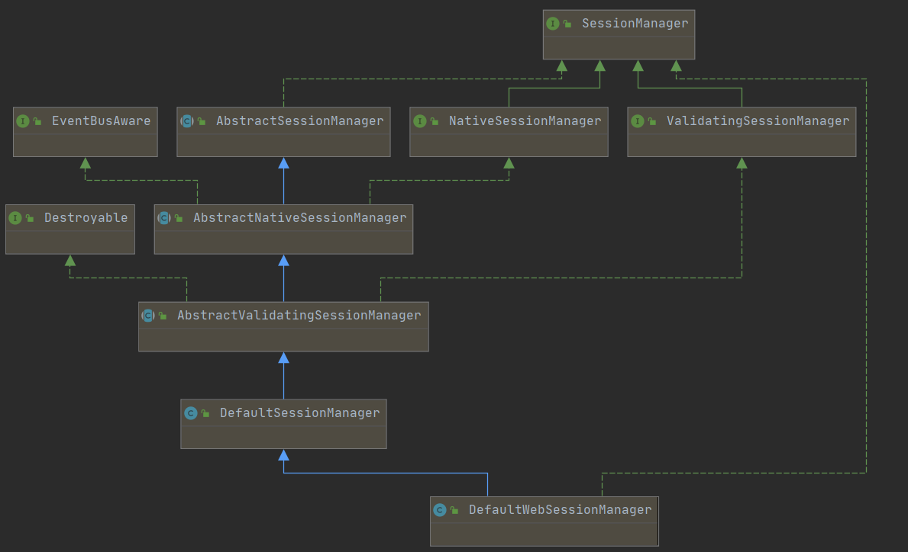

### 10.2.2 配置安全管理器

在`ShiroConfig.java`中配置安全管理器（SecurityManager Bean）。SecurityManager用于进行认证/授权管理、会话管理。

```java
/**
 * 配置安全管理器
 * @param oauth2Realm
 * @param sessionManager
 * @return
 */
@Bean
public SecurityManager securityManager(Oauth2Realm oauth2Realm, SessionManager sessionManager) {
    DefaultWebSecurityManager securityManager = new DefaultWebSecurityManager();
    securityManager.setRealm(oauth2Realm); // 设置认证与鉴权逻辑
    securityManager.setSessionManager(sessionManager); // 设置会话管理器
    return securityManager;
}
```

DefaultWebSecurityManager的继承关系如下：

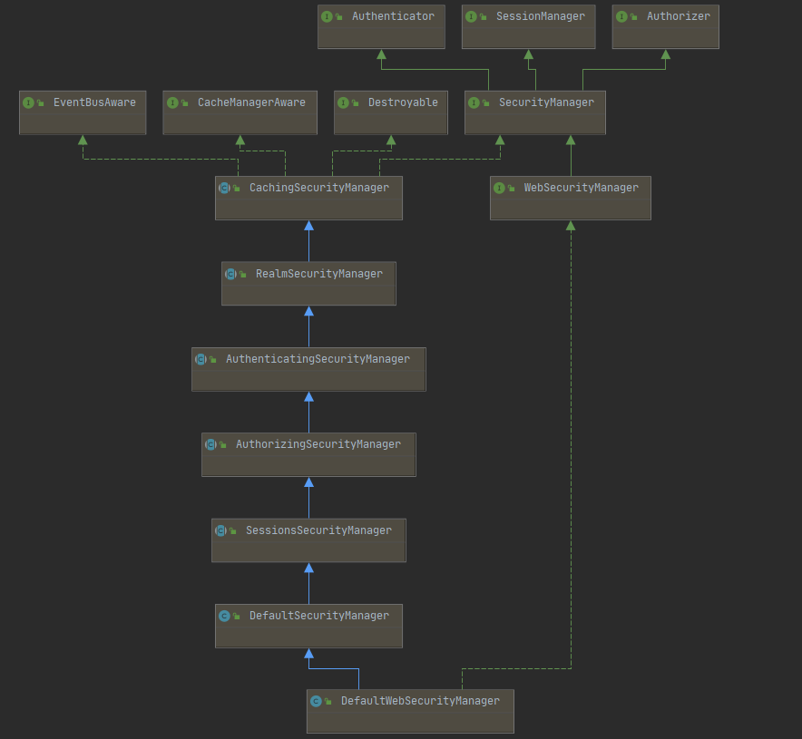

### 10.2.3 配置Shiro过滤器

在`ShiroConfig.java`中配置Shiro过滤器，作用有两个：一是配置过滤器（包括自定义过滤器和Shiro默认的过滤器）；二是设置SecurityManager安全管理器（当过滤器将URL拦截到后会交由SecurityManager处理）。相关代码如下：

```java
/**
 * 配置Shiro过滤器
 * @param securityManager
 * @return
 */
@Bean
public ShiroFilterFactoryBean shiroFilter(SecurityManager securityManager) {
    ShiroFilterFactoryBean shiroFilter = new ShiroFilterFactoryBean();
    shiroFilter.setSecurityManager(securityManager); // 设置安全管理器

    Map<String, Filter> filters = new HashMap<>();
    filters.put("oauth2", new Oauth2Filter());
    shiroFilter.setFilters(filters); // 对拦截到的页面请求进行捕获进行认证与鉴权

    Map<String, String> filterMap = new LinkedHashMap<>();
    // 两个url规则都可以同时匹配同一个url，且只执行第一个
    filterMap.put("/admin/sys/login", "anon"); // 放行zcblog-front2manage的登录页面
    filterMap.put("/admin/**", "oauth2"); // zcblog-front2manage的其他页面需要认证和授权
    filterMap.put("/**", "anon"); // 放行zcblog-front2client项目页面
    shiroFilter.setFilterChainDefinitionMap(filterMap); // 设置页面请求拦截

    return shiroFilter;
}
```

- 关于Shiro默认的过滤器：

|     配置缩写      |          对应的过滤器          | 功能                                                         |
| :---------------: | :----------------------------: | ------------------------------------------------------------ |
|     **anon**      |        AnonymousFilter         | 指定url可以匿名访问                                          |
|     **authc**     |    FormAuthenticationFilter    | 指定url需要form表单登录，默认会从请求中获取`username`、`password`,`rememberMe`等参数并尝试登录，如果登录不了就会跳转到loginUrl配置的路径。我们也可以用这个过滤器做默认的登录逻辑，但是一般都是我们自己在控制器写登录逻辑的，自己写的话出错返回的信息都可以定制嘛。 |
|    authcBasic     | BasicHttpAuthenticationFilter  | 指定url需要basic登录                                         |
|      logout       |          LogoutFilter          | 登出过滤器，配置指定url就可以实现退出功能，非常方便          |
| noSessionCreation |    NoSessionCreationFilter     | 禁止创建会话                                                 |
|       perms       | PermissionsAuthorizationFilter | 需要指定权限才能访问                                         |
|       port        |           PortFilter           | 需要指定端口才能访问                                         |
|       rest        |   HttpMethodPermissionFilter   | 将http请求方法转化成相应的动词来构造一个权限字符串，这个感觉意义不大，有兴趣自己看源码的注释 |
|       roles       |    RolesAuthorizationFilter    | 需要指定角色才能访问                                         |
|        ssl        |           SslFilter            | 需要https请求才能访问                                        |
|       user        |           UserFilter           | 需要已登录或“记住我”的用户才能访问                           |
**注意事项**：

1. 多个过滤器匹配URL，则第一个过滤器生效（**利用此功能，可以实现放行zcblog-front2client项目页面和zcblog-front2manage的登录页面，而zcblog-front2manage的其他页面需要认证和授权**）。
2. 自定义过滤器可以将URL拦截下来，获取其中的token，然后交由SecurityManager处理。

> 参考博客文章：[Shiro过滤器](https://www.w3cschool.cn/shiro/oibf1ifh.html)

### 10.2.4 管理Shiro Bean的生命周期

在`ShiroConfig.java`中配置LifecycleBeanPostProcessor Bean，作用是管理Shiro Bean的生命周期。相关代码如下：

```java
/**
 * 管理Shiro Bean的生命周期：其实在ShiroBeanConfiguration中已经配置好了，多次一举了
 * @return
 */
@Bean
public LifecycleBeanPostProcessor lifecycleBeanPostProcessor() {
    return new LifecycleBeanPostProcessor();
}
```

查看源码可知，LifecycleBeanPostProcessor将Initializable和Destroyable的实现类统一在其内部自动分别调用了Initializable.init()和Destroyable.destroy()方法，从而达到管理shiro bean生命周期的目的。

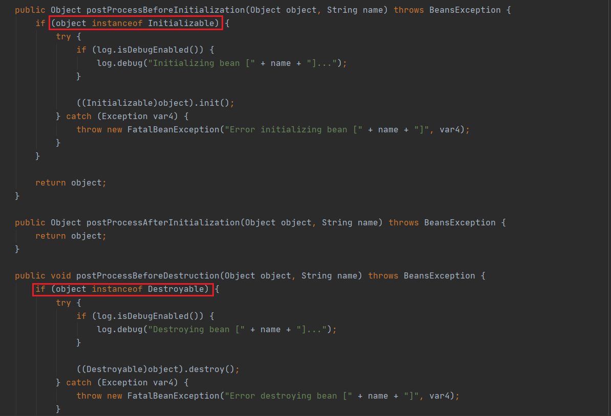
**那是不是一定要在`ShiroConfig.java`中配置LifecycleBeanPostProcessor Bean呢？**

其实不需要，因为其实Shiro已经在ShiroBeanConfiguration中帮我们配置好了LifecycleBeanPostProcessor Bean。

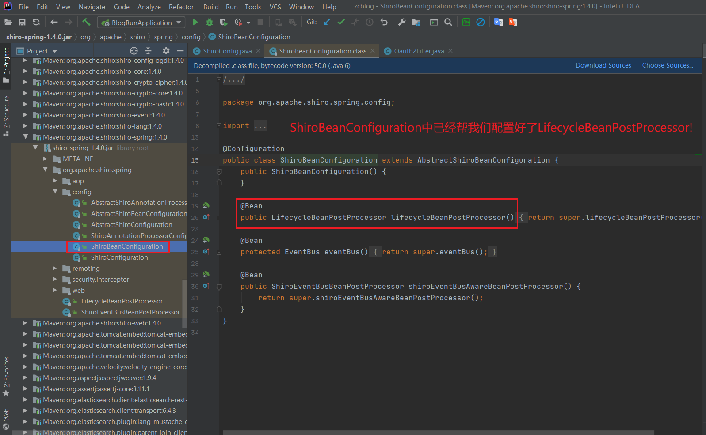

> 参考博客文章：[Shiro笔记之LifecycleBeanPostProcessor的作用](https://blog.csdn.net/qq_36850813/article/details/93750520)

### 10.2.5 使用AOP代理

在`ShiroConfig.java`中配置DefaultAdvisorAutoProxyCreator Bean，作用是启用AOP代理，寻找所有的Advisor。相关代码如下：

```java
/**
 * DefaultAdvisorAutoProxyCreator实现了BeanProcessor接口,
 * 当ApplicationContext读如所有的Bean配置信息后，这个类将扫描上下文，寻找所有的Advisor
 * @return
 */
@Bean
@DependsOn({"lifecycleBeanPostProcessor"})
public DefaultAdvisorAutoProxyCreator defaultAdvisorAutoProxyCreator() {
    DefaultAdvisorAutoProxyCreator proxyCreator = new DefaultAdvisorAutoProxyCreator();
    proxyCreator.setProxyTargetClass(true);
    return proxyCreator;
}
```

从继承关系知，**DefaultAdvisorAutoProxyCreator本质是Spring AOP的一个核心类（与Shiro无关）**。DefaultAdvisorAutoProxyCreator实现了BeanProcessor接口，作用是当ApplicationContext读取所有Bean配置信息后，将扫描上下文，寻找所有的Advisor，将这些Advisor应用到所有符合切入点的Bean中（因此必须在lifecycleBeanPostProcessor创建之后创建）。**DefaultAdvisorAutoProxyCreator和AuthorizationAttributeSourceAdvisor共同作用实现了Shiro注解的启用**。

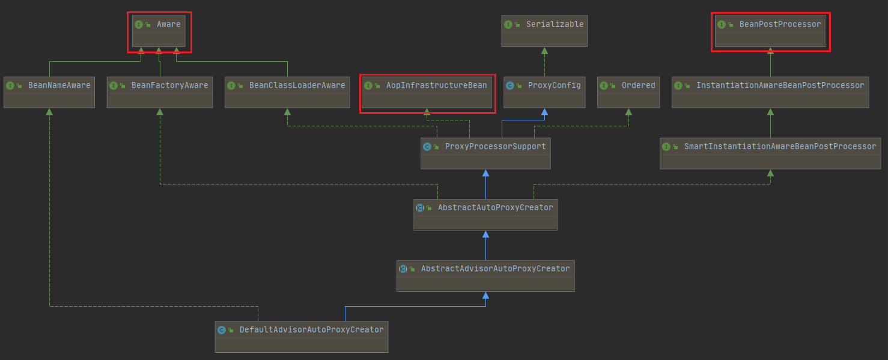

> 参考博客文章：[使用DefaultAdvisorAutoProxyCreator实现spring的自动代理](https://blog.csdn.net/daryl715/article/details/1621610)

### 10.2.6 启用Shiro注解

在`ShiroConfig.java`中配置AuthorizationAttributeSourceAdvisor Bean，作用是启用Shiro注解。相关代码如下：

```java
/**
 * 通知，启用Shiro注解
 * @param securityManager
 * @return
 */
@Bean
public AuthorizationAttributeSourceAdvisor authorizationAttributeSourceAdvisor(SecurityManager securityManager) {
    AuthorizationAttributeSourceAdvisor advisor = new AuthorizationAttributeSourceAdvisor();
    advisor.setSecurityManager(securityManager); // // 设置安全管理器
    return advisor;
}
```

**为什么配置AuthorizationAttributeSourceAdvisor Bean可以启用Shiro注解？**

从下面的继承关系可知：AuthorizationAttributeSourceAdvisor实现了Pointcut和Advisor接口，说明AuthorizationAttributeSourceAdvisor是一个通知器，可以依靠AOP来识别Shiro注解。StaticMethodMatcherPointcut类的类属性classFilter的值是`ClassFilter.TRUE`，表示匹配所有类；getMethodMatcher方法匹配所有加了认证注解的方法。

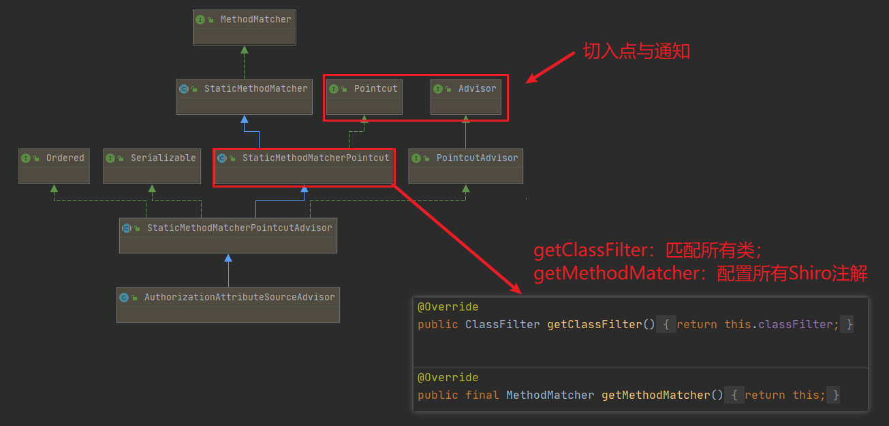

> 参考博客文章：[使用AuthorizationAttributeSourceAdvisor启用Shiro注解](https://blog.csdn.net/wangjun5159/article/details/51889628)

## 10.3 封装认证令牌Oauth2Token

登录成功后，生成一个token存储在Redis中，并返回给前端用户，vue将token加入到cookie中，后续的每次请求都将携带token的cookie加入到请求头中，ShiroFilter将请求拦截到后，去除请求头中的cookie，交由SecurityManager进行认证与鉴权，认证与鉴权成功后进入到控制器中执行业务代码，最后将响应回写到前端客户。

登录成功后，后续的认证与鉴权都是验证请求头的cookie与Redis中的token是否相对。封装认证令牌如下：

```java
// 封装认证令牌
public class Oauth2Token implements AuthenticationToken {
    private static final long serialVersionUID = 1L;
    private String token;
    public Oauth2Token(String token) {
        this.token = token;
    }

    // 获取身份信息
    @Override
    public Object getPrincipal() {
        return token;
    }

    // 获取身份凭证
    @Override
    public Object getCredentials() {
        return token;
    }
}
```

AuthenticationToken的继承关系如下（**比较常用的是用户名和密码组成的登录令牌`UsernamePasswordToken`**）：

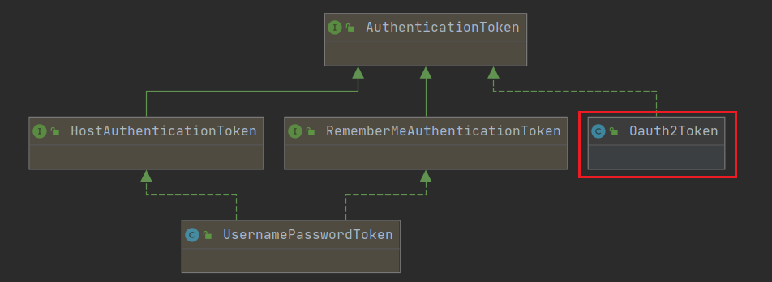

## 10.4 自定义过滤器ShiroFilter

AuthenticatingFilter的继承关系如下：

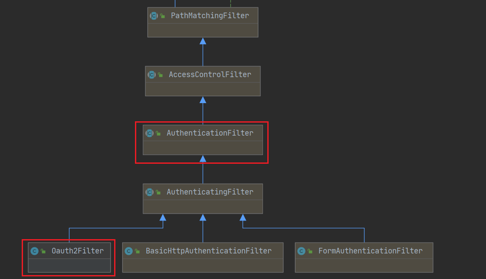

### 10.4.1 判断是否登录

在`ShiroFilter.java`中的**isAccessAllowed方法用来判断是否登录**。

- 若isAccessAllowed方法返回true，则不会再调用onAccessDenied方法，会直接访问控制器。
- 若isisAccessAllowed方法返回false，则会继续调用onAccessDenied方法。

除了OPTIONS请求（**POST请求的预请求**）直接返回true；其他请求（GET/POST/PUT/PATCH/DELETE）返回false，表示需要登录，进入到onAccessDenied中执行操作。

具体代码如下：

```java
// 放行OPTIONS请求，其他请求（GET/POST/PUT/PATCH/DELETE）需要登录
@Override
protected boolean isAccessAllowed(ServletRequest servletRequest, ServletResponse servletResponse, Object mappedValue) {
    // POST请求属于HTTP请求中的复杂请求，HTTP协议在浏览器中对复杂请求会先发起一次OPTIONS的预请求，发起OPTIONS请求常会报403错误
    // 针对这种情况，通常是在DispacerServlet中没有找都到执行OPTIONS请求的方法。
    // 在做跨域处理时，通常配置好跨域请求头信息后，常常忽略在Spring MVC中添加对OPTIONS请求的处理。
    // 解决办法有三种：
    // （1）在Filter中添加对OPTIONS请求的支持处理；（需要搞清楚Filter过滤器和Interceptor拦截器的区别）
    // （2）在Interceptor中添加对OPTIONS请求的支持处理；
    // （3）添加一个支持OPTIONS的ReqeuestMapping（即在控制器中对OPTIONS请求做处理）
    // 本项目采用的是第一种解决方案
    if (((HttpServletRequest) servletRequest).getMethod().equals(RequestMethod.OPTIONS.name())) {
        return true;
    }
    return false;
}
```

> 参考博客文章：[isAccessAllowed和onAccessDenied执行流程](https://blog.csdn.net/qq_40202111/article/details/106397360)

### 10.4.2 判断是否提交登录

在`ShiroFilter.java`中的**onAccessDenied方法用来判断是否提交登录**。

- 若请求头中的token不存在，直接返回false，表示登录失败，并回写错误信息到页面（前台页面跳转到登录页面重新登录）。
- 若请求头中token存在，则提交登录（**会转到Realm中执行认证和鉴权逻辑**）。

具体代码如下：

```java
// 提交登录操作
@Override
protected boolean onAccessDenied(ServletRequest servletRequest, ServletResponse servletResponse) throws Exception {
    String token = getRequestToken((HttpServletRequest) servletRequest);
    // 若token不存在，直接返回401
    if (StringUtils.isEmpty(token)) {
        HttpServletResponse httpResponse = (HttpServletResponse) servletResponse;
        httpResponse.setHeader("Access-Control-Allow-Credentials", "true"); // 允许在跨域响应中携带cookie
        httpResponse.setHeader("Access-Control-Allow-Origin", HttpContextUtils.getOrigin()); // 允许跨域响应
        log.debug(ErrorEnum.INVALID_TOKEN.getMsg());
        String resultJson = JsonUtils.toJson(Result.error(ErrorEnum.INVALID_TOKEN));
        httpResponse.getWriter().print(resultJson); // 错误信息输出到页面
        return false;
    }
    return executeLogin(servletRequest, servletResponse); // 若token存在，则执行登录
}
```

查看源码可知：executeLogin(servletRequest, servletResponse)方法将会从请求头中或取出token与Realm中的new SimpleAuthenticationInfo(sysUser, token, getName())认证信息中的token进行比较，判断是否登录成功。

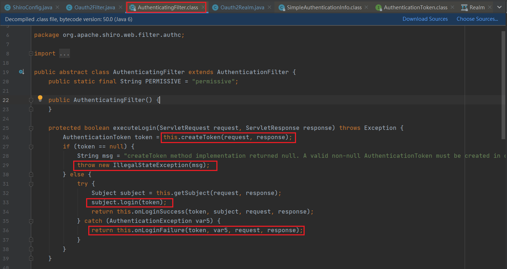

### 10.4.3 从请求头中获取token

在`ShiroFilter.java`中获取token的代码如下：

```java
// 获取认证令牌
@Override
protected AuthenticationToken createToken(ServletRequest servletRequest, ServletResponse servletResponse) throws Exception {
    String token = getRequestToken((HttpServletRequest) servletRequest);
    if (StringUtils.isEmpty(token)) {
        return null;
    }
    return new Oauth2Token(token);
}

// 从请求头中获取token
private String getRequestToken(HttpServletRequest httpRequest) {
    String token = httpRequest.getHeader("token");
    // 若请求头中token不存在，则从请求参数中获取token
    if (StringUtils.isEmpty(token)) {
        token = httpRequest.getParameter("token");
    }
    return token;
}
```

### 10.4.4 登录失败后的操作

在`ShiroFilter.java`中的**onLoginFailure方法用来执行登录后的操作**。

当Realm中的认证操作执行失败后，onLoginFailure方法中会回写错误到前台页面。

```java
// 登录失败后的操作
@Override
protected boolean onLoginFailure(AuthenticationToken authenticationToken, AuthenticationException e, ServletRequest servletRequest, ServletResponse servletResponse) {
    HttpServletResponse httpResponnse = (HttpServletResponse) servletResponse;
    httpResponnse.setContentType("application/json;charset=utf-8");
    httpResponnse.setHeader("Access-Control-Allow-Credentials", "true"); // 允许在跨域响应中携带cookie
    httpResponnse.setHeader("Access-Control-Allow-Origin", HttpContextUtils.getOrigin());
    Throwable throwable = e.getCause() == null ? e : e.getCause();
    String resultJson = JsonUtils.toJson(Result.error(ErrorEnum.NO_AUTH.getCode(), throwable.getMessage()));
    try {
        httpResponnse.getWriter().print(resultJson);
    } catch (IOException ioException) {
        log.debug("登录失败", ioException);
    }
    return false;
}
```

## 10.5 认证/鉴权逻辑

自定义Oauth2Realm**从Redis判断此token是否有效**或**从数据库中判断用户是否被禁用**。

Oauth2Realm继承自Realm，Realm的继承关系如下：


### 10.5.1 识别token

由`10.4.2`可以知道：在executeLogin(servletRequest, servletResponse)方法中会执行subject.login(token)，接下来就会执行Oauth2Realm中的supports方法判断该token的类型是否正确，若不正确则直接返回false，返回true则进入到doGetAuthenticationInfo方法中执行认证操作。

```java
// 识别登录数据类型
@Override
public boolean supports(AuthenticationToken authenticationToken) {
    return authenticationToken instanceof Oauth2Token;
}
```

### 10.5.2 认证逻辑

认证逻辑主要包含三个部分：

- 从Redis中查询此token是否有效，如无效则抛出**MyException(ErrorEnum.TOKEN_EXPIRED)异常**。
- 从数据库中查询判断用户是否被禁用，若被禁用则抛出**MyException(ErrorEnum.USER_ACCOUNT_LOCKED)异常**。
- 若token有效且用户未被禁用，则**对token进行续期**。
- 最后返回认证信息，将SimpleAuthenticationInfo(sysUser, token, getName())与subject.login(token)中的token进行比较（从程序代码来看，显然这两个token一定相等）

```java
// 认证逻辑
@Override
protected AuthenticationInfo doGetAuthenticationInfo(AuthenticationToken authenticationToken) {
    // 根据用户token从Redis获取用户token+用户id信息
    String token = (String) authenticationToken.getPrincipal();
    SysUserToken sysUserToken = shiroService.queryByToken(token);

    // 若token失效
    if (sysUserToken == null) {
        log.error(ErrorEnum.TOKEN_EXPIRED.getMsg());
        throw new MyException(ErrorEnum.TOKEN_EXPIRED);
    }

    // 根据用户id从数据库查询用户信息
    SysUser sysUser = shiroService.queryByUserId(sysUserToken.getUserId());
    // 若用户账号被锁定
    if (Boolean.FALSE.equals(sysUser.getStatus())) {
        log.error(ErrorEnum.USER_ACCOUNT_LOCKED.getMsg());
        throw new MyException(ErrorEnum.USER_ACCOUNT_LOCKED);
    }
    // 续期
    shiroService.refreshToken(sysUserToken.getUserId(), token);

    return new SimpleAuthenticationInfo(sysUser, token, getName());
}
```

### 10.5.3 鉴权逻辑

鉴权逻辑比较简单，直接根据用户id查询菜单权限即可。

```java
// 鉴权逻辑
@Override
protected AuthorizationInfo doGetAuthorizationInfo(PrincipalCollection principals) {
    SysUser sysUser = (SysUser) principals.getPrimaryPrincipal();
    Long userId = sysUser.getUserId();
    Set<String> userPerms = shiroService.getUserPerms(userId);
    SimpleAuthorizationInfo authorizationInfo = new SimpleAuthorizationInfo();
    authorizationInfo.setStringPermissions(userPerms);
    return authorizationInfo;
}
```

## 10.6 处理认证/鉴权异常

### 10.6.1 异常类型

可能抛出的异常有：

- 执行executeLogin(servletRequest, servletResponse)可能会抛出**java.lang.IllegalStateException异常**。
- 执行doGetAuthenticationInfo(AuthenticationToken authenticationToken)可能会抛出**MyException异常**。

### 10.6.2 Shiro异常组织结构

shiro中的异常组织结构见下图：

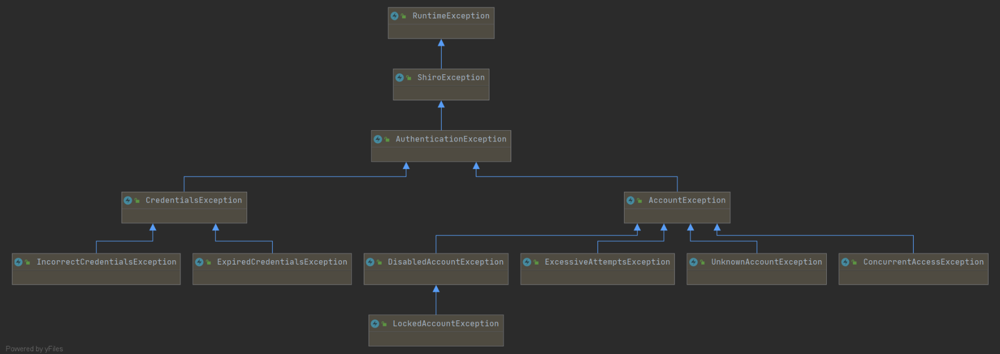

### 10.6.3 异常处理

根据`10.6.2`可知，只需要在全局异常处理类`MyExceptionHandler`中处理自定义异常及ShiroException即可。

```java
// 处理自定义异常：包含校验异常、认证异常
@ExceptionHandler(MyException.class)
public Result handleMyException(MyException e) {
    Result result = new Result();
    result.put("code", e.getCode());
    result.put("msg", e.getMsg());
    return result;
}

// 处理鉴权异常以及认证中的除自定义外的异常
@ExceptionHandler(ShiroException.class)
public Result hanldeAuthorizationException(ShiroException e) {
    log.error(e.getMessage(), e);
    return Result.exception(ErrorEnum.NO_AUTH);
}

// 处理其他异常
@ExceptionHandler(Exception.class)
public Result handleException(Exception e) {
    log.error(e.getMessage(), e);
    return Result.exception();

}
```

本项目的异常处理结构如下：


## 10.7 源码总结

到此为止，Shiro已经折腾的比较清楚了，这里根据整个登录过程回顾归纳一下认证与鉴权的方法链。

### 10.7.1 Bean初始化顺序

ShiroConfig中的Bean初始化顺序：

lifecycleBeanPostProcessor（**注入Shiro生命管理器**）== 》defaultAdvisorAutoProxyCreator （**注入AOP代理：寻找所有的通知器**） == 》sessionManager（**注入会话管理器**） ==》securityManager（**注入安全管理器**） ==》shirFilter（**注入Shiro过滤器**） ==》authorizationAttributeSourceAdvisor （**注入Shiro通知器**）

### 10.7.2 跨域请求执行过程

跨域请求执行顺序（【】表示可无这一步）：

【OAuth2Filter.isAccessAllowed（**POST预请求OPTIONS**）】 ==》OAuth2Filter.isAccessAllowed（**正常GET/DELETE...请求**） == 》OAuth2Filter.onAccessDenied（**提交登录操作**） ==》OAuth2Filter.createToken（**获取token，封装成Oauth2Token**） ==》OAuth2Filter.getRequestToken（**从请求头获取token**） ==》 OAuth2Realm.supports（**判断Realm中Oauth2Token的类型**） ==》OAuth2Realm.doGetAuthenticationInfo（**获取数据源进行认证**） ==》【OAuth2Filter.onLoginFailure（**认证失败**）】 ==》OAuth2Realm.doGetAuthorizationInfo（**进行鉴权**）==》【OAuth2Filter.onLoginSuccess（**认证成功**）】

### 10.7.3 图解跨域请求过程

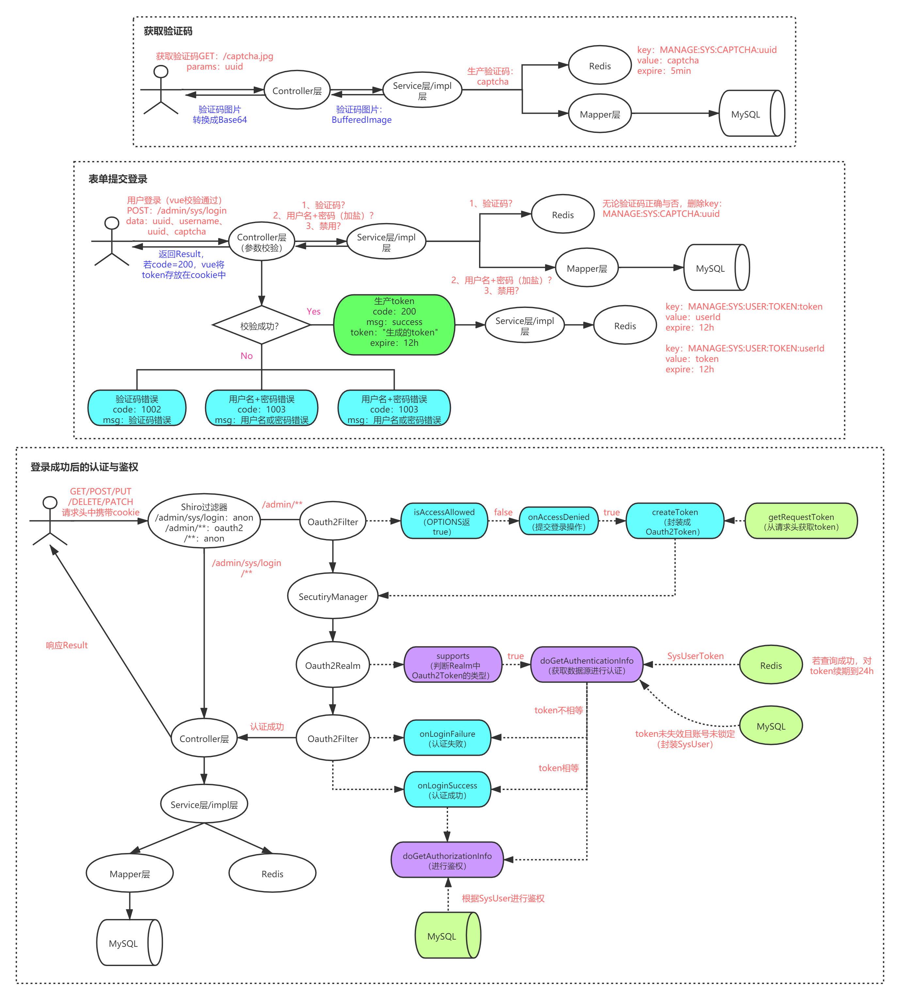

> **总结学习源码的方法**：分析类的继承关系 + 打印log + Debug断点步入
>
> **总结学习Shiro的方式：**[Shiro官方文档](https://shiro.apache.org/reference.html)、[跟我学Shiro](https://www.w3cschool.cn/shiro/)、[B站Shiro视频](https://www.bilibili.com/video/BV1uz4y197Zm?from=search&seid=12299467433778243095)

# 11 Spring 缓存

在项目开发过程中，可以使用Spring缓存技术将数据存入服务器的缓存中（**本质上缓存是在Spring的容器中，位于服务器的内存上**），这样对于一些重复的查询操作可以避免频繁访问数据库，提高响应速度。

## 11.1 使用缓存的步骤

使用Spring缓存（保证Springd的版本高于V3.1）的步骤如下：

1. 第1步：在Springboot**启动类**或者**某一配置类**上使用**@EnableCaching**注解启用Spring缓存技术。
2. 第2步：配置缓存管理器。
3. 第3步：在类上或类中的方法上（**该类必须注入到容器中，否则缓存不会生效**）使用缓存注解（例如：@Cacheable添加缓存、@CacheEvict清除缓存...）。

## 11.2 缓存注解

- **@EnableCaching**：开启缓存。在项目启动类或某个配置类上使用此注解后，则表示允许使用注解的方式进行缓存操作。
- **@CacheEvict**：可用于类或方法上。在执行完目标方法后，清除缓存中对应key的数据（如果缓存中有对应key的数据缓存的话）。
- **@Cacheable**：可用于类或方法上。在目标方法执行前，会根据key先去缓存中查询看是否有数据，若存在就直接返回缓存中的key对应的value值。不再执行目标方法；若不存在则执行目标方法，并将方法的返回值作为value，并以键值对的形式存入缓存。
- **@CachePut**：可用于类或方法上。在执行完目标方法后，并将方法的返回值作为value，并以键值对的形式存入缓存中。
- @Caching：可作为@Cacheable、@CacheEvict、@CachePut三种注解中的的任何一种或几种来使用。
- **@CacheConfig**：@Cacheable、@CacheEvict、@CachePut这三个注解的cacheNames属性是必填项（或value属性是必填项，因为value属性是cacheNames的别名属性）；如果上述三种注解都用的是同一个cacheNames的话，那么在每次都写cacheNames的话，就会显得麻烦。@CacheConfig注解就是来配置一些公共属性（如：cacheNames、keyGenerator等）的值。该注解一般用于类上。

## 11.3 缓存注解的常用属性

- **key属性**：默认/keyGenerator生成/主动指定。**（优先级：主动指定>keyGenerator>默认）**

> 默认key：
>
> 1. 方法无参时，默认key为SimpleKey[]；
> 2. 方法只有一个参数时，默认key为传入的参数的toString的值；
> 3. 方法有多个参数时，默认的key为SimpleKey [参数1的toString的值,参数2的toString的值...]。
>
> keyGenerator生产key：
>
> 1. 编写配置类（配置类需继承CachingConfigurerSupport类，重写keyGenerato()方法），定制化key生成器。
>
> 主动指定key：
>
> 1. 若key为常量，需要使用导引号引起来；
> 2. 也可以使用Spring表达式语言（SpEL）动态为key设置值（可以通过"#形参名"或"#p参数索引"或"#a参数索引"）；
> 3. 可以通过打点的方式对获得的参数进行方法或属性调用（如key="#str.hashCode()"或key="#p1.name"）；
> 4. SpEL中可以是以Spring提供的隐藏根对象，如key="#root.target"表示以全限定类型@内存地址作为key值。

- **condition属性**：若condition结果为true，则注解生效，否则注解不生效（condition的作用时机在缓存注解检查缓存中是否有对应key-value 之前）。

- **cacheNames属性**：命名空间（指开辟的一块内存空间），与value属性互为别名（作用一致）。

> 1. 不同cacheNames下可以有相同的key。
> 2. 若cacheNames（或value）指定了多个命名空间，当进行缓存存储时会在每个命名空间下均存有一份key-value；当进行缓存读取时，会按照cacheNames值里命名空间的顺序，依次从命名空间中查找对应的key，查到即返回key对应的value值。

- **unless属性**：是否令注解（在方法执行后的功能）不生效。若unless结果为true，则不生效；若unless结果为false，则生效。unless默认值为false。

> 1. unless的作用时机在目标方法运行后；若因为直接从缓存中获取到了数据，而导致目标方法没有被执行，那么unless字段不生效。
> 2. unless的作用时机是在方法运行完毕后，所以我们可以用SpEL表达式#result 来获取方法的返回值。

- **allEntries属性**：主要出现在@CacheEvict注解中，表示是否清除指定命名空间中的所有数据，默认为false（即不清除所有数据）。
- **beforeInvocation属性**：主要出现在@CacheEvict注解中，表示是否在目标方法执行前使此注解生效， 默认为false（即不生效）。

## 11.4 配置CacheManager

Spring缓存本质上是将缓存存储在Spring容器中，使用缓存管理器可以将Spring缓存储存在Redis内存中，可以给不同的缓存空间进行不同的设置（如过期时间、序列化方式...）

在`RedisConfig.config`中开启Spring缓存并配置缓存管理器，相关代码如下：

```java
@Configuration
@EnableCaching // 开启Spring缓存注解
public class RedisConfig {
    /**
     * 配置Redis缓存管理器，处理Spring缓存
     * @param redisConnectionFactory
     * @return
     */
    @Bean
    public CacheManager cacheManager(RedisConnectionFactory redisConnectionFactory) {
        // 未配置的key默认缓存一周过期
        RedisCacheWriter redisCacheWriter = RedisCacheWriter.nonLockingRedisCacheWriter(redisConnectionFactory);
        RedisCacheConfiguration redisCacheConfiguration = RedisCacheConfiguration.defaultCacheConfig()
                .entryTtl(Duration.ofDays(7)).serializeValuesWith(RedisSerializationContext.SerializationPair.fromSerializer(new GenericJackson2JsonRedisSerializer()));
        Map<String, RedisCacheConfiguration> redisCacheConfigurationMap = getRedisCacheConfigurationMap();
        return new RedisCacheManager(redisCacheWriter, redisCacheConfiguration, redisCacheConfigurationMap);
    }

    private Map<String, RedisCacheConfiguration> getRedisCacheConfigurationMap() {
        HashMap<String, RedisCacheConfiguration> redisCacheConfigurationMap = new HashMap<>(1);
        // ZCBLOG:ARTICLE缓存空间过期时间为1天（文章缓存1天）
        redisCacheConfigurationMap.put(RedisCacheNames.ARTICLE, RedisCacheConfiguration.defaultCacheConfig().entryTtl(Duration.ofDays(1))
                .serializeValuesWith(RedisSerializationContext.SerializationPair.fromSerializer(new GenericJackson2JsonRedisSerializer())));
        // ZCBLOG:GALLERY缓存空间过期时间为1天（相册缓存1天）
        redisCacheConfigurationMap.put(RedisCacheNames.GALLERY, RedisCacheConfiguration.defaultCacheConfig().entryTtl(Duration.ofDays(1))
                .serializeValuesWith(RedisSerializationContext.SerializationPair.fromSerializer(new GenericJackson2JsonRedisSerializer())));
        return redisCacheConfigurationMap;
    }
}
```

> 参考博客文章：[Spring缓存注解](https://blog.csdn.net/justry_deng/article/details/89283664)、[B站Spring缓存视频](https://www.bilibili.com/video/BV1ZE411J7Yb?from=search&seid=4715812049534535936)、[Spring缓存与CacheManager](https://www.cnblogs.com/top-housekeeper/p/11865399.html)、[配置RedisCacheManager](https://blog.csdn.net/weixin_43526498/article/details/106621180)

# 12 Redis的使用

## 12.1 背景

### 12.1.1 互联网项目的架构演进

**架构模型的演进**：单机MySQL—>Memcached + MySQL读写分离（垂直拆分）—> 分库分表+ MySQL集群（水平拆分）—>负载均衡 + 分库分表 + MySQ集群（水平拆分）+ 图片/文件/流媒体...服务器

MySQL引擎：以前采用MyISAM（表锁）、现在采用Innodb（行锁）。

NoSQL（Not only SQL）特点：

1. 数据之间没有关系，方便扩展。
2. 大数据量高性能（Redis每秒写8万次，每秒读11万次）。
3. 数据类型多样型（不需要事先设计数据库，随取随用）。

大数据的3V+3高：数据3V（海量Volume、多样Variety、实时Velocity）；程序要3高（高并发、高可拓、高性能）。

### 12.1.2 NoSQL的四大分类

- KV键值对：新浪（**Redis**）、美团（Redis+Tair）、阿里/百度（Redis + Memcache）。
- 文档型数据库：**MongoDB**（是一个介于关系型数据库和非关系型数据库的中间的产品）、ConthDB。
- 列存储数据库：**HBase**、分布式文件系统。
- 图形关系数据库：**Neo4J**、InfoGrid，主要用于社交网络、推荐系统。

### 12.1.3 Redis介绍

Redis（Remote Dictionary Server）：远程字典服务。

**Redis的作用**：内存存储、持久化（rdb和aof）；**高速缓存**；发布订阅系统；地图信息分析；计时器、计数器（**浏览量**）...

> 本项目使用Redis做**高速缓存**及使用Hyperloglog统计博客文章**浏览量**、统计页面**访客数**。

**Redis的特性**：数据类型多样化；持久化；集群；事务...

**Redis的基本指令**（指令不区分大小写，但key-value区分大小写）：

- SELECT 3：切换到第3个数据库（Redis默认有16个数据库，默认使用的是第0个）。
- DBBASE：查看数据库大小。
- KEYS pattern：查看满足pattern正则表达式的key。
- FLUSHDB：清空当前数据库。
- FLUSHALL：清空全部数据库。

**为什么Redis这么块**：Redis是单线程的（CPU不是Redis的性能瓶颈，机器的内存和网络带宽才是）。

1. 误区一：高性能的服务器一定是多线程的？（错误）

2. 误区二：多线程（CPU上下文切换也很耗时）一定比单线程效率高（错误）

   原因：Redis是将所有的数据全部存放在内存中，使用单线程操作效率最高；多线程存在CPU上下文切换（很耗时）。因此，对于内存系统而言，没有上下文切换效率更高。

## 12.2 基本使用

### 12.2.1 常用的命令

命令的使用需要在Redis官网或者菜鸟网站上查询即可。

- EXISTS key：判断某个键是否存在。
- DEL key：移除某个键。
- EXPIRE key seconds：设置某个键的存货时间（单位是秒）。
- TTL key：查看某个键的剩余存活时间。
- SET key value：设置键值对。
- GET key：获取键位key的值。
- TYPE key：查看某个key的数据类型。

### 12.2.2 五种基本数据类型

五大基本数据类型是**String**、**List**、**Set**、**Hash**、**Zset**

- String（字符串）

```yaml
APPEND key value  # 在原来的值上拼接字符串(若key不存在，则相当于新建一个key-value)
STRLEN key  # 获得字符串的长度
incr key / decr key  # 自增1/自减1
INCRBY key num / DECRBY key num  # 自增num/自减num
GETRANGE key start end  # 截取字符串(GETRANGE key 0 -1可以截取全部字符串)
SETRANGE key offset value  # 替换(从offset索引处开始替换，替换的长度位value的长度)
SETEX key seconds value  # 设置过期时间
SETNX key value  # 若key不存在再设置key-value(在分布式锁中会常常使用);若存在则创建失败
mset key value [key value...]  # 设置多个key-value
mget key [key...]  # 获取多个key
msetnx key value [key value...]  # 不存在再设置key-value(原子性的操作:要么一起成功,要么一起失败)
getset key value  # 若存在就获取该key对应的value;若不存在就返回nil,再设置key-value

# 使用场景:
# 1. 计数器
# 2. 统计多单位的数量
# 3. 粉丝数
# 4. 对象缓存存储
```

- List（链表）：可以把List当成栈、队列、阻塞队列

```yaml
LPUSH key value [value...]  # 将一个值或者多个值插入到链表的头部(左)
RPUSH key value [value...]  # 将一个值或者多个值插入到链表的尾部(右)
LRANGE key start stop  # 截取哪几个value（LRANGE key 0 -1 截取链表的所有元素）（不会改变链表）
LPOP key  # 移除链表的头部元素(第一个元素)
RPOP key  # 移除链表的尾部元素(最后一个元素)
LINDEX key index  # 获取链表中索引位index(index从0开始)的元素
LLEN key  # 返回链表的长度
LREM key count value  # 移除链表中指定个数的value元素，精确匹配
LTRIM key start stop  # 通过下表截取指定的长度（会改变链表）
RPOPLPUSH source destination  # 移除源链表的尾部元素，并添加到目标链表的头部元素中
LSET key index value  # 改变链表中索引位index的元素的值，设置为value(要求链表必须先存在,若不存在会报错)
LINSERT key BEFORE|AFTER pivot value  # 在链表中哪个元素之前/或之后插入一个元素

# 使用场景：
# 1. 消息排队
# 2. 消息队列
# 3. 栈
```

- Set（集合）：Set中的值不能重复

```yaml
SADD key value  # 添加一个元素到Set集合中
SMEMBERS key  # 查看Set集合中的所有元素
SISMEMBER key value  # 判断某个元素是否在Set集合中
SCARD key  # 获取Set集合中的元素个数
SREM key value  # 移除Set集合中的某个元素
SRANDMEMBER key [count]  # 随机抽取出count个元素(若未设置count,则随机抽取出1个元素)
SPOP key  # 随机删除Set集合中的一个元素
SMOVE source destination member  # 将source集合中的member元素移除，并添加到destination集合中
SDIFF key1 key2  # 以key1集合为标准，比较两个集合的差集
SINTER key1 key2  # 比较两个集合的交集（如查找共同好友）
SUNION key1 key2  #  求两个集合的并集

# 使用场景：
# 1. 共同关注、共同爱好、推荐好友
```

- Hash（哈希）：key的value值是Map集合，相当于是key-Map

```yaml
HSET key field value  # 在hash表中设置一个field-value
HGET key field  # 获取hash表的一个字段值
HMSET key field value [field value...]  # 在hash表中设置多个field-value
HMGET key field [field...]  # 获取hash表的多个字段值
HGETALL key  # 获取hash表的field-value
HDEL key field  # 删除hash表中的某个字段
HLEN key  # 获取hash表的字段数量
HEXISTS key field  # 判断hash表中的某个字段是否存在
HkEYS key  # 获取hash表中所有字段
HVALS key  # 获取hash表中所有字段值
HINCRBY key field num  # 使hash表中的字段值自增num
HDECRBY key field num  # 使hash表中的字段值自减num
HSETNX key field value  # 若hash表中某个字段不存在，则设置字段值；若存在，则设置失败

# 使用场景：
# 1. Hash一般用于存储需要经常变动的信息（如用户信息）
# 2. Hash更适合于对象的存储，String更加适合于字符串的存储
```

- Zset（有序集合）

```yaml
ZADD key score member [score member...]  # 添加一个或多个元素到有序集合中，并为元素设置score
ZRANGE key start end  # 截取部分元素（如ZRANGE key 0 -1表示截取所有元素）
ZRANGEBYSCORE key min max  # 显示score值在min到max之间的member
ZRANGEBYSCORE key min max WITHSCORES  # 显示score值在min到max之间的member,并附带score值
ZREM key member  # 移除有序集合中的某个元素
ZCARD key  # 获取有序集合中的元素个数
ZREVRANGE key start stop  # 有序集合中索引从start到stop的元素按照从大到小排序
ZCOUNT key min max  # 有序集合中score值在min到max之间的元素数量

# 使用场景：
# 1. 主要用在需要排序的场景：如排行榜、取TOP N测试...
```

### 12.2.3 三种特殊数据类型

- Geospatial（地理位置）

```yaml
# 规则：两级无法直接添加（有效的经度从-180度到180度，有效的纬度从-85.05112878度到85.05112878度）
# 一般会下载城市数据，直接通过Java程序导入
GETADD key longitude latitude member [longitude latitude member...]  # 将经度、纬度、城市名称添加到地理空间中
GEOPOS key member  # 获取指定名称的经纬度信息
GEODIST key member1 member2 km  # 获取两个城市之间的直线距离，指定距离单位是km（默认单位即是km）
# 以给定的经纬度为中心，找出某一半径(单位是km)内的元素
# WITHDIST表示显示到中心的距离、WITHCOORD表示显示他人的定位信息、COUNT num表示只显示num个结果
GEORADIUS key longitude latitude radius km [WITHDIST] [WITHCOORD] [COUNT num] 
# 以给定的城市为中心，找出某一半径(单位是km)内的元素
GEORADIUSBYMEMBER key member radius km
GEOHASH key member1 member2  # 将二维的经纬度转换为一维的字符串（如果两个字符串越接近，那么则距离越近）

# GEO底层的实现原理其实就是ZSet，可以使用Zset命令来操作GEO
ZRANGE key 0 -1  # 查看地图中的所有元素
ZREM key member  # 移除地图中的某个元素


# 使用场景：
# 1. 朋友的定位
# 2. 附近的人
# 3. 打车距离计算...
```

- Hyperloglog（基数统计）

Hyperloglog基数统计的优点：占用的内存固定，只需要12KB内存（2），从内存角度来比较的话使用Hyperloglog作为统计计数是首选。

Hyperloglog基数统计的错误率：0.81%（**针对于统计UV任务，可以忽略不计**）

```yaml
PFADD key element [element...]  # 添加元素到key中
PFCOUNT key  # 统计key中元素的数量
PFMERGE destkey sourcekey [sourcekey...]  # 合并sourcekey1和sourcekey2中的元素（去掉重复值，即并集）

# 使用场景：
# 1. 统计网页的UV(一个人访问一个网站多次，但是还是算作一个人)
# 1.1 传统的解决方式：使用Set保存用户的id（IP地址），然后统计set中的元素数量作为标准判断！但弊端是会保存大量的用户id（IP地址），会造成资源的浪费，而我们的目的是为了计数，而不是保存用户的id。
# 1.2 现在采用Redis Hyperloglog基数统计的方式（如果允许容错）就可以更加优雅地解决我们的问题。
```

- Bitmaps（位图）：操作二进制位来进行记录，只有0和1两个状态（查询的时间复杂度：O(1)）

```yaml
SETBIT key offset value  # 对key所储存的字符串值,设置或清除指定偏移量上的位(bit)
GETBIT key offset  # 对key所储存的字符串值,获取指定偏移量上的位(bit)
BITCOUNT key  # 统计给定字符串中,被设置为1的比特位的数量

# 使用场景：
# 1. 使用位储存统计用户信息（如活跃/不活跃；登录/未登录...）
# 2. 统计365天打卡信息（某天是否打卡、总的打卡天数...）
```

## 12.3 事务

### 12.3.1 事务的处理

**Redis事务的本质**：一组命令（如多个set命令）的集合。一个事务中的所有命令都会被序列化，在事务执行的过程中，会按照顺序执行。

**Redis事务的特性**：一次性、顺序性、排他性。

> 注意事项：
>
> 1. Redis事务没有隔离级别的概念（需回顾Spring中的隔离级别）。
> 2. 所有的命令在事务中，并未被直接执行，只有发起执行命令（EXEC）的时候才会执行。
> 3. **Redis单条命令是原子性的，但是Redis事务不是原子性的。**
>    - 开启（MULTI）事务后，若将命令加入队列时报错（这种错误是**编译型错误**）；执行（EXEC）事务后，所有入队的命令都不会执行。
>    - 开启（MULTI）事务后，若将命令加入队列时成功；执行（EXEC）事务后，部分入队的指令出错（这种错误是**运行时错误**），则未出错的命令依旧会执行成功（**体现了Redis的事务不是原子性的**）。
> 4. 虽然Redis自带的事务并不具备原子性，但是我们可以在java程序中通过异常处理来回滚（详见`12.4.1`）。

**Redis事务的处理**：开启事务（MULTI）-->命令入队（...）-->（EXEC）

```yaml
# 开启事务
MULTI
# 取消事务
DISCARD
# 执行事务
EXEC
```

### 12.3.2 悲观锁/乐观锁

**悲观锁**：很悲观，认为在什么时候都会出问题，无论做什么都会加锁。

**乐观锁**：很乐观，认为什么时候都不会出问题，所以不会上锁。更新数据的时候去判断一下，在此期间是否有人修改过这个数据（先获取version，更新的时候比较version）。

**使用watch可以当作Redis的乐观锁操作，使用unwatch可以取消监视。**

```yaml
# 举个例子
# 步骤一：线程1
watch money  # 监视money（类似于添加乐观锁）
multi  # 开启事务
DECRBY money 20
INCRBY out 20 # 为了模拟多线程操作，先不提交线程1的事务
# 步骤二：线程2
INCRBY money 10  # 线程2修改了money的值
# 步骤三：提交线程1的事务
EXEC  # 执行后输出（nil），表示线程1的事务执行失败了，这是由于watch监视到了线程2对money的改动，起到了乐观锁的作用

# 使用unwatch可以取消监视
# 结合使用watch和unwatch可以实现自旋锁的功能
```

## 12.4 操作Redis

### 12.4.1 使用Jedis操作Redis

使用步骤如下：

```java
// 1. 导入依赖包
...
// 2. 使用Jedis操作Redis（这里截取部分关键代码）
    Jedis jedis = New Jedis("127.0.0.1", 6379);
	// jedis的所有命令就是之前学习客户端操作的哪些指令
	System.out.println(jedis.ping()); // 输出PONG表示已连接上
	// 其他指令不一一讲解
	...
// 3. 使用jedis操作Redis事务
// 注意事项：虽然Redis自带的事务并不具备原子性，但是我们可以在程序中通过异常处理来回滚
public class TestMulti {
    public static void main(String[] args) {
        //创建客户端连接服务端，redis服务端需要被开启
        Jedis jedis = new Jedis("127.0.0.1", 6379);
        jedis.flushDB();

        JSONObject jsonObject = new JSONObject(); // 此处需要重点回顾Jackson与FastJson
        jsonObject.put("hello", "world");
        jsonObject.put("name", "java");
        Transaction multi = jedis.multi(); //开启事务
        String result = jsonObject.toJSONString();
        try{
            multi.set("json", result); //向redis存入一条数据
            multi.set("json2", result); //再存入一条数据
            int i = 100/0; //这里引发了异常，用0作为被除数
            multi.exec(); //如果没有引发异常，执行进入队列的命令
        }catch(Exception e){
            e.printStackTrace();
            multi.discard(); // 如果出现异常，回滚(放弃事务)
        }finally{
            System.out.println(jedis.get("json"));
            System.out.println(jedis.get("json2"));
            jedis.close(); //最终关闭客户端
        }
    }
}
```

### 12.4.2 使用Springboot操作Redis

**注意**：在SpringBoot2.x之后，原来使用的JEDIS被替换成了Lettuce。

**原因**：Jedis采用的是直连，多个线程操作的话，是不安全的；若为了避免不安全，使用Jedis pool连接池，又会造成性能的降低（类似BIO模式）。而Lettuce采用Netty，实例可以在多个线程中共享，不存在线程不安全的情况，可以减少线程数据，提高性能（类似NIO模式）。

`RedisAutoConfiguration.java`中的部分源码分析：

```java
	@Bean
    @ConditionalOnMissingBean(name = {"redisTemplate"}) // 可以自定义一个redisTemplate来替换这个默认的Bean
    public RedisTemplate<Object, Object> redisTemplate(RedisConnectionFactory redisConnectionFactory) throws UnknownHostException {
        // 默认的RedisTemplate没有过多的设置，Redis对象都是需要序列化的！
		// 两个泛型都是Object、Object的类型，我们后面使用需要强制转换<String, Object>
        RedisTemplate<Object, Object> template = new RedisTemplate();
        template.setConnectionFactory(redisConnectionFactory);
        return template;
    }

    @Bean
    @ConditionalOnMissingBean // 由于String是Redis中最常使用的类型，所以单独封装了一个stringRedisTemplate Bean
    public StringRedisTemplate stringRedisTemplate(RedisConnectionFactory redisConnectionFactory) throws UnknownHostException {
        StringRedisTemplate template = new StringRedisTemplate();
        template.setConnectionFactory(redisConnectionFactory);
        return template;
    }
```

使用步骤下：

```java
// 1. 导入依赖
// 2. 配置连接
// 3. 测试或使用
//   3.1 实际使用时，一般会根据Spring提供的redisTemplate进行自定义（例如默认的RedisTemplate采用的时JDK序列化的方式，这种方式中文在Redis客户端中的显示不友好（会乱码），一般会自定义使用Jackson或者fastjson进行序列化）。
// 	 3.2 值得注意的是，Jackson或者fastjson进行序列化需要Entity类实现Serializable接口。
//   3.3 除此之外，一般会封装一个RedisUtils工具类。
```

#### 12.4.2.1 自定义redisTemplate

在`RedisConfig.java`中配置自定义redisTemplate Bean，部分代码如下：

```java
@Configuration
@EnableCaching // 开启Spring缓存注解
public class RedisConfig {

    /**
     * 通过改造Spring提供的RedisTemplate实现自定义RedisTemplate
     * @return redisTemplate Bean
     */
    @Bean
    public RedisTemplate<String, Object> redisTemplate(RedisConnectionFactory redisConnectionFactory){
        // 为了开发方便，一般直接使用<String, Object>
        RedisTemplate<String, Object> redisTemplate = new RedisTemplate<>();
        redisTemplate.setConnectionFactory(redisConnectionFactory);

        // 处理编码问题
        Jackson2JsonRedisSerializer<Object> jackson2JsonRedisSerializer = new Jackson2JsonRedisSerializer<>(Object.class);
        ObjectMapper objectMapper = new ObjectMapper();
        objectMapper.setVisibility(PropertyAccessor.ALL, JsonAutoDetect.Visibility.ANY);
        objectMapper.enableDefaultTyping(ObjectMapper.DefaultTyping.NON_FINAL);
        jackson2JsonRedisSerializer.setObjectMapper(objectMapper);
        StringRedisSerializer stringRedisSerializer = new StringRedisSerializer();

        redisTemplate.setKeySerializer(stringRedisSerializer); // key采用String的序列化方式
        redisTemplate.setHashKeySerializer(stringRedisSerializer); // hash的key也采用String的序列化方式
        redisTemplate.setValueSerializer(jackson2JsonRedisSerializer); // value序列化方式采用jackson
        redisTemplate.setHashValueSerializer(jackson2JsonRedisSerializer); // hash的value序列化方式采用jackson
        redisTemplate.afterPropertiesSet(); // 初始化redisTemplate

        return redisTemplate;
    }

    @Bean
    public ValueOperations<String, String> valueOperations(RedisTemplate<String, String> redisTemplate) {
        return  redisTemplate.opsForValue(); // 简化原生String类型的API调用
    }

    @Bean
    public ListOperations<String, Object> listOperations(RedisTemplate<String, Object> redisTemplate) {
        return redisTemplate.opsForList(); // 简化原生List类型的API调用
    }

    @Bean
    public SetOperations<String, Object> setOperations(RedisTemplate<String, Object> redisTemplate) {
        return redisTemplate.opsForSet(); // 简化原生Set类型的API调用
    }

    @Bean
    public ZSetOperations<String, Object> zSetOperations(RedisTemplate<String, Object> redisTemplate) {
        return redisTemplate.opsForZSet(); // 简化原生ZSet类型的API调用
    }

    @Bean
    public HashOperations<String, String, Object> hashOperations(RedisTemplate<String, Object> redisTemplate) {
        return redisTemplate.opsForHash(); // 简化原生Hash类型的API调用
    }
```

**注意事项**：

1. 使用Jackson2JsonRedisSerializer反序列化带泛型的数据时会报错，而使用GenericJackson2JsonRedisSerializer可以正常反序列化；这是因为GenericJackson2JsonRedisSerializer序列化时，会保存序列化的对象的包名和类名，反序列化时以这个作为标示就可以反序列化成指定的对象。
2. Jackson2JsonRedisSerializer要比GenericJackson2JsonRedisSerializer效率要高。
3. 使用StringRedisSerializer进行序列化的值，在Java和Redis中保存的内容一致；使用Jackson2JsonRedisSerializer进行序列化的值，在Redis中保存的内容，比Java中多了一对双引号。

本项目使用Jackson2JsonRedisSerializer进行序列化，针对带泛型的数据反序列化时不能将map解析成对象这一问题，**解决方案是：序列化存储时，使用工具类将对象转成json字符串；反序列化时再使用工具类将字符串转换为对象**。

> 参考文章：[Jackson2JsonRedisSerializer与GenericJacksonRedisSerializer对比](https://www.cnblogs.com/nieaojie625/p/13772906.html)、[Redis序列化问题](https://gitee.com/fengzxia/spring-boot-redis-cache/blob/master/Jackson%20Serializer%E7%BC%93%E5%AD%98%E6%95%B0%E6%8D%AE%E5%BA%8F%E5%88%97%E5%8C%96%E9%97%AE%E9%A2%98.md)

#### 12.4.3.2 自定义RedisUtils工具类

在`RedisUtils.java`中封装Redis工具类：

```java
@Component
public class RedisUtils {
    @Autowired
    private RedisTemplate<String,Object> redisTemplate;
    @Autowired
    private ValueOperations<String, String> valueOperations;
    @Autowired
    private HashOperations<String, String, Object> hashOperations;
    @Autowired
    private ListOperations<String, Object> listOperations;
    @Autowired
    private SetOperations<String, Object> setOperations;
    @Autowired
    private ZSetOperations<String, Object> zSetOperations;
    /**  默认过期时长，单位：秒 */
    public final static long DEFAULT_EXPIRE = 60 * 60 * 24;
    /**  不设置过期时长 */
    public final static long NOT_EXPIRE = -1;

    /**
     * 设置值与过期时间
     * @param key
     * @param value
     * @param expire
     */
    public void set(String key,Object value, long expire) {
        valueOperations.set(key, JsonUtils.toJson(value));
        if(expire != NOT_EXPIRE){
            redisTemplate.expire(key, expire, TimeUnit.SECONDS);
        }
    }

    /**
     * 设置值，默认过期时间1天
     * @param key
     * @param value
     */
    public void set(String key, Object value){
        set(key, value, DEFAULT_EXPIRE);
    }

    /**
     * 获取对象，同时设置过期时间
     * @param key
     * @param clazz
     * @param expire
     * @param <T>
     * @return
     */
    public <T> T getObj(String key, Class<T> clazz, long expire) {
        String value = valueOperations.get(key);
        if(expire != NOT_EXPIRE){
            redisTemplate.expire(key, expire, TimeUnit.SECONDS);
        }
        return value == null ? null : JsonUtils.toObj(value, clazz);
    }

    /**
     * 获取对象，不设置过期时间
     * @param key
     * @param clazz
     * @param <T>
     * @return
     */
    public <T> T getObj(String key, Class<T> clazz) {
        return getObj(key, clazz, NOT_EXPIRE);
    }

    /**
     * 获取值，同时设置过期时间
     * @param key
     * @param expire
     * @return
     */
    public String get(String key, long expire) {
        String value = valueOperations.get(key);
        if(expire != NOT_EXPIRE){
            redisTemplate.expire(key, expire, TimeUnit.SECONDS);
        }
        return value;
    }

    /**
     * 获取值，不设置过期时间
     * @param key
     * @return
     */
    public String get(String key) {
        return get(key, NOT_EXPIRE);
    }

    /**
     * 删除
     * @param key
     */
    public void delete(String key) {
        redisTemplate.delete(key);
    }

    /**
     * 更新过期时间
     * @param key
     */
    public void updateExpire(String key) {
        redisTemplate.expire(key,DEFAULT_EXPIRE,TimeUnit.SECONDS);
    }   
}
```

## 12.5 高级使用

### 12.5.1 Redis.conf

在Windows下的配置文件是redis.windows.conf，Linux下的配置文件是Redis.conf。**值得注意的是**：Windows平台的Redis官方已经放弃维护了（目前是微软在维护），且Redis官方也推荐在Linux环境下使用，在Windows环境下使用Redis可能会出现一些未知的错误。

```yaml
# Redis.conf配置文件详解
# 1. 配置文件相关
### 1.1 配置文件对大小写不敏感
### 1.2 可以使用include引入其他的配置文件，例如：include /path/to/local.conf

# 2. 网络相关
### 2.1 绑定IP：bind 127.0.0.1
### 2.2 一般开启保护模式：protected-mode yes
### 2.3 开启端口：port 6379

# 3. 通用设置
### 3.1 是否以守护线程方式运行，默认未no，需要手动开启未yes：daemonize yes
### 3.2 若以后台方式运行(即以守护线程方式运行)，则需要指定一个pid文件：pidfile /var/run/redis_6379.pid
### 3.3 配置日志级别(debug/verbose/notice/warning)：loglevel notice
### 3.4 配置输出的日志的文件名及位置（若为空，则为标准的输出）：logfile ""
### 3.5 默认的数据库数量为16个：databases 16
### 3.6 是否总是显示Logo（即启动Redis时的彩蛋Banner）：always-show-logo yes

# 4. 快照配置
### 4.1 配置持久化(会持久化到.rdb/.aof中)规则：
		save 900 1  # 若900s内，至少有1个key进行了修改，则会即时进行持久化操作
		save 300 10  # 若300s内，至少有10个key进行了修改，则会即时进行持久化操作
		save 60 10000  # 若60s内，至少有10000个key进行了修改，则会即时进行持久化操作
### 4.2 持久化之后，是否需要Redis继续工作：stop-writes-on-bgsave-error yes
### 4.3 是否压缩rdb文件，需要消耗一些CPU资源：rdbcompression yes
### 4.4 保存rdb文件的时候，是否进行错误的检查校验：rdbchecksum yes
### 4.5 rdb文件保存的目录：dir ./
### 4.6 rdb文件的名称：dbfilename dump.rdb

# 5. 主从复制的配置（在12.5.4详细介绍）
### 5.1 在从机的配置文件中配置主机的ip地址和端口号：replicaof <masterip> <masterport>
### 5.2 若主机有密码，在从机的配置文件中需配置密码：masterauth <master-password>

# 6. 安全配置
### 6.1 默认没有密码，但可以设置登录密码（更多地通过命令设置密码:config set requirepass;登录时使用命令: auth 密码）：requirepass 密码

# 7. 客户端限制配置
### 7.1 设置能连接上Redis的最大客户端的数量：maxclients 10000
### 7.2 配置Redis的最大内存容量（默认单位是字节）：maxmemory <bytes>
### 7.3 配置内存到达上限时的处理策略：maxmemory-policy noeviction
##### 7.3.1 volatile-lru策略：只对设置了过期时间的key进行LRU(默认值)
##### 7.3.2 allkeys-lru策略：删除lru算法的key
##### 7.3.3 volatile-random策略：随机删除即将过期的key
##### 7.3.4 allkeys-random策略：随机删除
##### 7.3.5 volatile-ttl策略：删除即将过期的
##### 7.3.6 noeviction策略：永不过期，返回错误

# 8. aof配置
### 8.1 默认不开启aof模式，默认使用rdb方式持久化；在大部分所有的情况下，rdb完全够用：appendonly no
### 8.2 持久化的文件名字：appendfilename "appendonly.aof"
### 8.3 持久化同步机制: 
		appendfsync always  # 每次修改都会同步，消耗性能
		appendfsync everysec  # 每秒执行一次同步，可能会丢失这1s的数据（默认是这种机制）
		appendfsync no  # 不执行同步，这个时候操作系统自己同步数据，速度最快	
### 8.4 配置重写规则
		auto-aof-rewrite-percentage 100  # 
		auto-aof-rewrite-min-size 64mb  # 若aof文件大于64m，会fock一个新的进程来将文件进行重写
```

> 参考博客文章：[Redis的缓存淘汰策略LRU与LFU](https://www.jianshu.com/p/c8aeb3eee6bc)

### 12.5.2 持久化

Redis是内存数据库，如果不将内存中的数据库状态保存到磁盘，那么一旦服务器进程退出，服务器中的数据库状态也会消息，故而使用Redis必须学会持久化（**持久化是面试和工作的重点**）。

#### 12.5.2.1 RDB（Redis DataBase）

**RDB持久化**：在指定的时间间隔内将内存中的数据集快照写入磁盘（即Snapshot快照），恢复时会将快照文件直接读到内存里。Redis会单独创建（fork）一个子进程来进行持久化，会先将数据写入到一个临时文件中，待持久化过程都结束了，再用这个临时文件替换上次持久化好的文件（文件默认名称是`dump.rdb`）。整个过程中，主进程是不进行任何IO操作的，这就确保了极高的性能。**如果需要进行大规模数据的恢复，且对数据恢复的完整性不是很敏感，那么RDB方式要比AOF方式更加的高效。RDB的缺点是最后一次持久化后的数据可能丢失。我们默认的就是RDB，一般情况下不需要修改这个配置**。在生产环境一般会对rdb文件进行备份。在主从复制中，RDB一般用在从机上面进行备用。

**RDB持久化触发机制**：

1. save规则满足的情况下，会自动触发rdb规则，生成rdb文件。
2. 执行FLUSHALL命令，也会触发rdb规则，生成rdb文件。
3. 退出Redis，也会产生rdb文件。

**RDB恢复机制**：

1. 只需要将rdb文件放在Redis的启动目录，那么启动的时候就会自动检查dump.rdb，并恢复其中的数据。
2. 查看rdb文件需要存在的位置：config get dir

**RDB持久化优点**：

1. 适合大规模的数据恢复。
2. 对数据的完整性要求不高。

**RDB持久化的缺点**：

1. 需要一定的时间间隔进程操作。若Redis意外宕机了，这个最后一次修改的数据就没有了。
2. fork进程的时候，会占用一定的内容空间。

#### 12.5.2.2 AOF（Append Only File）

**AOF持久化**： Redis同样会单独创建（fork）一个子进程来进行持久化，将所有的命令都记录下来，恢复的时候将文件（文件默认名称是`appendonly.aof`）全部执行一遍即可。以日志的形式来记录每个写操作，将Redis执行过的所有指令记录下来（**读操作不记录**），只允许追加文件但不可以改写文件。Redis启动之初会读取该文件重新构建数据。AOF持久化默认是不开启的，需要手动进行配置（设置：`appendonly yes`）（详见`12.5.1`）。

**注意**：若`appendonly.aof`有错误，那么Redis是启动不起来的，我们需要使用Redis的`redis-check-aof`工具来修复这个文件（Linux下的修复命令为`redis-check-aof --fix appendonly.aof`）。修复成功后，重启就可以恢复了。

**AOF持久化的优点**：

1. 每一次修改都同步，文件的完整性会更加好。
2. 每秒同步一次，可能会丢失1s的数据。
3. 永不同步，效率最高。

**AOF持久化的缺点**;

1. 相对于数据文件来说，AOF远远大于RDB，修复的速度也比RDB慢。
2. AOF运行效率要比RDB慢，故而Redis默认的配置是RDB持久化。

#### 15.5.2.3 总结

1. RDB持久化方式能够在指定的时间间隔内对数据进行快早存储。
2. AOF持久化方式记录每次对服务器写的操作，当服务器重启的时候会重新执行这些命令来恢复原始的数据，AOF命令以Redis协议追加保存每次写的操作到文件末尾。Redis还能对AOF文件进行后台重写，使AOF文件的体积不至于过大。
3. 只做缓存，如果只希望数据在服务器运行的时候存在，也可以不使用任何持久化。
4. 同时开启两种持久化方式：
   - 在这种情况下，当Redis重启的时候会优先载入AOF文件来恢复原始的数据，因为在通常情况下AOF文件保存的数据集要比RDB文件保存的数据集要完整。
   - RDB的数据不实时，同时使用两者时服务器重启也只会查找AOF文件，那要不要只使用AOF呢？建议不要，因为RDB更适合用于备份数据库（AOF在不断变化不好备份）、快速重启，而且不会有AOF可能潜在的Bug，留着作为一个万一的手段。

5. 性能建议：
   - 因为RDB文件只用作后备用途，建议只在Slave上持久化RDB文件，而且只要15分钟备份一次就够了，只需要save 900 1这条规则。
   - 如果使用AOF，好处是在最恶劣情况下也只会丢失不超过两秒的数据，启动脚本较简单只load自己的AOF文件就可以了，代价一是带来了持续的IO，二是AOF rewrite的最后将rewrite过程中产生的新数据写到新文件造成的阻塞几乎是不可避免的。只要硬盘许可，应该尽量减少AOF rewrite的频率。AOF重写的基础大小默认值64M太小了，可以设到5G以上，默认超过原大小100%时重写可以改到适当的数值。
   - 如果不使用AOF，仅靠master-slave-replication实现高可用也可以，能省掉一大笔IO，也减少了rewrite时带来的系统波动。代价是如果master/slave同时挂掉，会丢失十几分钟的数据，启动脚本也要比较两个master/slave中的RDB文件，载入较新的那个，微博就是这种架构。

### 12.5.3 发布订阅

Redis发布订阅（pub/sub）是一种消息通信模式（类似于RabbitMQ\Kafka等消息中间件）：发送者（pub）发送消息、订阅者（sub）接收消息。

Redis客户端可以订阅任意数量的频道。

```yaml
SUBSCRIBE channel [channel...]  # 订阅一个或多个频道（订阅端）
PSUBSCRIBE pattern [pattern...]  # 使用模式匹配订阅一个或多个符合给定模式的频道（订阅端）
UNSUBSCRIBE channel [channel...]  # 取消订阅一个或多个频道（订阅端）

PUBLISH channel message  # 将信息message发送到指定的频道channel（发布端）

# 使用场景（针对复杂的场景就会使用消息中间件如RabbitMQ/kafka）：
# 1. 订阅关注系统：例如微信公众号、微博的关注系统
# 2. 构建即时通信应用：例如网络聊天室、实时消息系统、实时提醒
```

**发布订阅的原理**：Redis是使用C语言实现的，可以分析源码里的pubsun.c文件，了解发布和订阅机制的底层实现。

1. 通过SUBSCRIBE命令订阅某个频道后，redis-server里维护了一个字典，字典的键就是一个个channel，而字典的值则是一个链表，链表中保存了所有订阅这个channel的客户端。SUBSCRIBE命令就是将客户端添加到给定channel的订阅链表中。
2. 通过PUBLISH命令向订阅者发送消息，redis-server会使用给定的频道作为键，在它所维护的channel字典中查找记录了订阅这个频道的所有客户端的链表，遍历这个链表，将消息发布给所有订阅者。
3. 在Redis中，可以设定对某一个key值进行消息发布及消息订阅；当一个key值上进行了消息发布后，所有订阅它的客户端都会收到相应的消息。这一功能最明显的用法就是用作实时消息系统，如普通的即时聊天、群聊等功能。

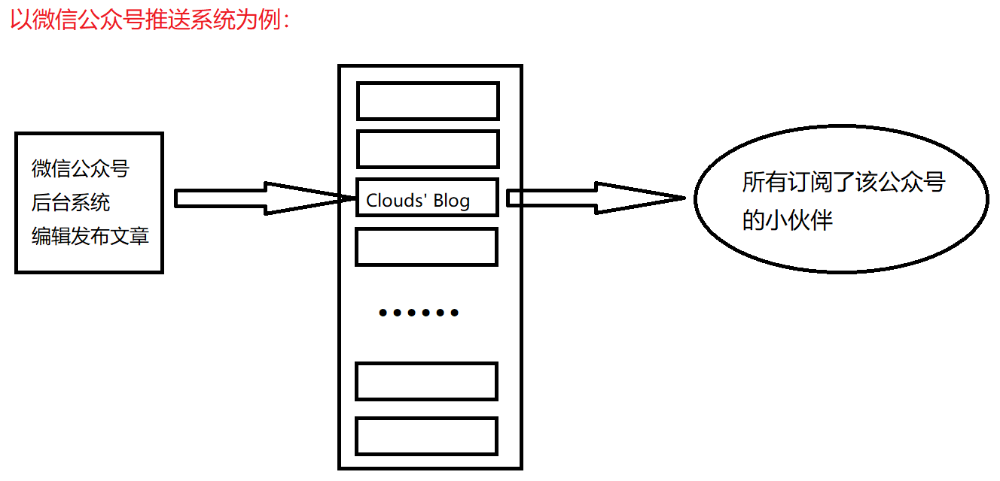

### 12.5.4 主从复制

**主从复制的概念**：是指将一台Redis服务器的数据，复制到其他的Redis服务器。前者称为主节点（master/leader），后者称为从节点（slave/follower）；数据的复制的单向的，只能由主节点到从节点；master以写为主，salve以读为主。默认情况下，每台Redis服务器都是主节点；且一个主节点可以有多个从节点（或没有从节点），但一个从节点只能有一个主节点。

**主从复制的作用**：

1. 数据冗余：主从复制实现了**数据的热备份**，是持久化之外的一种数据冗余方式。
2. 故障恢复：当主节点出现问题时，可以由从节点提供服务，实现快速的故障恢复；实际上是一种**服务的冗余**。
3. 负载均衡：在主从复制基础上，配合**读写分离**，可以由主节点提供写服务，由从节点提供读服务（即写Redis数据时应用连接主节点，读Redis数据时应用连接从节点），分担服务器负载。尤其是在写少读多的场景下，通过多个从节点分担读负载，可以大大提高Redis服务器的并发量。
4. 高可用基石：除了上述作用外，主从复制还是哨兵模式和集群能够实施的基础。

**为什么要使用Redis集群**：

1. 从结构上，单个Redis服务器会发生单点故障；并且一台服务器需要处理所有的请求负载，压力较大。
2. 从容量上，单个Redis服务器内存容量有限，就算一台Redis服务器内存容量为256G，也不能将所有内存用作Redis存储内存（一般来说，单台Redis最大使用内存不应超过20G）。

**主从复制使用场景**：例如电商网站上的商品，一般都是一次上传、无数次浏览（即读写少多），这是应该使用主从复制来进行读写分离。主从复制至少需要3台Redis服务器（1主2从）搭建集群。

Redis集群的搭建步骤如下：

```yaml
# 主从复制只需配置从库，不用配置主库（默认即是主库）
info replication  # 查看当前库主从复制的信息

# 1. 复制多个Redis.conf文件并编辑相应配置
### 1.1 修改端口号
### 1.2 修改pidfile（与端口号同步）
### 1.3 修改logfile
### 1.4 修改dbfilename
# 2. 启动多个Redis服务：redis-server config文件
# 3. 主从配置，搭建集群：
### 3.1 在需要作为从机的服务器上使用命令行配置：SLAVEOF host port
### 3.2 也可以在从机的配置文件中配置主机的ip地址和端口号：replicaof <masterip> <masterport>
### 3.3 若主机有密码，在从机的配置文件中需配置密码：masterauth <master-password>

# Linux相关知识
## 1. 启动后可以采用ps -ef|grep redis查看进程信息
## 2. 在进程中可以使用shutdown（是Redis的命令）
## 3. 在linux系统中（非程序进程中）可以使用shutdown关机、使用"kill 端口号"杀死进程
```

**集群使用注意事项**：

1. 真实的主从配置应该在配置文件中配置（这样才是永久生效的），使用命令`SLAVEOF host port`配置是暂时的。
2. 主机可以写，从机不可写只能读。主机中的所有信息和数据，都会自动被从机保存。
3. 若主机断开连接，从机依旧会连接到主机，但是没有写操作；若主机重新回来，从机依旧可以直接获取到主机写的信息。
4. 通过命令行配合的主从关系，若从机断开连接，重新会变回主机；只要再次变为从机，立马就会从主机中获取值。

**主从复制的原理**：

1. slave启动成功连接到master后会发送一个sync同步命令。
2. master接到命令后会启动后台的存盘进程，同时收集所有接收到的用于修改数据集的命令；在后台进程执行完毕之后，master将传送整个数据文件到salve，并完成一次完全同步。
3. 全量复制：slave在接收到数据库文件数据后，将其存盘并加载到内存中。
4. 增量复制：master继续将新的所有收集到的修改命令依次传给slave，完成同步。
5. 只要重新连接master，一次完全同步（全量复制）将被自动执行。

**宕机后手动配置主机**：层层链路模式下（**主机1-->从机1，主机1-->从机2，从机1-->从机2**：即从机1既是主机1的从机，也是从机2的主机；从机2既是主机1的从机，又是从机1的从机），若主机1断开，系统并不会主动挑选从机1作为主机，需要在从机1中使用命令"谋权篡位"成为新的主机（命令：`SLAVEOF no one`）；若主机1修复，不会重新连接从机1和从机2。（**了解即可，工作中会使用哨兵模式解决这一问题**）

### 12.5.5 哨兵模式

**哨兵（Sentinel）模式**：`12.5.4`所述主从切换的瓶颈在于，当主机宕机后，需要手动将一台从机配置成主机，这就需要人工干预，费时费力，还会造成一段时间内服务不可用。在工作方式中，会优先使用哨兵模式来解决这一问题。**哨兵模式会依据投票数自动将从机变为主机**。**哨兵是一个独立的进程，会独立运行**；哨兵通过发送命令，等待Redis服务器的响应，从而监控运行的多个Redis实例（**哨兵可以类比于调度中心**）。

**哨兵模式原理**：若主服务器宕机，哨兵1先检测到这个结果，系统并不会马上进行failover过程，仅仅是哨兵1主观地认为主服务器不可用，这个现象称为**主观下线**。当后面的哨兵也检测到主服务器不可用，并且数量达到一定值时，那么哨兵之间就会进行一次投票，投票的结果由一个哨兵发起，进行failover（故障转移）操作。切换成功后，就会通过发布订阅模式，让各个哨兵把自己监控的从服务器实现切换主机，这个过程称之为**客观下线**。**若宕机的主机在客观下机后又重新恢复，只能归并到新的主机下，当作从机使用了**。

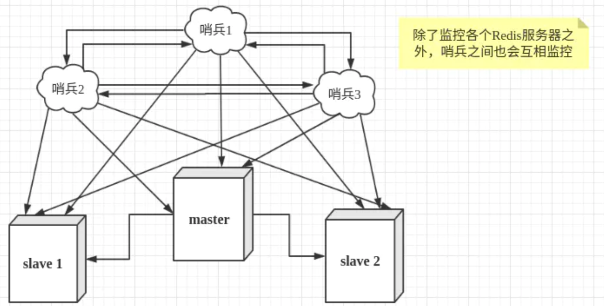

配置哨兵的步骤如下：

```yaml
# 12.5.4节中Redis集群搭建[续]
# 4. 配置哨兵：
### 4.1 创建哨兵的配置文件：sentinel.conf
### 数字1表示当1个哨兵统一认为master主节点失联，那么这时客观上就认为主节点失联了
### 4.2 配置哨兵：SENTINEL MONITOR 主节点名称名 被监控机器的IP地址 被监控机器的端口号 1 
# 5. 启动哨兵：redis-sentinel 配置文件名
```

**哨兵模式的优点**：

1. 哨兵集群，基于主从复制模式，所有的主从配置优点，它全有。
2. 主从可以切换、故障可以转移，系统的可用性会更好。
3. 哨兵模式就是主从模式的升级，手动到自动，更加健壮。

**哨兵模式的缺点**

1. Redis不好在线扩容，集群容量一旦到达上限，在线扩容就十分麻烦。
2. 实现哨兵模式的配置很麻烦，里面有很多选择。

哨兵模式的全部配置如下：

```yaml
# 1. 哨兵sentinel实例运行的端口：port 26379
# 2. 哨兵sentinel的工作目录：dir /tmp
# 3. 配置哨兵监控Redis节点：sentinel monitor <master-name> <ip> <redis-port> <quorum>
# 4. 设置哨兵连接主从的密码：sentinel auth-pass <master-name> <password>
# 5. 指定多少毫秒之后，主节点没有答应哨兵时，此时哨兵主观上认为主节点下线：
	sentinel down-after-milliseconds <master-name> <milliseconds>
# 6. 设置在发生failover主从切换时，最多可以有多少个salve可以同时对新的master进行同步：
	sentinel parallel-syncs <master-name> <numslaves>
# 7. 设置故障转移的超时时间：sentinel failover-timeout <master-name> <milliseconds>
# 8. 设置通知脚本（当出现故障时可以发送邮件通知相关人员）：sentinel notification-script <master-name> <script-path>
# 9. 当master由于failover而发生改变时，这个脚本将会执行通知客户端关于master地址已经发生改变：
	sentinel client-reconfig-script <master-name> <script-path>
```

### 12.5.6 缓存穿透与雪崩

> **缓存穿透（查不到）** ：用户想要查询一个数据，发现Redis内存数据库中没有，也就是缓存没有命中；于是向持久层数据库查询，发现也没有，于是本次查询失败。当用户很多的时候，缓存都没有命中，于是都去请求了持久层数据库，这会给持久层数据库造成很大的压力，这个时候就相当于出现了缓存穿透。

**缓存穿透的解决方案**：

1. **使用布隆过滤器**：布隆过滤器是一种数据结构，对所有可能查询的参数以hash形式存储，在控制层先进行校验，不符合则丢弃，从而避免了对底层存储系统的查询压力。

2. **缓存空对象**：当存储层不命中后，即使返回的空对象也将其缓存起来，同时会设置一个过期时间，之后再访问这个数据将会从缓存中获取，保护了后端数据源。这种方法存在两个问题：一是浪费存储空间、二是缓存层和存储层的数据会有一段时间窗口的不一致，对于需要保持一致性的业务会有影响。

> **缓存击穿（量太大）**：缓存击穿是指当某个key在过期的瞬间，有大量的请求并发访问，这类数据一般是热点数据，由于缓存过期，会同时访问数据库来查询最新数据，并且回写缓存，会导致数据库瞬间压力过大。

**缓存击穿的解决方案**：

1. **设置热点数据永不过期**：从缓存层面来看，没有设置过期时间，所以不会出现热点key过期后产生的问题。
2. **加互斥锁**：使用分布式锁，保证对于每个key同时只有一个线程去查询后端服务，其他线程没有获得分布式锁的权限，因此只需要等待即可。这种方式将高并发的压力转移到了分布式锁，因此对分布式锁的考验很大。*

> **缓存雪崩**：指在某一个时间段，缓存集中过期失效，这是产生雪崩的原因之一；缓存服务器的某个节点宕机或断网，这是产生雪崩的原因之二。

**缓存雪崩的解决方案**：

1. **Redis高可用**：既然Redis有可能挂掉，那就多增设几台Redis，这样一台挂掉之后其他的还可以继续工作，其实就是搭建Redis集群（异地多活）。
2. **限流降级**：在缓存失效后，通过加锁或者队列来控制读数据库写缓存的线程数量。比如对某个key只允许一个线程查询数据和写缓存，其他线程等待（消息中间件如RabbitMQ、Kafka都可以实现）。
3. **数据预热**：在正式部署前，先把可能的数据预先访问一遍，这样部分可能大量访问的数据就会加载到缓存中。在即将发生大并发访问前手动触发加载缓存不同的key，设置不同的过期时间，让缓存失效的时间点尽量均匀。

## 12.6 本项目中的应用

### 12.6.1 高速缓存


### 12.6.2 统计网站UV/PV


> 参考博客文章：**[Redis命令参考](http://doc.redisfans.com/index.html)**、**[B站Redis视频](https://www.bilibili.com/video/BV1S54y1R7SB?from=search&seid=5939754712593162694)**、**[Redis深度历险-钱文品]()**、[Redis中文网站](https://www.redis.net.cn/)、[Redis菜鸟教程](https://www.runoob.com/redis/)


# 13 博客搜索

本项目中的博客搜索功能采用ElasticSearch来完成。

## 13.1 关于ElasticSearch

Lucene、hadoop、mapreduce、Hbase都是出自Doug Cutting。ElasticSearch是基于Lucene封装和增强的一个开源的高扩展的分布式全文检索引擎，可以近乎实时的存储、检索数据；本身扩展性很好，可以扩展到上百台服务器，处理PB级别的数据；ElasticSearch通过简单的RESTful API来隐藏Lucene的复杂性，从而让全文搜索变得更加简单。在2016年1月，ElasticSearch超过Solr（也是基于Lucene封装的），成为排名第一的搜索引擎类应用。

使用ElasticSearch的公司：维基百科、Stack Overflow、GitHub、电商网站、**商品价格监控系统**（做完本博客项目后拟开发一个这个小功能使用）...

**ElasticSearch VS Solr**：

1. ElasticSearch基本是开箱即用（解压缩即可使用），但相对于Solr较新；Solr安装略微复杂一些，但拥有更大的用户群、更稳定，生态系统更加发达。
2. ElasticSearch自身带有分布式协调管理功能；而Solr利用Zookeeper进行分布式管理。
3. ElasticSearch仅支持JSON文件格式；而Solr支持更多格式的数据（如JSON、XML、CSV）。
4. ElasticSearch本身更注重于核心功能，高级功能多由第三方插件提供（例如图形化界面需要Kibana友好支撑）；Solr官方提供的功能更多。
5. ElasticSearch处理实时搜索时效率更高；Solr对已有数据进行搜索时速度更快，但当实时建立索引时，会产生IO阻塞，查询性能较差。此外，随着数据量的增加，Solr的搜索效率会变得更低，而Elasticsearch却没有明显的变化。
6. Elasticsearch常用于查询、过滤和分组分析统计，而Solr则专注于文本搜索。

**ElasticSearch的配置文件**：

```yaml
config/log4j2.properties  # 日志配置文件
config/jvm.options  # java虚拟机相关配置（其中默认虚拟机内存为1g(-Xms1g),若阿里云机器配置低，需要修改jvm.options文件）
config/elasticsearch.yml  # yml配置文件(包括集群配置，网络配置(默认端口是9200)、网关信息、跨域配置...)
```

**注意**：

1. 使用可视化组件ElasticSearch Head工具时存在跨域问题，需要在`config/elasticsearch.yml`文件中进行如下配置：

```yaml
# ElasticSearch配置跨域
http.cors.enabled: true
http.cors.allow-origin: "*"
```

2. 可以把ElasticSearch Head当作数据展示工具，查询使用Kibana工具。

**ELK**：不仅仅是日志分析架构技术栈（只是日志分析和收集更具代表性），还能支持任何数据分析和收集的场景。

1. ELK指ElasticSearch + Logstash + Kibana三大开源框架的简称，也被称为Elastic Stack。
2. ElasticSearch是一个基于Lucene、分布式、通过RESTful方式进行交互的近实时搜索平台框架。
3. Logstash是ELK的中央数据流引擎，用于从不同目标（文件/数据存储/MQ）收集的不同格式数据，经过过滤后支持输出到不同目的地（文件/MQ/Redis/ElasticSearch/Kafka等）
4. Kibana可以将ElasticSearch的数据通过友好的页面展示出来，提供实时分析的功能。

**测试工具**：Postman、curl、Head、谷歌浏览器插件、Kibana（**这里使用Kibana作为测试工具**）

**Kibana汉化**：

```yaml
# 在config/kibana.yml中配置国际化
i18n.locale: "zh-CN"
```

## 13.2 基本使用

### 13.2.1 基本概念

基本概念：**集群、节点、索引、类型、文档、分片、映射**

RDB（Relational DB） VS ElasticSearch

|   Relational DB    |          ElasticSearch          |
| :----------------: | :-----------------------------: |
| 数据库（database） |   索引（indices）：就是数据库   |
|    表（tables）    | 类型（types）：类型是文档的容器 |
|     行（rows）     |        文档（documents）        |
|   列（columns）    |         字段（fields）          |

**倒排索引**（例子如下）：

| 博客文章（原始数据） |             | 索引列表（倒排索引） | |
| :--: | :--: | :--: | :--: |
| 博客文章ID | 标签 | 标签 | 博客文章ID |
| 1 | python | python | 1,2,3 |
| 2 | python | linux | 3,4 |
| 3 | linux、python | | |
| 4 | linux | | |

**ElasticSearch索引与Lucene索引的区别**：在ElasticSearch中，索引被分为多个分片、每份分片是一个Lucene的索引。因此，一个ElasticSearch索引是由多个Lucene索引组成的（如无特指，一般索引指ElasticSearch索引）。

### 13.2.2 IK分词器

分词：把一段文字分成一个个的关键词。在搜索的时候会把索引库中的数据进行分词，然后进行匹配操作；默认的中文分词是将每个字看成一个词，这不符合实际应用，中文分词器IK可以解决这一问题。

IK提供了两个分词算法：ik_smart和ik_max_word，其中ik_smart为最少切分，ik_max_word为最细粒度划分（穷尽词库的可能）。

**配置自定义的词库**：

```yaml
# 1. 在IK分词器的config目录下自定义词库文件（.dic文件）：
	config/Clouds.dic
# 2. 将自定义词库文件引入config/IKAnalyzer.cfg.xml文件中：
	config/IKAnalyzer.cfg.xml
```

`IKAnalyzer.cfg.xml`文件配置如下：

```xml
<?xml version="1.0" encoding="UTF-8"?>
<!DOCTYPE properties SYSTEM "http://java.sun.com/dtd/properties.dtd">
<properties>
	<comment>IK Analyzer 扩展配置</comment>
	<!--用户可以在这里配置自己的扩展字典 -->
	<entry key="ext_dict">Cloud.dic</entry>
	 <!--用户可以在这里配置自己的扩展停止词字典-->
	<entry key="ext_stopwords"></entry>
	<!--用户可以在这里配置远程扩展字典 -->
	<!-- <entry key="remote_ext_dict">words_location</entry> -->
	<!--用户可以在这里配置远程扩展停止词字典-->
	<!-- <entry key="remote_ext_stopwords">words_location</entry> -->
</properties>
```

### 13.3.3 REST风格

REST是一种软件架构风格，而不是标准；只是提供了一组设计原则和约束条件。它主要用于客户端和服务器交互类的软件。基于这个风格设计的软件可以更简洁、更有层次，更易于实现缓存等机制。

基本的REST命令如下（可结合`2.5`节）：

| method |                     url地址                     |          描述          |
| :----: | :---------------------------------------------: | :--------------------: |
|  PUT   |     localhost:9200/索引名称/类型名称/文档id     | 创建文档（指定文档id） |
|  POST  |        localhost:9200/索引名称/类型名称         | 创建文档（随机文档id） |
|  POST  | localhost:9200/索引名称/类型名称/文档id/_update |        修改文档        |
| DELETE |     localhost:9200/索引名称/类型名称/文档id     |        删除文档        |
|  GET   |     localhost:9200/索引名称/类型名称/文档id     |   查询文档通过文档id   |
|  POST  |    localhost:9200/索引名称/类型名称/_search     |      查询所有数据      |

### 13.3.4 索引/文档增删改查

关于es中的字段类型：

- 字符串类型：text、keyword
- 数值类型：long、integer、short、byte、double、float、half float 、scaled float
- 日期类型：data
- 布尔类型：boolean
- 二进制类型：binary

关于索引的基本操作：

- **创建索引（不指定字段类型）并添加数据**：

```json
PUT /索引名/~类型名~/文档id
{
  // 这里输入文档id对应的文档数据
}
```

- **创建索引（指定字段类型）**：

```json
PUT /索引名
{
  "mappings": {
    "properties": {
      // 这里指定字段类型
    }
  }
}
```

- **获取索引信息**

```json
// 获取索引信息
GET /索引名
// 获取文档信息
GET /索引名/~类型名~/文档id
```

- **创建索引（不指定字段类型）**：

```json
// 创建索引时未指定字段类型，那么es就会进行智能推断
PUT /索引名/_doc/文档id  //_doc表示不使用文档类型（es7/es8会渐渐抛弃掉文档类型）
{
  // 这里输入文档id对应的文档数据
}
```

- **使用PUST修改文档数据**：以前采用这种方法

```json
// 使用PUST命令修改已存在的文档数据，修改完成后version会增加1
PUT /索引名/~类型名~/已存在的文档id
{
  // 这里输入文档id对应的文档数据
}
```

- **使用POST修改文档数据**：现在一般采用这种方法。（**与PUT方法的区别**：PUT方法更新数据，如果不传递值，就会被覆盖未空，现在一般推荐使用POST修改文档数据）

```json
// 使用POST命令修改已存在的文档数据，修改完成后version会增加1
POST /索引名/~类型名~/已存在的文档id/_update
{
   // 这里输入文档id对应的文档数据
}
```

- **删除索引或文档**：

```json
// 使用DELETE命令删除索引
DELETE /索引名
// 使用DELETE命令删除指定id的文档
DELETE /索引名/~类型名~/已存在的文档id
```

### 13.3.5 文档复杂查询

复杂查询：匹配、条件匹配、精确匹配、区间范围匹配、匹配字段过滤、多条件查询、高亮查询。

```json
// 若字段的fields的type为"keyword"，则分词器不会起作用，会采用精确查询
GET /索引名/~类型名~/_search?q=查询条件  // 例查询条件为：name:张三

// 如果条件比较复杂，会采用下面的这种形式
GET /索引名/~类型名~/_search
{
   "query": { // query表示查询条件
       "match": { // match表示精确匹配（还有许多其他匹配模式）
           "name": "张三" // 具体条件
       }
   },
   "_source": ["name", "desc"],  // 过滤结果：只显示查询结果中的name和desc信息
   "sort": [
      {
         "age": {
            "order": "asc" // 表示按照age升序排列
         }
      }
   ],
   "from": 0, // from和size一起设置分页查询，from表示从第几条数据开始，size表示返回多少条数据，等价于MySQL中的limit start pageSize
   "size": 1
}

// 布尔查询、过滤数据
GET /索引名/~类型名~/_search
{
   "query": { // query表示查询条件
       "bool": { // 布尔查询，可以实现多条件精确查询
           "must": [ // must相当于MySQL里的add;should相当于MySQL里的or;must_not相当于MySQL里的not
              {
                 "match": {
                    "name": "张三"
                 }
              },
              {
                 "match": {
                    "age": 3
                 }
              }
           ],
          "filter": [
             "range": {
              	"age": {
              	  "gte": 10, // 过滤数据：大于等于10岁且小于等于25岁的结果才显示
              	  "lte": 25
              	}
            }
          ]
       }
   }
}


// 多条件查询
GET /索引名/~类型名~/_search
{
   "query": { // query表示查询条件
       "match": { // match表示精确匹配（还有许多其他匹配模式）
           "tags": "男 技术" // 多个条件使用空格隔开，只要满足其中一个结果即可被查出，这个时候可以通过分值进行基本的判断
       }
   }
}

// 精确查询请使用term查询
// term查询是采用倒排索引进行查询的，效率很高
// term查询与match查询：term查询会直接查询精确的结果；而match查询会使用分词器解析（先分析文档，再通过分析的文档进行查询）
// text类型与keyword类型：text类型会被分词器解析，而keyword类型不会被分词器解析
GET _analyze
{
  "analyzer": "keyword", // 设置"Java study"在被查询时不会进行分词匹配
  "text": "Java study"
}
GET _analyze
{
  "analyzer": "standard", // 设置"python study"在被查询时会进行分词匹配
  "text": "python study"
}

// 精确查询多个值
GET /索引名/_search
{
   "query": {
      "bool": {
         "should": [
            {
               "term": {
                  "name": "张三"
               }
            },
            {
               "term": {
                  "name": "李四"
               }
            }
         ]
      }
   }
}

// 高亮查询
GET /索引名/~类型名~/_search
{
   "query": {
      "match": {
         "name": "张三"
      }
   },
   "hightlight": {
      "pre_tags": "<p class="className" style='color:red'>", // 若不想使用默认的<em>标签，可以自定义高亮条件
      "post_tags": "</p>",
      "fields": {
         "name": {} // name字段会高亮，高亮的字段默认会被<em>标签包裹
      }
   }
}
```

## 13.3 API使用

**注意事项**：一定要保证导入的依赖与使用的ElasticSearch的客户端版本一致。

### 13.3.1 索引API

```java
// 1. 引入依赖（保证与使用的ElasticSearch的客户端版本一致），这里略
// 2. 创建ElasticSearchConfig.java配置类

```


### 13.3.2 文档API


> 参考文章博客：[B站 ElasticSearch视频](https://www.bilibili.com/video/BV17a4y1x7zq)、[Java High Level REST Client官方文档](https://www.elastic.co/guide/en/elasticsearch/client/java-rest/current/java-rest-high.html#java-rest-high)

# 14 使用消息队列


# 15 关于Netty


# 16 关于Nginx

## 16.1 反向代理与负载均衡


## 16.2 防盗链操作


# 17 测试与改进

## 17.1 并发压力测试


## 17.2 程序调优


# 18 开发过程的坑

## 18.1 @Resource与@Autowired

@AutoWried按by type自动注入，而@Resource默认按byName自动注入。

**问题描述：**IDEA的纠错机制在解析Spring通过类型约定的方式进行配置时，支持的并不是太好，而用Autowired注入时IDEA会报错（虽然运行时不会报错，但是观感不好）。

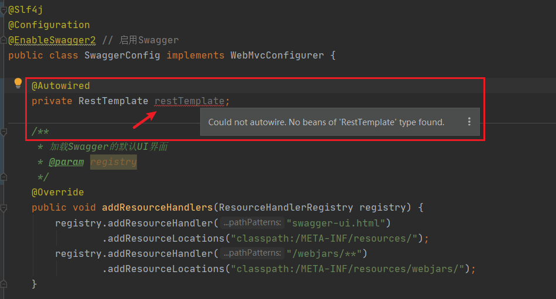

**解决办法：**使用@Resource注解注入IDEA即不会报错。

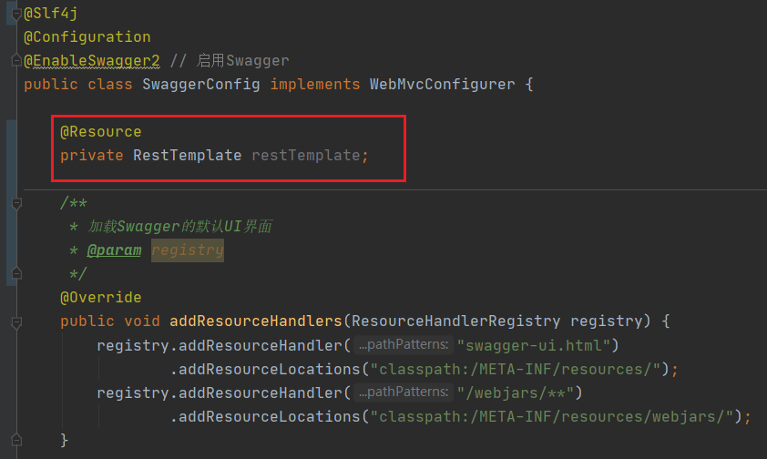

> 参考博客文章：[@AutoWired和@Resource的区别](https://blog.csdn.net/weixin_40423597/article/details/80643990)

## 18.2 Test测试下@Autowired失效

**问题描述**：SpringBoot在Test测试类或自定义类中通过@Autowired注入为null。

**解决办法**：暂停自动热部署，在测试类上加上`@RunWith(SpringRunner.class)`和`@SpringBootTest`注解，正常注入bean，然后开始使用Junit正常测试即可。**目前还未发现在自动热部署时执行自动化测试的方法。**

## 18.3 java.util.Date和java.sql.Date

- java.util.Date 是 java.sql.Date 的父类。
- java.util.Date是常用的表示时间的类，通常格式化或者得到当前时间都是采用java.util.Date；java.sql.Date常用在读写数据库的时候，用于数据库的时间字段。
- java.util.Date用于一般环境都可，而java.sql.Date主要用于sql中。

## 18.4 MySQL表中id自增问题

**问题描述**：MySQL表中删除自增id数据后，再次添加数据时，id不会毗邻。例如：

1. 初始数据中id=1、2、3、4；
2. 删除id=4的数据后，id=1、2、3；
3. 再次插入数据，id=1、2、3、5；而我们理想的数据是：id=1、2、3、4。

**解决办法：**插入数据之前先执行：`ALTER TABLE table_name AUTO_INCREMENT = 1`

## 18.5 Redis单机多实例

**问题描述**：由于多个项目同时跑在本机上，Redis需要同时运行多个实例。

**解决办法**：先在`redis.windows.conf`中配置端口号；使用`redis-cli.exe`查看某一实例的缓存：

> 参考博客文章：[Redis部署及开启多个端口服务](https://blog.csdn.net/weixin_42290280/article/details/89158513)

## 18.6 IDEA Debug的深入使用

- **Step Over：**步过调试。作用：步过，一行一行往下走，若这一行上有方法**不会进入方法**；常用于调试过程中不想进入调用的方法体的情况。
- **Setp Into：**步入调试。作用：步入，一步一步往下执行，若这一行上有方法，则**进入方法内部**；一般用于进入自定义方法内，不会进入官方类库的方法。
- **Force Step Into：**强制步入调试。作用：**进入官方类库方法**；常用于我们学习和查看JDK源码。
- **Step Out：**步出调试。作用：**从方法内退出到方法调用处**；常用于调试时跳入到自己不想查看的方法体内后，可以使用步出。
- **Drop Frame：**回退断点。作用：**回退到当前方法的调用处**；当想重新查看该方法体的执行过程时，不用重新启动Debug，可以使用回退断点方式。
- **Run to Cursor：**运行到光标处。作用：**使程序运行到光标处，而无需设置断点**。
- **Evaluate Expression...：**计算表达式。作用：设置变量，在计算表达式里，可以**改变变量的值**，这样有时候就能很方便我们去调试各种值的情况。
- **条件断点：**右键单击断点处，可以**设置进入断点的条件**。
- **View Breakpoints：**可以对断点进行管理。作用：可以用来**一键清除所有断点**。

在IDEA中可以设置Step时忽略哪些包：

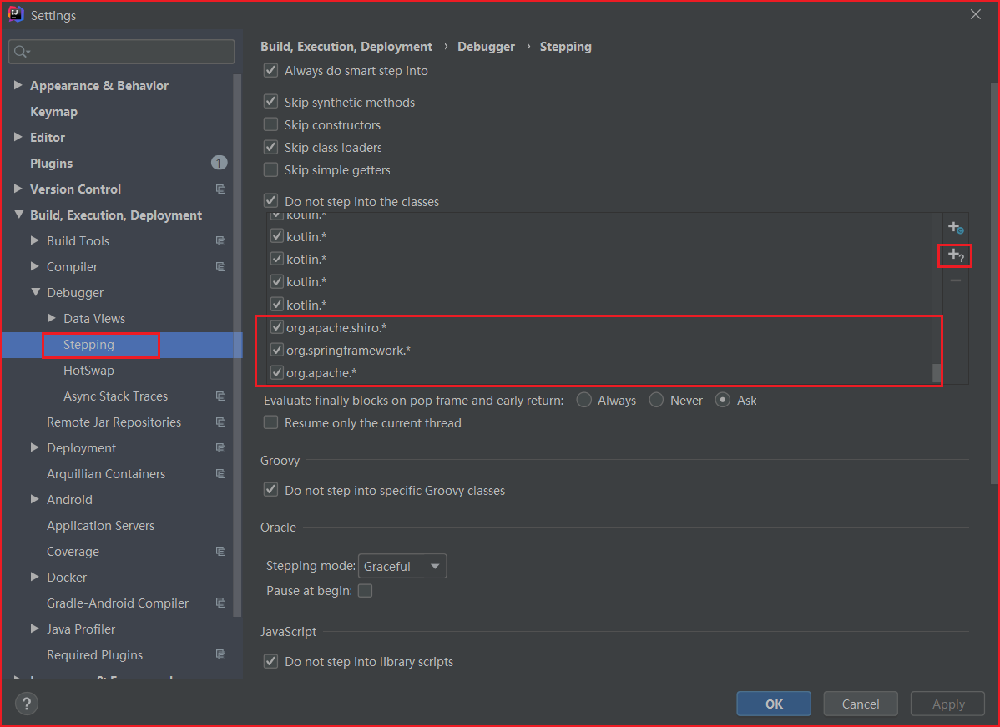

## 18.7 字符串与json字符串Bug

**问题描述：**从Redis中将数据取回后使用工具类将其转换为json字符串报错（大概意思是字符串解析出错了）。

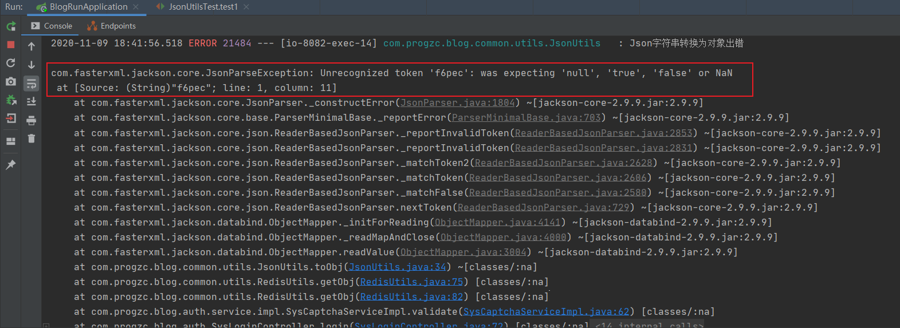

**解决办法：**需要注意普通字符串与json字符串有着本质的区别（如"zhangsan"是一个字符串；"{name: 'zhangshan', age: '15'}"是json字符串），json工具类只能将json字符串转化为对象，针对字符串转化为对象会报异常。为此，我选择在Redis工具类中对其做一次过滤操作。关键代码如下：

```java
/**
 * String类型设置key-vue及过期时间
 */
public void set(String key, Object value, long expire) {
    // 若是字符串则直接存储；若是对象先转化为json字符串再存储
    if (value.getClass() == String.class){
        valueOperations.set(key, value);
    } else {
        valueOperations.set(key, JsonUtils.toJson(value));
    }

    if (expire != NOT_EXPIRE) {
        redisTemplate.expire(key, expire, TimeUnit.SECONDS);
    }
}

/**
 * String类型根据key获取value,同时设置过期时间
 */
public <T> T getObj(String key, Class<T> clazz, long expire) {
    String value = (String)valueOperations.get(key);
    if (expire != NOT_EXPIRE) {
        redisTemplate.expire(key, expire, TimeUnit.SECONDS);
    }

    // 若获取的是字符串，直接返回即可；若获取的是对象，则将json字符串转化为对象再返回
    return clazz == String.class ? (T) value : JsonUtils.toObj(value, clazz);
}
```

## 18.8 Redis中的缓存策略

- 验证码
  1. 写入验证码时设置**5分钟**过期。（写入时若未设置过期时间，则默认设置过期时间为1天，不过程序已经明确写过）
  2. 验证码校验之后（无论校验成功与否），都要从缓存中删掉。
  3. 读取验证码时不设置过期时间。

- 用户token与用户id
  1. 写入用户token与用户id时设置**12h**过期。（写入时若未设置过期时间，则默认设置过期时间为1天）
  2. 

## 18.9 json字符串转化为集合

本项目采用jackson（由谷歌开发）实现json字符串与Object的相互转换（**阿里巴巴的fastjson速度更快**），其中一个难点是如何实现json字符串转化为集合，本人采用以下方案：

- 第1步：先从Redis获取json字符串。
- 第2步：再从json字符串转化为集合。

测试代码如下：

```java
// JsonUtils.java（Json字符串与Object互相转换的工具类）

@Slf4j
public class JsonUtils {

    private static ObjectMapper objMapper = new ObjectMapper();

    /**
     * Json字符串转换为Object（不包含集合）
     */
    public static <T> T toObj(String jsonString, Class<T> clazz) {
        objMapper.configure(DeserializationFeature.ACCEPT_SINGLE_VALUE_AS_ARRAY, true);
        try {
            return objMapper.readValue(jsonString, clazz);
        } catch (IOException e) {
            log.error("Json字符串转换为对象出错", e);
        }
        return null;
    }

    /**
     * Object（包含集合）转换为Json字符串
     */
    public static String toJson(Object obj) {
        if (obj instanceof Integer || obj instanceof Long || obj instanceof Float ||
                obj instanceof Double || obj instanceof Boolean || obj instanceof String) {
            return String.valueOf(obj);
        }
        try {
            return objMapper.writeValueAsString(obj);
        } catch (JsonProcessingException e) {
            log.error("对象转换为Json字符串出错", e);
        }
        return null;
    }

    /**
     * json字符串转化为Collection<JavaBean>
     */
    public static <T,E> T toObjArray(String jsonString, Class<T> collectionClass, Class<E>... elementClasses){
        try {
            JavaType javaType = objMapper.getTypeFactory().constructParametricType(collectionClass, elementClasses);
            return objMapper.readValue(jsonString, javaType);
        } catch (IOException e) {
            log.error("json字符串转化为集合出错", e);
        }
        return null;
    }
}

// RedisUtilsTest.java（Redis工具类测试）
@RunWith(SpringRunner.class)
@SpringBootTest
public class RedisUtilsTest {

    @Autowired
    private RedisUtils redisUtils;

    /**
     * 测试集合
     */
    @Test
    public void test5(){
        List<SysLoginForm> list = new ArrayList<>();
        for (int i = 0; i < 4; i++) {
            SysLoginForm sysLoginForm = new SysLoginForm();
            sysLoginForm.setCaptcha("abcde" + i);
            sysLoginForm.setUsername("admin" + i);
            sysLoginForm.setPassword("admin" + i);
            sysLoginForm.setUuid("uuid" + i);
            list.add(sysLoginForm);
        }
        redisUtils.set("abc3", list, 60*5L);
        // 第1步：先从Redis获取json字符串
        String str5 = redisUtils.getObj("abc3", String.class);
        // 第2步：再从json字符串转化为集合
        ArrayList<SysLoginForm> queryList = JsonUtils.toObjArray(str5, ArrayList.class, SysLoginForm.class);
        queryList.forEach(System.out::println);
    }
}
```

## 18.10 自定义HTML属性

**问题描述：**一些vue元素的属性添加到HTML中，IDEA不识别，频繁警告。

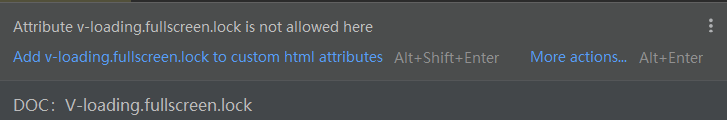

**解决办法：**可以在IDEA中自定义HTML属性，消除警告。


## 18.11 流式计算与链式编程

**Stream流式计算的特点：**

- Stream不会改变源对象，会返回一个新的Stream。
- Stream中的操作是延时执行。

**Stream流式计算的使用步骤：**

1. **创建流**

   - 通过Collection对象的stream()或parallelStream()方法。

   - 通过Arrays的stream()方法。

   - 通过Stream接口的of()、iterate()、generate()方法。

   - 通过IntStream、LongStream、DoubleStream接口中of()、range()、rangeClosed()等方法。

     ```java
     public class StreamTest {
         public static void main(String[] args) {
             ArrayList<String> arrayList = new ArrayList<>();
             arrayList.add("北京");
             arrayList.add("上海");
             arrayList.add("北京");
             
             // 1 通过Collection对象的stream()或parallelStream()方法
             Stream<String> stream1 = arrayList.stream();
     
             // 2 通过Arrays的stream()方法
             IntStream stream2 = Arrays.stream(new int[]{5, 2, 0, 1, 3, 1, 4});
     
             // 3 通过Stream接口的of()、iterate()、generate()方法
             // 3.1 of()
             Stream<String> stream3 = Stream.of("北京", "上海");        
             // 3.2 iterate() 无限迭代流
             Stream<Integer> iterate = Stream.iterate(1, x -> x + 1);
             // 3.3 generate() 无限生成流
             Stream<Integer> generate = Stream.generate(() -> new Random().nextInt(100));
             
             // 4 通过IntStream、LongStream、DoubleStream接口中of()、range()、rangeClosed()等方法
             // 4.1 InStream.of(): 生成数组
             IntStream intStream = IntStream.of(5, 2, 0, 1, 3, 1, 4);       
             // 4.2 InStream.range(): (0,100)
             IntStream range = IntStream.range(0, 100);        
             // 4.3 InStream.rangeClosed(): (0,100]
             IntStream rangeClosed = IntStream.rangeClosed(0, 100);
     }
     ```

2. **中间操作**

   - 如：sorted、filter、distinct、limit、skip、map、flatMap...（注意：forEach是终止操作）

   - **map和flatMap的区别**：map是一对一映射；flatMap是多对一映射

     ```java
     public class StreamTest {
         public static void main(String[] args) {
             ArrayList<String> arrayList = new ArrayList<>();
             arrayList.add("北京");
             arrayList.add("上海");
             arrayList.add("北京");
             arrayList.stream()
                     .sorted(String::compareTo) // 排序
                     .filter(s -> s.equals("北京")) // 过滤
                     .forEach(System.out::println); // 打印
         }
     }
     
     public class StreamTest2 {
         public static void main(String[] args) {      
             IntStream stream2 = Arrays.stream(new int[]{5, 2, 0, 1, 3, 1, 4});      
             stream2.sorted() // 排序: 可以自定义排序规则
                     .distinct() // 去重: 如果使用自定义对象，则需要重写hashCode与equals
                     .limit(5) // 限制生成个数
                     .skip(2) // 跳过
                     .forEach(System.out::println); // 打印
         }
     }
     
     public class StreamTest3 {
         public static void main(String[] args) {
             ArrayList<Student> arrayList = new ArrayList<>();
             arrayList.add(new Student("张", 21));
             arrayList.add(new Student("李", 20));
             arrayList.add(new Student("王", 25));
     
             arrayList.stream()
                     .map(Student::getName) // 映射: 获取所有人的名字
                     .forEach(System.out::println); // 打印
     
             // 并行流: 当操作多的时候，会开启多个流并行执行，提高效率
             arrayList.parallelStream();
             arrayList.stream().parallel();
         }
     }
     ```

3. **终止操作：**只有调用了终止操作，中间操作才会执行。

   - 如：forEach、min、max、count、reduce、collect、allMatch、anyMatch、noneMatch、findFirst、findAny...

     ```java
     public class StreamTest2 {
         public static void main(String[] args) {
             ArrayList<Student> arrayList = new ArrayList<>();
             arrayList.add(new Student("张", 21));
             arrayList.add(new Student("李", 20));
             arrayList.add(new Student("王", 25));
     
             // 遍历打印
             arrayList.stream().forEach(System.out::println);        
             // 求最小值
             // Optional: 保存对象的容器，防止空指针异常
             Optional<Student> min = arrayList.stream().min(Comparator.comparingInt(Student::getAge));
             System.out.println(min);
             // 求最大值
             Optional<Student> max = arrayList.stream().max(Comparator.comparingInt(Student::getAge));
             System.out.println(max);
             // 计算数量
             long count = arrayList.stream().count();
             System.out.println(count);
             // 规约
             Optional<Integer> reduce = arrayList.stream().map(Student::getAge).reduce(Integer::sum);// 统计所有年龄和
             System.out.println(reduce);
             // 收集
             List<String> collect = arrayList.stream().map(Student::getName)
                 .collect(Collectors.toList()); // 收集所有人的姓名
             System.out.println(collect);
         }
     }
     ```

> 参考博客文章：[Java8新特性之流式计算](https://blog.csdn.net/weixin_42193813/article/details/108087715?utm_medium=distribute.pc_relevant.none-task-blog-baidulandingword-2&spm=1001.2101.3001.4242)、**[JDK8新特性流式数据处理](https://blog.csdn.net/canot/article/details/52957262?utm_medium=distribute.pc_relevant.none-task-blog-BlogCommendFromMachineLearnPai2-2.add_param_isCf&depth_1-utm_source=distribute.pc_relevant.none-task-blog-BlogCommendFromMachineLearnPai2-2.add_param_isCf)**、[map和flatMap的区别](https://blog.csdn.net/weixin_39723544/article/details/97976604)

## 18.12 Lambda方法引用

**Lambda表达式的特点：**

1. 可选类型声明：不需要声明参数类型，编译器可以统一识别参数值。（也可以声明类型）
2. 可选的参数圆括号：一个参数无需定义圆括号，但多个参数需要定义圆括号。（无参数必须使用圆括号）
3. 可选的大括号：如果主体包含了一个语句，就不需要使用大括号。
4. 可选的返回关键字：如果主体只有一个表达式返回值则编译器会自动返回值，大括号需要指定明表达式返回了一个数值。

**Lambda表达式的使用形式：**

1. **省略花括号的代码块。**

2. **引用类方法：**函数式接口中被实现方法的全部参数传给该类方法作为参数。（例如：Arrays::stream）

   - 示例：类名::类方法。

   - 对应的Lambda表达式：(a,b,...)->类名.类方法(a,b,...)。

     ```java
     // 1. TestLambda添加一个静态方法
     public static boolean testHero(Hero h) {
        return h.hp>100 && h.damage<50;
     }
     
     // 2 filter是一个自定义方法，方法的第二个参数是一个函数式接口的实例
     // 2.1 Lambda表达式
     filter(heros, h->h.hp>100 && h.damage<50);
     // 2.2 在Lambda表达式中调用类方法
     filter(heros, h -> TestLambda.testHero(h) );
     // 2.3 进一步简化
     filter(heros, TestLambda::testHero);
     ```

3. **引用特定对象的实例方法：**函数式接口中被实现方法的全部参数传给该方法作为参数。（例如：Collection::stream）

   - 示例：特定对象::实例方法。

   - 对应的Lambda表达式：(a,b,...)->特定对象.实例方法(a,b,...)。

     ```java
     // 与引用类方法很类似，只是传递方法的时候，需要一个对象的存在
     TestLambda testLambda = new TestLambda();
     filter(heros, testLambda::testHero);
     ```

4. **引用某类对象的实例方法：**函数式接口中被实现方法的第一个参数作为调用者，后面的参数全部传给该方法作为参数。（例如：System.out::println）

   - 示例：类名::实例方法。

   - 对应的Lambda表达式：(a,b,...)->a.实例方法(b,...)。

     ```java
     // 与引用类方法很类似，引用类对象的实例方法
     filter(heros, Hero::matched);
     ```

5. **引用构造器：**函数式接口中被实现方法的全部参数传给该构造器作为参数。（例如：Student::New）

   - 示例：类名::new。

   - 对应的Lambda表达式：(a,b,...)->new 类名(a,b,...)。

     ```java
     // 引用构造器
     List list3 = getList(ArrayList::new);
     ```

**总结：**Lambda表达式一般与流式计算一起使用来实现链式编程的简化。

> 参考博客文章：[Lambda中的方法引用](https://blog.csdn.net/jeddzd/article/details/91973049)

## 18.13 LEFT JOIN...ON...

### 18.13.1 LEFT JOIN...ON...的使用

**LEFT JOIN...ON...：**把LEFT JOIN左边的表的记录全部找出来。系统会先用表A和表B做个笛卡儿积，然后以表A为基表，去掉笛卡儿积中表A部分为NULL的记录，最后形成你的结果。**进行左连接时，就有涉及到主表、辅表，这时主表条件写在WHERE之后，辅表条件写在ON后面**。

```SQL
#############################以下是数据源####################################
# 表a
table a(id, type):
id     type 
----------------------------------
1      1
2      1
3      2

# 表b
table b(id, class):
id    class 
----------------------------------
1      1
2      2

#############################执行SQL语句1###################################
SELECT a.*, b.* FROM a LEFT JOIN b ON a.id = b.id;1
#查询结果：
a.id    a.type    b.id    b.class
-----------------------------------
1        1         1        1
2        1         2        2
3        2
#############################执行SQL语句2###################################
# 这是比较常见的用法(主表条件写在WHERE之后，辅表条件写在ON后面)
select a.*, b.* from a left join b on a.id = b.id where a.type = 1; 
# 查询结果：
a.id    a.type    b.id    b.class
-----------------------------------
1        1         1        1
2        1         2        2
#############################执行SQL语句3###################################
# 后面的and未起作用，与SQL语句1执行结果相同(主表条件写在WHERE之后，辅表条件写在ON后面)
select a.*, b.* from a left join b on a.id = b.id and a.type = 1;
# 查询结果：
a.id    a.type    b.id    b.class
-----------------------------------
1        1         1        1
2        1         2        2
3        2
#############################执行SQL语句4###################################
# 后面的and起作用了，与SQL语句1执行结果不同(主表条件写在WHERE之后，辅表条件写在ON后面)
select a.*, b.* from a left join b on a.id = b.id and b.class = 1;
# 查询结果：
a.id    a.type    b.id    b.class
-----------------------------------
1        1         1        1
2        1
3        2
```

### 18.13.2 本项目中的使用

根据用户id查询权限：

```sql
# 思路：sys_user >>> sys_user_role >>> sys_role_menu >>> sys_menu
# 第一种方法：一次性查出
SELECT sm.perms FROM sys_user_role sur
LEFT JOIN sys_role_menu srm ON sur.role_id=srm.role_id
LEFT JOIN sys_menu sm ON srm.menu_id = sm.menu_id
WHERE sur.user_id = #{userId}

# 第二种方法：拆分多步查出
# 第一步：
SELECT sur.`role_id` FROM sys_user_role sur WHERE sur.user_id = 2
# 第二步：
SELECT srm.`menu_id` FROM sys_role_menu srm 
WHERE srm.`role_id` IN (SELECT sur.`role_id` FROM sys_user_role sur WHERE sur.user_id = 2)
# 第三步：最终结果
SELECT sm.`perms` FROM sys_menu sm 
WHERE sm.`menu_id` IN 
(SELECT srm.`menu_id` FROM sys_role_menu srm 
WHERE srm.`role_id` IN 
(SELECT sur.`role_id` FROM sys_user_role sur WHERE sur.user_id = 2))
```

**总结：**显然，使用LEFT...JOIN...ON...不仅更加容易理解和维护，而且运行效率也更高。

## 18.14 关于HTTP请求

### 18.14.1 Filter与Interceptor的区别

**Filter（过滤器）和Interceptor（拦截器）的区别：**

1. Filter是基于函数回调的，而Interceptor则是基于Java反射的。
2. Filter依赖于Servlet容器，而Interceptor不依赖于Servlet容器。
3. Filter对几乎所有的请求起作用，而Interceptor只能对action请求起作用。
4. Interceptor可以访问Action的上下文，值栈里的对象，而Filter不能。
5. 在action的生命周期里，Interceptor可以被多次调用，而Filter只能在容器初始化时调用一次。
6.  Filter和Interceptor的执行顺序：过滤前-->拦截前-->action执行-->拦截后-->过滤后。

### 18.14.2 关于OPTIONS请求

POST请求属于HTTP请求中的复杂请求，HTTP协议在浏览器中对复杂请求会先发起一次OPTIONS的预请求，发起OPTIONS请求常会报403错误。针对这种情况，通常是在DispacerServlet中没有找都到执行OPTIONS请求的方法。
在做跨域处理时，通常配置好跨域请求头信息后，常常忽略在Spring MVC中添加对OPTIONS请求的处理。 解决办法有三种：

1. 方法一：在Filter中添加对OPTIONS请求的支持处理；（需要搞清楚Filter过滤器和Interceptor拦截器的区别）。
2. 方法二：在Interceptor中添加对OPTIONS请求的支持处理。
3. 方法三：添加一个支持OPTIONS的ReqeuestMapping（即在控制器中对OPTIONS请求做处理）。

本项目采用的是第一种解决方案：在`Oauth2Filter.java`中放行OPTIONS请求。


# 19 提高编码效率

## 19.1 使用快捷键

根据实际编码经验，IDEA中常用的快捷键归纳如下：

|     快捷键      |                       释义                       |       快捷键        |                释义                |
| :-------------: | :----------------------------------------------: | :-----------------: | :--------------------------------: |
|  CTRL+SHIFT+Y   |                     即时翻译                     |      Shift+F10      |         启动SrpingBoot项目         |
|     Ctrl+I      |                  实现接口的方法                  |     Ctrl+Alt+L      |             格式化代码             |
|    Ctrl+F12     |                   调出类的方法                   |       Ctrl+Y        |           删除光标所在行           |
|    Alt+Enter    |               导入包，自动修正代码               |       Ctrl+D        | 复制光标所在行并插入在光标位置下面 |
|     Ctrl+/      |                     单行注释                     |    Ctrl+Shift+N     |              查找文件              |
|  Ctrl+Shift+/   |                     多行注释                     |  Ctrl+Shift+Alt+N   |           按照类名查找类           |
|      Alt+/      |                 自动代码补全提示                 |         TAB         |            整体向右缩进            |
|     Ctrl+B      |             快速打开光标处的类或方法             |      shift+TAB      |            整体向左缩进            |
|     Ctrl+E      |                  最近打开的文件                  | shift+alt +方向键上 |  选中代码（或者是光标所在行）上移  |
|     Ctrl+R      |                     替换文本                     | shift+alt +方向键下 |  选中代码（或者是光标所在行）下移  |
|     Ctrl+F      |                     查找文本                     |       Ctrl+G        |             定位行和列             |
|     Ctrl+P      |                   方法参数提示                   |    Ctrl+Shift+C     |          拷贝文件绝对路径          |
|   ALT+Insert    |          快速生成get、set和toString方法          |  Ctrl+Alt+Shift+C   |  拷贝相关数据（包括路径和所在行）  |
|   Ctrl+Alt+V    |          快速生成方法返回值，生成变量名          |    Ctrl+Shift+V     |          从历史记录中粘贴          |
|   Ctrl+Alt+T    | 选中代码块或者光标所在行，快速添加try...catch... |  Ctrl+Shift+Enter   |               新建行               |
| ALT+SHIFT+ENTER |                     抛出异常                     |  Ctrl+Alter+Enter   |         在当前行前面新建行         |
|  Ctrl+shift+F9  |                     重新编译                     |    Ctrl+Shift+U     |             大小写转换             |

## 19.2 实时代码模板

IDEA中的部分实时代码模块如下：

| 代码模板 |                    释义                    | 代码模板 |                      释义                       |
| :------: | :----------------------------------------: | :------: | :---------------------------------------------: |
|   psvm   |             快捷生成 main 方法             |   sout   |          快捷输出System.out.println()           |
|   fori   |              快捷生成for循环               |  soutp   | 快捷输出System.out.println("变量名 = " + 变量)  |
|   iter   |            快捷生成增强for循环             |  soutm   | 快捷输出System.out.println("当前类名.当前方法") |
|   itar   |            快捷生成普通for循环             |   prsf   |          快捷生成 private static final          |
| list.for |         快捷生成集合list的for循环          |   psf    |          快捷生成 public static final           |
|   ifn    |           快捷生成if(xxx = null)           |   psfi   |        快捷生成 public static final int         |
|   inn    | 快捷生成if(xxx != null) 或xxx.nn或xxx.null |   psfs   |       快捷生成 public static final String       |

## 19.3 环绕功能

环绕功能（对前端页面特别有用）：

- Ctrl+Alt+T：选中代码块或者光标所在行，快速添加try...catch...

## 19.4 Emmet语法

**Emmet**的前身是**Zen Coding**，可以加速HTML/CSS代码的快速编写。下面举几个例子：

- 带有层级结构：ul>li
- 同级结构：ul+li
- 带有优先级：(ul>li)+p
- 不带优先级：ul>li+p
- 批量赋值：ul>li*3
- 创建带有指定class样式的标签：div.box
- 创建带有指定id样式的标签：div#box
- 一个标签创建多个class：div.box1.box2.box3
- 一个标签同时创建class和id：div.box#box2
- 自定义属性内容：ul>li>a[href='#']
- $符号自增：`ul>li.$*3`、`ul>li{第$$条项目}*3`、`ul>li[id='item$']{第$$$条数据}*10`
- 快速生成HTML5结构：html:5
- 引入css：link:css
- 引入js：script:src


> [IDEA使用教程](https://github.com/judasn/IntelliJ-IDEA-Tutorial)


# # 个人建站流程

## ## 购买域名

在阿里云购买域名：`progzc.com`，购买期限为1年。

## ## 购买云服务器

在阿里云官网购买云服务器：CPU1核、内存2GiB、操作系统CentOS 8.0 64位、带宽3Mbps。

## ## 进行ICP备案

在阿里云ICP备案系统平台按照步骤备案：基础信息校验-->主办者信息填写-->网站信息填写-->上传资料（**本省注册不需要提交暂住证**）--> 5天左右ICP备案

## ## OSS设置


## ## Docker部署项目


