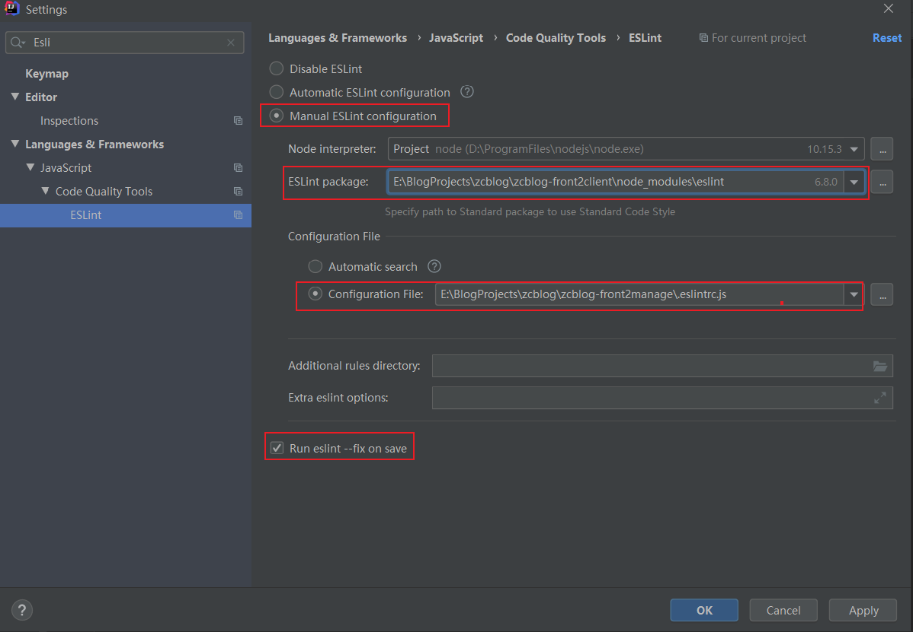
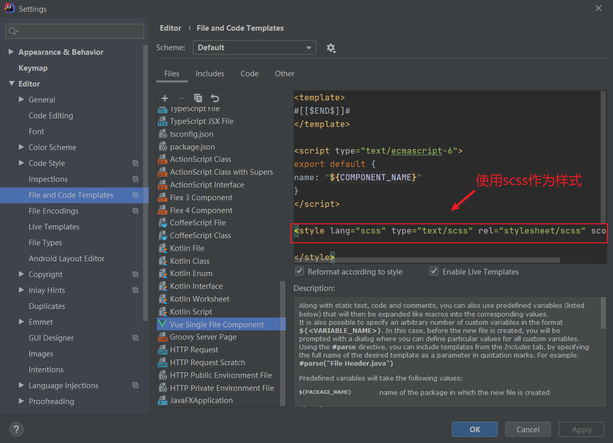
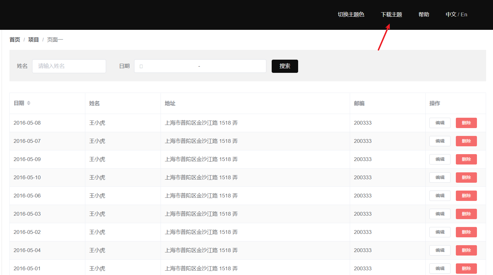

# 0 技术方案

> `Vue Cli4 + Vue + Vuex + Vue router`： vue全家桶；
>
> `axios`： 发送Ajax请求；
>
> `element-ui`：前端UI组件；
>
> `echarts` + `vue-count-to`：来自于百度的图表制作插件 + 数字滚动插件；
>
> `mavon-editor` + `marked`：实现markdown文档的编辑  + markdown转html（可自动为h1~h6生成id属性）；
>
> `vue-cookie`：处理浏览器的cookie（本项目中主要作用是将登录的token封装到cookie中，实现跨域访问后台）；
>
> `lodash`：是一个一致性、模块化、高性能的 JavaScript 实用工具库（主要用来处理数组、集合、日期以及提供一些工具函数）；
>
> `node-sass`+`sass-loader`：可以将sass转换成css；
>
> `svg-sprite-loader`：可以将加载的svg图片拼接成雪碧图（亦称精灵图）。

# 1 引入样式

## 1.1 引入normalize.css

`normalize.css`来自于github，只要对网页样式进行初始化：

- 所有标签的内外边距清零。

- em和i斜体的文字不倾斜。

- 去掉li的小圆点。

- 取消图片底层有空白的缝隙的问题。

- 当鼠标经过button的时候变成小手。

- 取消链接的下划线并且改变链接的颜色。

- 鼠标经过链接时改变颜色。

- 设置按钮、输入框的默认字体。

- 设置body的抗锯齿性、背景色、字体、字体颜色、字体大小同时规定body内元素的body之间的字体关系。

- 隐藏元素。

- 利用伪元素清除浮动

  ......

`normalize.css`的下载地址：`https://github.com/necolas/normalize.css/tags`；可以在下载的`normalize.css`上进行定制化修改。

## 1.2 引入base.scss

在`base.css`中编写全局基础样式。

## 1.3 引入theme.scss

在`theme.scss`中编写主题变量。

## 1.4 合并样式文件

- 第1步：合并`normalize.css`、`theme.scss`、`base.scss`到`index.scss`文件中，主要注意保持先后顺序。
- 第2步：在`main.js`中引入全局样式文件`index.scss`。

```javascript
import 'common/scss/index.scss' // 导入全局样式文件src/common/scss/index.scss
```

## 1.5 禁止缩放

考虑到实际使用，本博客项目的管理前台页面不对移动端进行适配（**移动端禁止缩放**）在public/index.html中进行设置：

```html
<!--原配置-->
<meta name="viewport" content="width=device-width,initial-scale=1.0">

<!--禁止缩放-->
<meta name="viewport" content="width=device-width,initial-scale=1.0,maximum-scale=1.0, user-scalable=0">

<!--可以缩放-->
<meta name="viewport" content="width=device-width,initial-scale=1.0,maximum-scale=1.0,minimum-scale=1.0,user-scalable=no">
```

## 1.6 修改网站图标

替换掉`public/favicon.ico`文件，图片格式必须为.ico（透明格式）。

# 2 代码风格限制

## 2.1 代码风格限制

在`.editorconfig`文件中进行代码风格限制：

```json
[*.{js,jsx,ts,tsx,vue}]
indent_style = space
indent_size = 2
end_of_line = lf
charset = utf-8
trim_trailing_whitespace = true
insert_final_newline = true

[*.md]
trim_trailing_whitespace = false

[Makefile]
indent_style = tab
```

## 2.2 JavaScript语法检测

在`.eslintrc.js`文件中配置JavaScript语法检测：

```javascript
module.exports = {
  root: true,
  env: {
    node: true
  },
  extends: [
    'plugin:vue/essential',
    '@vue/standard'
  ],
  parserOptions: {
    parser: 'babel-eslint'
  },
  rules: {
    'no-console': process.env.NODE_ENV === 'production' ? 'warn' : 'off',
    'no-debugger': process.env.NODE_ENV === 'production' ? 'warn' : 'off'
  }
}
```

在IDEA中设置使用ESLint语法检测文件：



## 2.3 SCSS和CSS语法检测

### 2.3.1 自定义vue模板

本项目使用scss作为vue组件的样式：



### 2.3.2 开启SCSS、CSS语法检测

- 第1步：安装语法检测插件。

```bash
npm i -D stylelint stylelint-config-standard stylelint-config-prettier stylelint-webpack-plugin

# 若使用scss样式，需先安装sass和sass-loader
npm i -D sass sass-loader
```

- 第2步：在`stylelint.config.js`中配置规则，开启stylelint检测css、scss。

```javascript
// 开启stylelint检测css、scss语法
module.exports = {
  ignoreFiles: ['**/*.js', 'src/assets/css/normalize.css', 'src/common/scss/theme.scss'],
  extends: ['stylelint-config-standard', 'stylelint-config-prettier'],
  rules: {
    // override/add rules settings here, such as:
    // "stylus/declaration-colon": "never"
    'no-empty-source': null, // 允许空源
    'font-family-no-duplicate-names': null, // 允许使用重复的字体名称
    'value-list-comma-space-after': 'always', // 在值列表的逗号之后要求有一个空格
    'selector-pseudo-element-colon-notation': 'single', // 指定伪元素使用双冒号
    'declaration-colon-space-before': 'never', // 在冒号之前禁止有空白
    'declaration-colon-space-after': 'always-single-line', // 在多行值列表的冒号之后必须有一个换行符
    'color-hex-length': 'long', // 指定十六进制颜色不使用缩写
    'value-keyword-case': 'lower', // 指定关键字的值采用小写
    'media-feature-name-no-unknown': null, // 允许使用未知的media特性名称
    'media-query-list-comma-newline-before': 'never-multi-line', // 在多行媒体查询列表的逗号之前禁止有空白
    'media-query-list-comma-space-after': 'always', // 在媒体查询的逗号之后要求有一个空格
    'rule-empty-line-before': null, // 在规则之前并非必须有一空行
    'font-family-no-missing-generic-family-keyword': null,
    'at-rule-no-unknown': [true, { ignoreAtRules: ['extend'] }]
  }
}
```

- 第3步：启用webpack配置。

在`vue.config.js`中启用自动检测修复SCSS、CSS功能：

```javascript
const IS_DEV = ['dev'].includes(process.env.NODE_ENV)
const StylelintPlugin = require("stylelint-webpack-plugin")

module.exports = {
  configureWebpack: config => {
    const plugins = []
    if (IS_DEV) {
      plugins.push(
        new StylelintPlugin({
          files: ["src/**/*.vue", "src/**/*.scss"],
          fix: true //打开自动修复（谨慎使用！注意上面的配置不要加入js或html文件，会发生问题，js文件请手动修复）
        })
      )
    }
    config.plugins = [...config.plugins, ...plugins]
  }
}
```

> 参考博客文章：[Stylelint规则用户指南](https://cloud.tencent.com/developer/section/1489630)、[配置Stylelint检测Scss、CSS语法](https://staven630.github.io/vue-cli4-config/#stylelint)

# 3 Vue Cli4配置

## 3.1 项目配置构建

在`vue.config.js`中配置项目构建：

```javascript
const IS_PROD = ['production', 'prod'].includes(process.env.NODE_ENV)

module.exports = {
  publicPath: IS_PROD ? process.env.VUE_APP_PUBLIC_PATH : '/', // 默认'/'，部署应用包时的基本 URL
  outputDir: 'dist', // 默认值,生产环境构建文件的目录
  assetsDir: '', // 默认值,放置生成的静态资源(js、css、img、fonts)的(相对于outputDir的)目录
  lintOnSave: false, // 不会将lint错误输出为编译警告,即有不符合lint语法时，也会编译成功
  runtimeCompiler: false, // 使用runtime-only编译，打包小、效率更高
  productionSourceMap: !IS_PROD, // 生产环境不需要source map时，将其设置为false,可以加速构建
  parallel: require('os').cpus().length > 1, // 默认值,作用于生产构建,在系统的 CPU 有多于一个内核时自动启用
}
```

## 3.2 配置跨域

在`vue.config.js`中配置跨域

```javascript
module.exports = {
  devServer: {
    open: true, // npm run serve后自动打开页面
    host: 'localhost', // 匹配本机IP地址
    port: 8081, // 开发服务器运行端口号
    https: false, // 不开启https
    hotOnly: true, // 开启热更新
    // 若前端应用和后端API服务器没有运行在同一个主机上，则需要将API请求代理到API服务器
    proxy: {
      // 例如将'http://localhost:8081/api/xxx'代理到'http://localhost:8082/api/xxx'
      '/api': {
		target: 'http://localhost:8082', // 目标代理接口地址
        secure: false, // 忽略https安全提示(如果是https接口，需要配置这个参数)
        changeOrigin: true, // 本地会虚拟一个服务器接收请求并代发该请求
        ws: true, // 启用websockets
        pathRewrite: { // 重写地址，将前缀 '/api' 转为 '/',相当于此时代理到'http://localhost:8082/xxx'
          '^/api': '/'
        }
      }
    }
  }
}
```

## 3.3 配置扩展名

在`vue.config.js`中配置扩展名：

```javascript
const path = require('path')
const resolve = dir => path.join(__dirname, dir)

module.exports = {
  // 配置扩展名
  configureWebpack: {
    config.resolve.extensions = ['.js', '.vue', '.json']
  }
}
```

## 3.4 配置别名

在`vue.config.js`中配置别名：

```javascript
const path = require('path')
const resolve = dir => path.join(__dirname, dir)

module.exports = {
  chainWebpack: config => {
    // 添加别名
    config.resolve.alias
      .set('vue$', 'vue/dist/vue.esm.js')
      .set('@', resolve('src'))
      .set('assets', resolve('src/assets'))
      .set('common', resolve('src/common'))
      .set('components', resolve('src/components'))
      .set('network', resolve('src/network'))
      .set('router', resolve('src/router'))
      .set('store', resolve('src/store'))
      .set('views', resolve('src/views'))
  }
}
```

## 3.5 配置SCSS全局变量

在`vue.config.js`中配置SCSS全局变量：

```javascript
const IS_PROD = ["production", "prod"].includes(process.env.NODE_ENV);

module.exports = {
  css: {
    extract: IS_PROD,
    sourceMap: false,
    loaderOptions: {
      scss: {
        prependData: `
        @import 'src/common/scss/theme.scss';
        `
      }
    }
  }
}
```

## 3.6 使用SVG组件

由于本项目采用动态路由，需要创建SVG组件实现菜单图标的动态加载。

- 第1步：安装`svg-sprite-loader`。

```bash
npm i -D svg-sprite-loader
```

- 第2步：在`src/components/common/`中创建SvgIcon.vue组件：

```vue
<template>
  <svg class="svg-icon"
       aria-hidden="true">
    <use :xlink:href="iconName" />
  </svg>
</template>

<script type="text/ecmascript-6">
export default {
  name: 'SvgIcon',
  props: {
    name: {
      type: String,
      required: true
    }
  },
  computed: {
    iconName () {
      return `#icon-${this.name}`
    }
  }
}
</script>

<style lang="scss" type="text/scss" rel="stylesheet/scss" scoped>
  .svg-icon {
    width: 1em;
    height: 1em;
    vertical-align: -0.15em;
    fill: currentColor;
    overflow: hidden;
  }
</style>
```

- 第3步：在`src/icons/svg`中存放从[iconfont](https://www.iconfont.cn/)下载的.svg格式的字体图标。

- 第4步：在`src/icons`中的创建index.js文件，批量导入.svg文件：

```javascript
import SvgIcon from 'components/common/SvgIcon'
import Vue from 'vue'

// 注册到全局
Vue.component('svg-icon', SvgIcon)

// 批量导入.svg文件
const requireAll = requireContext => requireContext.keys().map(requireContext)
const req = require.context('./svg', false, /\.svg$/)
requireAll(req)
```

- 第5步：在 `main.js` 中导入 icons/index.js。

```javascript
import 'icons' // 导入src/icons/index.js
```

- 第6步：在`vue.config.js`中进行配置。

```javascript
const path = require("path")
const resolve = dir => path.join(__dirname, dir)

module.exports = {
  chainWebpack: config => {
    const svgRule = config.module.rule("svg")
    svgRule.uses.clear();
    svgRule.exclude.add(/node_modules/)
    svgRule
      .test(/\.svg$/)
      .use("svg-sprite-loader")
      .loader("svg-sprite-loader")
      .options({
        symbolId: "icon-[name]"
      })

    const imagesRule = config.module.rule("images")
    imagesRule.exclude.add(resolve("src/icons"))
    config.module.rule("images").test(/\.(png|jpe?g|gif|svg)(\?.*)?$/)
  }
}
```

- 第7步：在组件模板中使用`<icon-svg :name="icon的名称"></icon-svg>`。

## 3.7 package.json

在`package.json`中主要对项目运行配置及依赖包进行管理：

```json

```

> 参考博客文章：[Stylelint规则用户指南](https://cloud.tencent.com/developer/section/1489630)、[配置Stylelint检测Scss、CSS语法](https://staven630.github.io/vue-cli4-config/#stylelint)

# 4 项目目录


# 5 引入element-ui

## 5.1 全局引入

- 第1步：安装element-ui。

```bash
npm i element-ui -S
```

- 第2步：在`main.js`中进行全局引入。

```javascript
import Vue from 'vue'
import ElementUI from 'element-ui'
import 'element-ui/lib/theme-chalk/index.css'

Vue.use(ElementUI)
```

- 第3步：在引入 Element 时，可以传入一个全局配置对象。该对象目前支持 size 与 zIndex 字段。size 用于改变组件的默认尺寸，zIndex 设置弹框的初始 z-index（默认值：2000）。在`main.js`进行配置：

```javascript
Vue.use(Element, { size: 'small', zIndex: 3000 });
```

## 5.2 按需引入

按需引入组件，可以达到减小项目体积的目的。本项目采用`按需引入`的方式。

- 第1步：安装`element-ui`。

```bash
npm i element-ui -S
```

- 第2步：在`src/elementUI`中的index.js中按需引入vue组件（也可以在main.js中进行引入，这里单独抽出到`src/elementUI/index.js`中进行配置是为了方便管理）。

```javascript
import Vue from 'vue'

// 按需引入vue组件，需要使用组件时，释放掉注释即可
import {
// Pagination,
// Dialog,
// ...
  Loading,
  MessageBox,
  Message,
  Notification
} from 'element-ui'

// 按需注册vue组件，需要使用组件时，释放掉注释即可
// Vue.use(Pagination)
// Vue.use(Dialog)
// ...

Vue.use(Loading.directive)

Vue.prototype.$loading = Loading.service
Vue.prototype.$msgbox = MessageBox
Vue.prototype.$alert = MessageBox.alert
Vue.prototype.$confirm = MessageBox.confirm
Vue.prototype.$prompt = MessageBox.prompt
Vue.prototype.$notify = Notification
Vue.prototype.$message = Message
```

- 第3步：**全局配置组件属性**。在引入 Element 时，可以传入一个全局配置对象。该对象目前支持 size 与 zIndex 字段。size 用于改变组件的默认尺寸，zIndex 设置弹框的初始 z-index（默认值：2000）。在`src/elementUI/index.js`中进行配置：

```javascript
Vue.prototype.$ELEMENT = { size: 'medium', zIndex: 3000 }
```

**此设置意味着**：项目中所有拥有 size 属性的组件的默认尺寸均为 `medium`，弹框的初始 z-index 为 3000。

- 第6步：在`main.js`中引入`src/elementUI/index.js`。

```javascript
import 'elementUI' // 按需引入element-ui中的vue组件
```

## 5.3 自定义主题

### 5.3.1 自定义主题样式

elemen-ui提供了三种方式自定义主题，第一种是使用**在线主题编辑器**修改定制 Element 所有全局和组件的 Design Tokens，并可以方便地实时预览样式改变后的视觉。同时它还可以基于新的定制样式生成完整的样式文件包，供直接下载使用；第二种是采用**在线主题生成工具**更换 Element 的主题色，让 Element 的视觉更加符合具体项目的定位；第三种是采用命令行主题工具进行深层次的主题定制。**第一种方式修改的颗粒度更细，自由度更大；本项目采用第二种方式自定义主题样式**。

在element-ui网站下载自定义主题：



### 5.3.2 引入自定义主题

- 第1步：在`src/elementUI/theme/elementUITheme.js`中指定当前element-ui主题色：

```javascript
// 1. 此处只包含element-ui组件的主题色。
// 2. 若要修改整个网站的主题效果，请保证当前element-ui主题色与src/common/scss/theme.scss中的$--color-primary一致
import './element-#17B3A3/index.css' // 当前element-ui主题色
export default {
  list: [
    '#0BB2D4', // 青色
    '#3E8EF7', // 蓝色
    '#11C26D', // 绿色
    '#17B3A3', // 蓝绿色
    '#667AFA', // 靛青色
    '#997B71', // 棕色
    '#9463F7', // 紫色
    '#757575', // 灰色
    '#EB6709', // 橙色
    '#F74584', // 粉红色
    '#FCB900', // 黄色
    '#FF4C52', // 红色
    '#0E0E0E' // 黑色
  ]
}
```

- 第2步：在`main.js`引入自定义主题色。

```javascript
import 'elementUI/theme/elementUITheme' // 引入element-ui自定义主题色
```

# 6 封装网络请求

## 6.1 封装axios

为了降低代码的耦合度，可以根据axios封装自己的网络请求。

在`network/request.js`中封装进行封装：

```javascript
import axios from 'axios'

export function request (config) { // 封装网络请求
  // 1.创建axios的示例
  const instance = axios.create({ // 创建网络请求实例（若有不同配置，可以封装多个网络请求实例）
    baseURL: process.env.OPEN_PROXY ? process.env.VUE_APP_API : process.env.BASE_URL,
    timeout: 1000 * 10, // 最大延时10s
    withCredentials: true, // 当前请求为跨域类型时,在请求中携带cookie
    headers: {
      'Content-Type': 'application/json;charset=utf-8'
    }
  })

  // 2.1 请求拦截
  instance.interceptors.request.use(config => {
    return config
  }, error => {
    console.log(error)
  })

  // 2.2 响应拦截
  instance.interceptors.response.use(res => {
    return res.data
  }, error => {
    console.log(error)
  })

  // 3.发送真正的网络请求
  return instance(config)
}
```

# 7 使用vue-cookie

本项目涉及到跨域登录问题，采取的解决方案是登录成功后生成一个token缓存到cookie中作为通行证。使用vue-cookie进行cookie的设置。


# 8 使用mavon-editor


> 参考博客文章：[Element UI官网](https://element.eleme.cn/#/zh-CN/)

# # 常见问题

## ## JS生成随机UUID（模拟）

- 算法1：

  ```javascript
  function uuid() {
      var s = []
      var hexDigits = "0123456789abcdef"
      for (var i = 0; i < 36; i++) {
          s[i] = hexDigits.substr(Math.floor(Math.random() * 0x10), 1)
      }
      s[14] = "4"  // bits 12-15 of the time_hi_and_version field to 0010
      s[19] = hexDigits.substr((s[19] & 0x3) | 0x8, 1)  // bits 6-7 of the clock_seq_hi_and_reserved to 01
      s[8] = s[13] = s[18] = s[23] = "-"
      var uuid = s.join("")
      return uuid
  
  }
  ```

- 算法2（本项目所采用）：

  ```javascript
  function guid() {
      return 'xxxxxxxx-xxxx-4xxx-yxxx-xxxxxxxxxxxx'.replace(/[xy]/g, function(c) {
          var r = Math.random()*16|0, v = c == 'x' ? r : (r&0x3|0x8)
          return v.toString(16)
      })
  }
  ```

- 算法3：

  ```javascript
  function guid() {
      function S4() {
         return (((1+Math.random())*0x10000)|0).toString(16).substring(1)
      }
      return (S4()+S4()+"-"+S4()+"-"+S4()+"-"+S4()+"-"+S4()+S4()+S4())
  }
  ```

- 算法4：

  ```javascript
  function uuid(len, radix) {
      var chars = '0123456789ABCDEFGHIJKLMNOPQRSTUVWXYZabcdefghijklmnopqrstuvwxyz'.split('');
      var uuid = [], i;
      radix = radix || chars.length;
      if (len) {
        // Compact form
        for (i = 0; i < len; i++) uuid[i] = chars[0 | Math.random()*radix];
      } else {
        // rfc4122, version 4 form
        var r
        // rfc4122 requires these characters
        uuid[8] = uuid[13] = uuid[18] = uuid[23] = '-'
        uuid[14] = '4'
        // Fill in random data.  At i==19 set the high bits of clock sequence as
        // per rfc4122, sec. 4.1.5
        for (i = 0; i < 36; i++) {
          if (!uuid[i]) {
            r = 0 | Math.random()*16;
            uuid[i] = chars[(i == 19) ? (r & 0x3) | 0x8 : r]
          }
        }
      }
      return uuid.join('')
  }
  ```

## ## localStorage与sessionStorage

- 相同点：
  1. 均只能存储字符串类型的对象。

> **注意事项**：JavaScript中的JSON对象提供的stringify方法将其他数据类型转化成字符串，再存储到storage中；JavaScript中的JSON对象提供的parse方法可以将storage中取出的字符串转化成对象。
>
> ```javascript
> // 存储
> var obj = {"name":"xiaoming","age":"16"}
> localStorage.setItem("userInfo",JSON.stringify(obj))
> // 读取
> var user = JSON.parse(localStorage.getItem("userInfo"))
> // 删除
> localStorage.remove("userInfo)
> // 清空
> localStorage.clear()
> ```

- 不同点：
  1. localStorage生命周期是永久，这意味着除非用户显示在浏览器提供的UI上清除localStorage信息，否则这些信息将永远存在；sessionStorage生命周期为当前窗口或标签页，一旦窗口或标签页被永久关闭了，那么所有通过sessionStorage存储的数据也就被清空了。
  2. 不同浏览器无法共享localStorage或sessionStorage中的信息；相同浏览器的不同页面间可以共享相同的 localStorage；不同页面或标签页间无法共享sessionStorage的信息

> **注意事项**：页面及标签页仅指顶级窗口，如果一个标签页包含多个iframe标签且他们属于同源页面（同源指相同的相同的协议、主机和端口），那么他们之间可以共享sessionStorage。

## ## Lodash的extend/assign/merge

相似点：

- 均不能用于数组。
- extend和assign用法相同。

不同点：

- merge可以合并子对象。
- extend和assign会从根级别复写对象。

```javascript
// They all handle members at the root in similar ways.
_.assign      ({}, { a: 'a' }, { a: 'bb' }) // => { a: "bb" }
_.merge       ({}, { a: 'a' }, { a: 'bb' }) // => { a: "bb" }

// _.assign handles undefined but _.merge will skip it
_.assign      ({}, { a: 'a'  }, { a: undefined }) // => { a: undefined }
_.merge       ({}, { a: 'a'  }, { a: undefined }) // => { a: "a" }\

// They all handle null the same
_.assign      ({}, { a: 'a'  }, { a: null }) // => { a: null }
_.merge       ({}, { a: 'a'  }, { a: null }) // => { a: null }

// only _.merge will merge child objects
_.assign      ({}, {a:{a:'a'}}, {a:{b:'bb'}}) // => { "a": { "b": "bb" }}
_.merge       ({}, {a:{a:'a'}}, {a:{b:'bb'}}) // => { "a": { "a": "a", "b": "bb" }}

// none of them will merge arrays it seems
_.assign      ({}, {a:['a']}, {a:['bb']}) // => { "a": [ "bb" ] }
_.merge       ({}, {a:['a']}, {a:['bb']}) // => { "a": [ "bb" ] }

// All modify the target object
a={a:'a'}; _.assign      (a, {b:'bb'}); // a => { a: "a", b: "bb" }
a={a:'a'}; _.merge       (a, {b:'bb'}); // a => { a: "a", b: "bb" }

// None really work as expected on arrays.(Lodash treats arrays as objects where the keys are the index into the array.)
_.assign      ([], ['a'], ['bb']) // => [ "bb" ]
_.merge       ([], ['a'], ['bb']) // => [ "bb" ]
_.assign      ([], ['a','b'], ['bb']) // => [ "bb", "b" ]
_.merge       ([], ['a','b'], ['bb']) // => [ "bb", "b" ]
```

## ## axios拦截器返回response.data

在读取数据的时候还需要加一层data: response.data.data，这样的编码易引起混淆，可以在拦截器中配置axios让返回值直接能获取到data，而不是response.data.data。

```javascript
axios.interceptors.response.use(res => {
　　return res.data;
})
```

## ## HTTPS加密机制及登录界面的实现

> 背景：HTTP（**未加密**） --> 对称加密（**秘钥**） --> 非对称加密 （**公钥+私钥**）--> HTTPS（**证书+数字签名**）
>
> 总结：HTTPS = HTTP + TLS/SSL

相关博客文章：[HTTPS加密机制](https://blog.csdn.net/akunshouyoudou/article/details/95184254)、[网站启用HTTPS加密传输协议](https://blog.csdn.net/weixin_30426065/article/details/97928605)

# # Vue相关

##  ## 严格模式

strict：默认值为false，值为true则表示Vuex store进入严格模式，在严格模式下，任何 mutation 处理函数以外修改 Vuex state 都会抛出错误。

**注意事项**：不要在发布环境下启用严格模式。

```javascript
const store = new Vuex.Store({
  // ...
  strict: process.env.NODE_ENV !== 'production'
})
```

## ## 智能懒加载

vue懒加载：要求在开发环境不使用懒加载，生产环境才使用懒加载，可以如下配置：

```javascript
// router/index.js
import Vue from 'vue'
import Router from 'vue-router'
Vue.use(Router)
const _import = require('./_import_' + process.env.NODE_ENV) // 开发环境不使用懒加载，生产环境不使用懒加载
// 全局路由(无需嵌套上左右整体布局)
const globalRoutes = [
  { path: '/404', component: _import('common/404'), name: '404', meta: { title: '404未找到' } },
  { path: '/login', component: _import('common/login'), name: 'login', meta: { title: '登录' } }
]

// router/_import_development.js
module.exports = file => require('@/views/' + file + '.vue').default // vue-loader at least v13.0.0+

// router/_import_production.js
module.exports = file => () => import('@/views/' + file + '.vue')
```

## ## 三种导航守卫的执行时机

> 举个例子：vue项目常见的3种导航守卫有全局守卫、独享守卫、组件内守卫。例如：`beforeEach：路由全局前置守卫`、`beforeEnter：路由独享守卫`、`beforeRouteEnter：组件内前置守卫`。[三种常见导航守卫](https://blog.csdn.net/weixin_44781409/article/details/106461212?utm_medium=distribute.pc_aggpage_search_result.none-task-blog-2~all~sobaiduend~default-3-106461212.nonecase&utm_term=vue%20%E5%85%A8%E5%B1%80%E5%89%8D%E7%BD%AE%E5%AE%88%E5%8D%AB%20%E6%89%A7%E8%A1%8C%E5%A4%9A%E6%AC%A1%20%E8%BF%98%E6%98%AF%E4%B8%80%E6%AC%A1&spm=1000.2123.3001.4430)

完整的导航守卫的执行时机如下：

1. 导航被触发。
2. 在失活的组件里调用离开守卫（组件内后置钩子）。
3. **调用全局的beforeEach守卫。**
4. 在重用的组件里调用beforeRouteUpdate守卫 (2.2+)。
5. **在路由配置里调用beforeEnter。**
6. 解析异步路由组件。
7. **在被激活的组件里调用beforeRouteEnter。**
8. 调用全局的beforeResolve守卫 (2.5+)。
9. 导航被确认。
10. 调用全局的afterEach钩子。
11. 触发DOM更新。
12. 用创建好的实例调用beforeRouteEnter守卫中传给next的回调函数。


