# 0 技术方案

> `Vue Cli4 + Vue + Vuex + Vue router`： vue全家桶；
>
> `axios`： 发送Ajax请求；
>
> `element-ui`：前端UI组件；
>
> `echarts` + `vue-count-to`：来自于百度的图表制作插件 + 数字滚动插件；
>
> `mavon-editor` + `marked`：实现markdown文档的编辑  + markdown转html（可自动为h1~h6生成id属性）；
>
> `vue-cookie`：处理浏览器的cookie（本项目中主要作用是将登录的token封装到cookie中，实现跨域访问后台）；
>
> `lodash`：是一个一致性、模块化、高性能的 JavaScript 实用工具库（主要用来处理数组、集合、日期以及提供一些工具函数）；
>
> `node-sass`+`sass-loader`：可以将sass转换成css；
>
> `svg-sprite-loader`：可以将加载的svg图片拼接成雪碧图（亦称精灵图）。

# 1 引入样式

## 1.1 引入normalize.css

`normalize.css`来自于github，只要对网页样式进行初始化：

- 所有标签的内外边距清零。

- em和i斜体的文字不倾斜。

- 去掉li的小圆点。

- 取消图片底层有空白的缝隙的问题。

- 当鼠标经过button的时候变成小手。

- 取消链接的下划线并且改变链接的颜色。

- 鼠标经过链接时改变颜色。

- 设置按钮、输入框的默认字体。

- 设置body的抗锯齿性、背景色、字体、字体颜色、字体大小同时规定body内元素的body之间的字体关系。

- 隐藏元素。

- 利用伪元素清除浮动

  ......

`normalize.css`的下载地址：`https://github.com/necolas/normalize.css/tags`；可以在下载的`normalize.css`上进行定制化修改。

## 1.2 引入base.scss

在`base.css`中编写全局基础样式。

## 1.3 引入theme.scss

在`theme.scss`中编写主题变量。

## 1.4 合并样式文件

- 第1步：合并`normalize.css`、`theme.scss`、`base.scss`到`index.scss`文件中，主要注意保持先后顺序。
- 第2步：在`main.js`中引入全局样式文件`index.scss`。

```javascript
import 'common/scss/index.scss' // 导入全局样式文件src/common/scss/index.scss
```

## 1.5 禁止缩放

考虑到实际使用，本博客项目的管理前台页面不对移动端进行适配（**移动端禁止缩放**）在public/index.html中进行设置：

```html
<!--原配置-->
<meta name="viewport" content="width=device-width,initial-scale=1.0">

<!--禁止缩放-->
<meta name="viewport" content="width=device-width,initial-scale=1.0,maximum-scale=1.0, user-scalable=0">

<!--可以缩放-->
<meta name="viewport" content="width=device-width,initial-scale=1.0,maximum-scale=1.0,minimum-scale=1.0,user-scalable=no">
```

## 1.6 修改网站图标

替换掉`public/favicon.ico`文件，图片格式必须为.ico（透明格式）。

# 2 代码风格限制

## 2.1 代码风格限制

在`.editorconfig`文件中进行代码风格限制：

```json
[*.{js,jsx,ts,tsx,vue}]
indent_style = space
indent_size = 2
end_of_line = lf
charset = utf-8
trim_trailing_whitespace = true
insert_final_newline = true

[*.md]
trim_trailing_whitespace = false

[Makefile]
indent_style = tab
```

## 2.2 JavaScript语法检测

在`.eslintrc.js`文件中配置JavaScript语法检测：

```javascript
module.exports = {
  root: true,
  env: {
    node: true
  },
  extends: [
    'plugin:vue/essential',
    '@vue/standard'
  ],
  parserOptions: {
    parser: 'babel-eslint'
  },
  rules: {
    'no-console': process.env.NODE_ENV === 'production' ? 'warn' : 'off',
    'no-debugger': process.env.NODE_ENV === 'production' ? 'warn' : 'off'
  }
}
```

在IDEA中设置使用ESLint语法检测文件：


## 2.3 SCSS和CSS语法检测

### 2.3.1 自定义vue模板

本项目使用scss作为vue组件的样式：


### 2.3.2 开启SCSS、CSS语法检测

- 第1步：安装语法检测插件。

```bash
npm i -D stylelint stylelint-config-standard stylelint-config-prettier stylelint-webpack-plugin

# 若使用scss样式，需先安装sass和sass-loader
npm i -D sass sass-loader
```

- 第2步：在`stylelint.config.js`中配置规则，开启stylelint检测css、scss。

```javascript
// 开启stylelint检测css、scss语法
module.exports = {
  ignoreFiles: ['**/*.js', 'src/assets/css/normalize.css', 'src/common/scss/theme.scss'],
  extends: ['stylelint-config-standard', 'stylelint-config-prettier'],
  rules: {
    // override/add rules settings here, such as:
    // "stylus/declaration-colon": "never"
    'no-empty-source': null, // 允许空源
    'font-family-no-duplicate-names': null, // 允许使用重复的字体名称
    'value-list-comma-space-after': 'always', // 在值列表的逗号之后要求有一个空格
    'selector-pseudo-element-colon-notation': 'single', // 指定伪元素使用双冒号
    'declaration-colon-space-before': 'never', // 在冒号之前禁止有空白
    'declaration-colon-space-after': 'always-single-line', // 在多行值列表的冒号之后必须有一个换行符
    'color-hex-length': 'long', // 指定十六进制颜色不使用缩写
    'value-keyword-case': 'lower', // 指定关键字的值采用小写
    'media-feature-name-no-unknown': null, // 允许使用未知的media特性名称
    'media-query-list-comma-newline-before': 'never-multi-line', // 在多行媒体查询列表的逗号之前禁止有空白
    'media-query-list-comma-space-after': 'always', // 在媒体查询的逗号之后要求有一个空格
    'rule-empty-line-before': null, // 在规则之前并非必须有一空行
    'font-family-no-missing-generic-family-keyword': null,
    'at-rule-no-unknown': [true, { ignoreAtRules: ['extend'] }]
  }
}
```

- 第3步：启用webpack配置。

在`vue.config.js`中启用自动检测修复SCSS、CSS功能：

```javascript
const IS_DEV = ['dev'].includes(process.env.NODE_ENV)
const StylelintPlugin = require("stylelint-webpack-plugin")

module.exports = {
  configureWebpack: config => {
    const plugins = []
    if (IS_DEV) {
      plugins.push(
        new StylelintPlugin({
          files: ["src/**/*.vue", "src/**/*.scss"],
          fix: true //打开自动修复（谨慎使用！注意上面的配置不要加入js或html文件，会发生问题，js文件请手动修复）
        })
      )
    }
    config.plugins = [...config.plugins, ...plugins]
  }
}
```

> 参考博客文章：[Stylelint规则用户指南](https://cloud.tencent.com/developer/section/1489630)、[配置Stylelint检测Scss、CSS语法](https://staven630.github.io/vue-cli4-config/#stylelint)

### 2.2.3 Scss/Sass/Stylus/Less用法


> 参考博客文档：

# 3 Vue Cli4配置

## 3.1 项目配置构建

在`vue.config.js`中配置项目构建：

```javascript
const IS_PROD = ['production', 'prod'].includes(process.env.NODE_ENV)

module.exports = {
  publicPath: IS_PROD ? process.env.VUE_APP_PUBLIC_PATH : '/', // 默认'/'，部署应用包时的基本 URL
  outputDir: 'dist', // 默认值,生产环境构建文件的目录
  assetsDir: '', // 默认值,放置生成的静态资源(js、css、img、fonts)的(相对于outputDir的)目录
  lintOnSave: false, // 不会将lint错误输出为编译警告,即有不符合lint语法时，也会编译成功
  runtimeCompiler: false, // 使用runtime-only编译，打包小、效率更高
  productionSourceMap: !IS_PROD, // 生产环境不需要source map时，将其设置为false,可以加速构建
  parallel: require('os').cpus().length > 1, // 默认值,作用于生产构建,在系统的 CPU 有多于一个内核时自动启用
}
```

## 3.2 配置跨域

在`vue.config.js`中配置跨域

```javascript
module.exports = {
  devServer: {
    open: true, // npm run serve后自动打开页面
    host: 'localhost', // 匹配本机IP地址
    port: 8081, // 开发服务器运行端口号
    https: false, // 不开启https
    hotOnly: true, // 开启热更新
    // 若前端应用和后端API服务器没有运行在同一个主机上，则需要将API请求代理到API服务器
    proxy: {
      // 例如将'http://localhost:8081/api/xxx'代理到'http://localhost:8082/api/xxx'
      '/api': {
		target: 'http://localhost:8082', // 目标代理接口地址
        secure: false, // 忽略https安全提示(如果是https接口，需要配置这个参数)
        changeOrigin: true, // 本地会虚拟一个服务器接收请求并代发该请求
        ws: true, // 启用websockets
        pathRewrite: { // 重写地址，将前缀 '/api' 转为 '/',相当于此时代理到'http://localhost:8082/xxx'
          '^/api': '/'
        }
      }
    }
  }
}
```

## 3.3 配置扩展名

在`vue.config.js`中配置扩展名：

```javascript
const path = require('path')
const resolve = dir => path.join(__dirname, dir)

module.exports = {
  // 配置扩展名
  configureWebpack: {
    config.resolve.extensions = ['.js', '.vue', '.json']
  }
}
```

## 3.4 配置别名

在`vue.config.js`中配置别名：

```javascript
const path = require('path')
const resolve = dir => path.join(__dirname, dir)

module.exports = {
  chainWebpack: config => {
    // 添加别名
    config.resolve.alias
      .set('vue$', 'vue/dist/vue.esm.js')
      .set('@', resolve('src'))
      .set('assets', resolve('src/assets'))
      .set('common', resolve('src/common'))
      .set('components', resolve('src/components'))
      .set('network', resolve('src/network'))
      .set('router', resolve('src/router'))
      .set('store', resolve('src/store'))
      .set('views', resolve('src/views'))
  }
}
```

## 3.5 配置SCSS全局变量

在`vue.config.js`中配置SCSS全局变量：

```javascript
const IS_PROD = ["production", "prod"].includes(process.env.NODE_ENV);

module.exports = {
  css: {
    extract: IS_PROD,
    sourceMap: false,
    loaderOptions: {
      scss: {
        // 注意：在sass-loader v8中，这个选项名是"prependData"（选项名写错会导致编译时报错Undefined variable）
        additionalData: `@import "~@/common/scss/theme.scss"`
      }
    }
  }
}
```

> 参考博客文章：[VueCLI官网-CSS相关](https://cli.vuejs.org/zh/guide/css.html)

## 3.6 使用SVG组件

### 3.6.1 使用方法

由于本项目采用动态路由，需要创建SVG组件实现菜单图标的动态加载。

- 第1步：安装`svg-sprite-loader`。

```bash
npm i -D svg-sprite-loader
```

- 第2步：在`src/components/common/`中创建SvgIcon.vue组件：

```vue
<template>
  <svg :class="getClassName" :width="width" :height="height" aria-hidden="true">
    <use :xlink:href="getName" />
  </svg>
</template>

<script type="text/ecmascript-6">
export default {
  name: 'SvgIcon',
  props: {
    name: { type: String, required: true },
    className: { type: String },
    width: { type: String },
    height: { type: String }
  },
  computed: {
    getName () { return `#icon-${this.name}` },
    getClassName () {
      return [
        'svg-icon',
        `svg-icon__${this.name}`,
        this.className && /\S/.test(this.className) ? `${this.className}` : ''
      ]
    }
  }
}
</script>

<style lang="scss" type="text/scss" rel="stylesheet/scss" scoped>
  .svg-icon {
    width: 1em;
    height: 1em;
    vertical-align: -0.15em;
    fill: currentColor;
    overflow: hidden;
    color: blue;
  }
</style>
```

- 第3步：在`src/icons/svg`中存放从[iconfont](https://www.iconfont.cn/)下载的.svg格式的字体图标。

- 第4步：在`src/icons`中的创建index.js文件，批量导入.svg文件：

```javascript
import SvgIcon from 'components/common/SvgIcon'
import Vue from 'vue'

// 注册到全局
Vue.component('svg-icon', SvgIcon)

// 批量导入.svg文件
const requireAll = requireContext => requireContext.keys().map(requireContext)
const req = require.context('./svg', false, /\.svg$/)
requireAll(req)
```

- 第5步：在 `main.js` 中导入 icons/index.js。

```javascript
import 'icons' // 导入src/icons/index.js
```

- 第6步：在`vue.config.js`中进行配置。

```javascript
const path = require("path")
const resolve = dir => path.join(__dirname, dir)

module.exports = {
  chainWebpack: config => {
   // 配置svg组件
    // 1. 让其他的svg loader不要对src/icons/svg进行操作
    config.module
      .rule('svg')
      .exclude
      .add(resolve('src/icons/svg'))
      .end()
    // 2. 使用svg-sprite-loader对src/icons/svg下的.svg进行操作
    config.module
      .rule('icons')
      .test(/\.svg$/)
      .include
      .add(resolve('src/icons/svg'))
      .end()
      .use('svg-sprite-loader')
      .loader('svg-sprite-loader')
      // 3.定义规则，使用时<svg class="icon"> <use xlink:href="#icon-svg文件名"></use></svg>
      .options({
        symbolId: '[name]' // 注意这里容易出错
      }).end()
  }
}
```

- 第7步：在组件模板中使用`<icon-svg :name="icon的名称"></icon-svg>`。

### 3.6.2 遇到的大坑

**问题描述：**在使用`svg-sprite-loader`的时候遇到一个大坑，按照网上的设置配好之后，svg的图标一直出不来（这个问题折腾了半天才搞定）。


**解决办法：**

1. 查看html body引入的svg空间约束，发现svg图片的id是`icon-icon-xxx`形式。

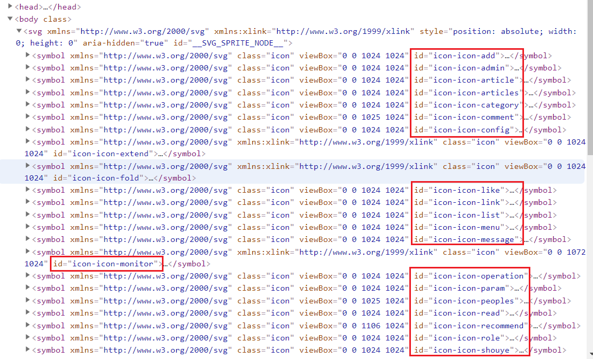

2. 在使用id选择器选择svg图标时却是`href="icon-shouye"`。

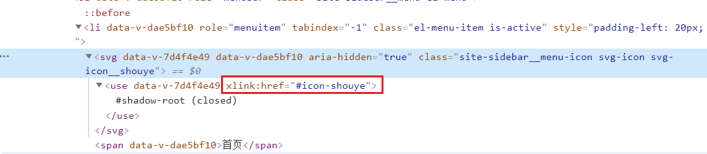

3. 解决办法是在`vue.config.js`中修改`svg-sprite-loader`的配置，让svg的id名称与xlink:href对上（**也可以选择修改.svg文件的名称，例如将icon-shouye.svg文件的名称改为shouye.svg也可以，二者选其一即可**）。

```javascript
// 修改前
symbolId: 'icon-[name]'
// 修改后
symbolId: '[name]'
```

### 3.6.3 去除底色

若要能自己设置svg组件的颜色，需要先在iconfont网站上批量去除底色。

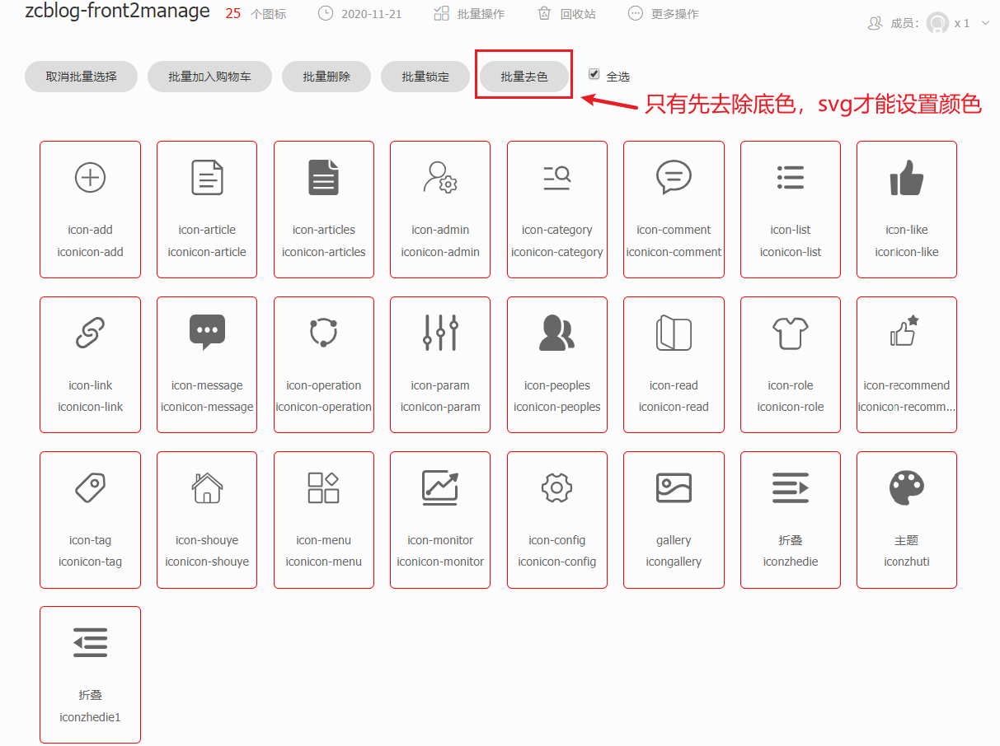

设置底色时可以设置：

```css
fill: currentColor;
```


## 3.7 package.json

在`package.json`中主要对项目运行配置及依赖包进行管理：

```json
{
  "name": "zcblog-front2manage",
  "version": "0.1.0",
  "private": true,
  "scripts": {
    "serve": "vue-cli-service serve",
    "build": "vue-cli-service build",
    "lint": "vue-cli-service lint"
  },
  "dependencies": {
    "axios": "^0.21.0",
    "core-js": "^3.6.5",
    "echarts": "^4.9.0",
    "element-ui": "^2.14.0",
    "lodash": "^4.17.20",
    "marked": "^1.2.3",
    "mavon-editor": "^2.9.0",
    "vue": "^2.6.11",
    "vue-cookie": "^1.1.4",
    "vue-count-to": "^1.0.13",
    "vue-router": "^3.2.0",
    "vuex": "^3.4.0"
  },
  "devDependencies": {
    "@vue/cli-plugin-babel": "~4.5.0",
    "@vue/cli-plugin-eslint": "~4.5.0",
    "@vue/cli-plugin-router": "~4.5.0",
    "@vue/cli-plugin-vuex": "~4.5.0",
    "@vue/cli-service": "~4.5.0",
    "@vue/eslint-config-standard": "^5.1.2",
    "babel-eslint": "^10.1.0",
    "eslint": "^6.7.2",
    "eslint-plugin-import": "^2.20.2",
    "eslint-plugin-node": "^11.1.0",
    "eslint-plugin-promise": "^4.2.1",
    "eslint-plugin-standard": "^4.0.0",
    "eslint-plugin-vue": "^6.2.2",
    "sass": "^1.28.0",
    "sass-loader": "^10.0.5",
    "stylelint": "^13.7.2",
    "stylelint-config-prettier": "^8.0.2",
    "stylelint-config-standard": "^20.0.0",
    "stylelint-webpack-plugin": "^2.1.1",
    "svg-sprite-loader": "^5.0.0",
    "vue-template-compiler": "^2.6.11"
  }
}
```

> 参考博客文章：[Stylelint规则用户指南](https://cloud.tencent.com/developer/section/1489630)、[配置Stylelint检测Scss、CSS语法](https://staven630.github.io/vue-cli4-config/#stylelint)

## 3.8 开发环境配置

​	开发环境配置一般有开发环境（development）、测试环境（test）、预发服务器环境（crm）、生产环境（production）；其中基于Vue的前端项目有部分公司有test环境，有大部分是没有test环境的；预发服务器环境和生产环境基本一致。

​		还有项目的开发环境是这样配置的：.env（配置基本环境）、.env.development（配置开发环境）、.env.test（配置测试环境）、.env.production（配置生产环境）。

### 3.8.1 本地开发环境

本地开发环境在`.env`文件中配置：

```json
// serve 默认的本地开发环境配置
NODE_ENV = "development"
BASE_URL = "http://localhost:8081/"
VUE_APP_API = "http://localhost:8081/api"
VUE_APP_PUBLIC_PATH = "/"
// 配置Valine评论系统
// VUE_APP_Valine_APPID = "z0GnFIFva6YrfBpFL8Uy8BTP-gzGzoHsz"
// VUE_APP_Valine_APPKEY = "wOR9EzOL58zIkUBQS2LTGKIg"
```

### 3.8.2 预发环境配置

预发环境在`.env.crm`中配置：

```json
// 自定义 build 环境配置（预发服务器）
NODE_ENV = "production"
// BASE_URL = "http://crm.progzc.com/"
// VUE_APP_PUBLIC_PATH = "https://crm.oss.com/blog"
// VUE_APP_API = "http://crm.progzc.com/api"

// ACCESS_KEY_ID = "xxxxxxxxxxxxx"
// ACCESS_KEY_SECRET = "xxxxxxxxxxxxx"
// REGION = "oss-cn-hangzhou"
// BUCKET = "zcblog-crm"
// PREFIX = "zc-blog"

// 配置Valine评论系统
// VUE_APP_Valine_APPID = "z0GnFIFva6YrfBpFL8Uy8BTP-gzGzoHsz"
// VUE_APP_Valine_APPKEY = "wOR9EzOL58zIkUBQS2LTGKIg"
```

### 3.8.3 生产环境配置

生产环境在`.env.production`中配置：

```json
// build 默认的环境配置（正式服务器）
NODE_ENV = "production"
// BASE_URL = "http://www.progzc.com/"
// VUE_APP_API = "http://www.progzc.com/api"
// VUE_APP_PUBLIC_PATH = "http://www.progzc.com/blog"

// ACCESS_KEY_ID = "xxxxxxxxxxxxx"
// ACCESS_KEY_SECRET = "xxxxxxxxxxxxx"
// REGION = "oss-cn-hangzhou"
// BUCKET = "zcblog-prod"
// PREFIX = "zc-blog"

// 配置Valine评论系统
// VUE_APP_Valine_APPID = "z0GnFIFva6YrfBpFL8Uy8BTP-gzGzoHsz"
// VUE_APP_Valine_APPKEY = "wOR9EzOL58zIkUBQS2LTGKIg"
```

# 4 项目目录


# 5 引入element-ui

## 5.1 全局引入

- 第1步：安装element-ui。

```bash
npm i element-ui -S
```

- 第2步：在`main.js`中进行全局引入。

```javascript
import Vue from 'vue'
import ElementUI from 'element-ui'
import 'element-ui/lib/theme-chalk/index.css'

Vue.use(ElementUI)
```

- 第3步：在引入 Element 时，可以传入一个全局配置对象。该对象目前支持 size 与 zIndex 字段。size 用于改变组件的默认尺寸，zIndex 设置弹框的初始 z-index（默认值：2000）。在`main.js`进行配置：

```javascript
Vue.use(Element, { size: 'small', zIndex: 3000 });
```

## 5.2 按需引入

按需引入组件，可以达到减小项目体积的目的。本项目采用`按需引入`的方式。

- 第1步：安装`element-ui`。

```bash
npm i element-ui -S
```

- 第2步：在`src/elementUI`中的index.js中按需引入vue组件（也可以在main.js中进行引入，这里单独抽出到`src/elementUI/index.js`中进行配置是为了方便管理）。

```javascript
import Vue from 'vue'

// 按需引入vue组件，需要使用组件时，释放掉注释即可
import {
// Pagination,
// Dialog,
// ...
  Loading,
  MessageBox,
  Message,
  Notification
} from 'element-ui'

// 按需注册vue组件，需要使用组件时，释放掉注释即可
// Vue.use(Pagination)
// Vue.use(Dialog)
// ...

Vue.use(Loading.directive)

Vue.prototype.$loading = Loading.service
Vue.prototype.$msgbox = MessageBox
Vue.prototype.$alert = MessageBox.alert
Vue.prototype.$confirm = MessageBox.confirm
Vue.prototype.$prompt = MessageBox.prompt
Vue.prototype.$notify = Notification
Vue.prototype.$message = Message
```

- 第3步：**全局配置组件属性**。在引入 Element 时，可以传入一个全局配置对象。该对象目前支持 size 与 zIndex 字段。size 用于改变组件的默认尺寸，zIndex 设置弹框的初始 z-index（默认值：2000）。在`src/elementUI/index.js`中进行配置：

```javascript
Vue.prototype.$ELEMENT = { size: 'medium', zIndex: 3000 }
```

**此设置意味着**：项目中所有拥有 size 属性的组件的默认尺寸均为 `medium`，弹框的初始 z-index 为 3000。

- 第6步：在`main.js`中引入`src/elementUI/index.js`。

```javascript
import 'elementUI' // 按需引入element-ui中的vue组件
```

## 5.3 自定义主题

### 5.3.1 自定义主题样式

elemen-ui提供了三种方式自定义主题，第一种是使用**在线主题编辑器**修改定制 Element 所有全局和组件的 Design Tokens，并可以方便地实时预览样式改变后的视觉。同时它还可以基于新的定制样式生成完整的样式文件包，供直接下载使用；第二种是采用**在线主题生成工具**更换 Element 的主题色，让 Element 的视觉更加符合具体项目的定位；第三种是采用命令行主题工具进行深层次的主题定制。**第一种方式修改的颗粒度更细，自由度更大；本项目采用第二种方式自定义主题样式**。

在element-ui网站下载自定义主题：


### 5.3.2 引入自定义主题

- 第1步：在`src/elementUI/theme/elementUITheme.js`中指定当前element-ui主题色：

```javascript
// 1. 此处只包含element-ui组件的主题色。
// 2. 若要修改整个网站的主题效果，请保证当前element-ui主题色与src/common/scss/theme.scss中的$--color-primary一致
import './element-#17B3A3/index.css' // 当前element-ui主题色
export default {
  list: [
    '#0BB2D4', // 青色
    '#3E8EF7', // 蓝色
    '#11C26D', // 绿色
    '#17B3A3', // 蓝绿色
    '#667AFA', // 靛青色
    '#997B71', // 棕色
    '#9463F7', // 紫色
    '#757575', // 灰色
    '#EB6709', // 橙色
    '#F74584', // 粉红色
    '#FCB900', // 黄色
    '#FF4C52', // 红色
    '#0E0E0E' // 黑色
  ]
}
```

- 第2步：在`main.js`引入自定义主题色。

```javascript
import 'elementUI/theme/elementUITheme' // 引入element-ui自定义主题色
```

## 5.4 v-loading

`v-loading`：来自于ElementUI，用于给正在加载的内容添加遮罩。

> 参考博客文章：[v-loading使用](https://blog.csdn.net/sherpan/article/details/97935370)

## 5.5 ElementUI源码

ElementUI组件的源码文档组织结构如下（可以用来深入学习Vue组件化的思想）：

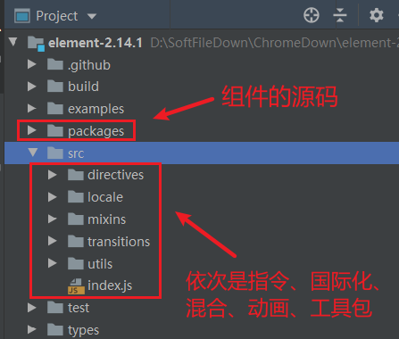

**总结：**

1. 当调用Vue.use方法的时候就会调用组件的install方法，将Vue注入到组件中去来实现组件的全局注册。
2. 父组件通过provide方法向后代注入，子组件通过inject从父代引入依赖。使用依赖注入的方式，可以避免组件之间的逐级传递。缺点是耦合度上升，日常开发中避免少使用，可以用vuex等方案来代替，尽量做到组件之间解耦。
3. 当有多个组件有用到相同的data、methods、life hooks等等，都可以用mixins抽象出来复用（**注意：**生命周期函数混入的话，是先执行混入的方法，再执行原来的方法）。

> 参考博客文章：[ElementUI源码探索](https://www.imooc.com/article/275102)

## 5.6 表单校验规则

ElementUI表单校验实际上是依赖`async-validator`插件实现的，因此具体的校验规则可以参考[async-validator官网](https://github.com/yiminghe/async-validator)。

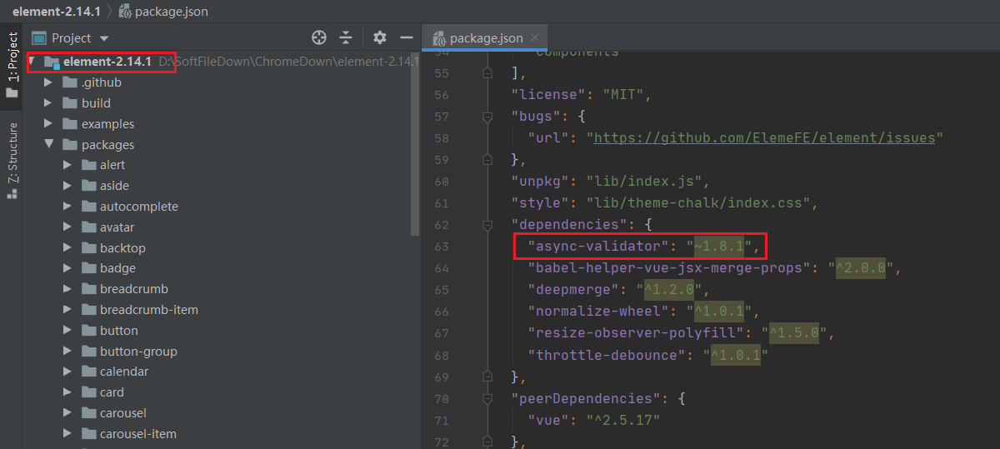


# 6 封装网络请求

## 6.1 封装axios

为了降低代码的耦合度，可以根据axios封装自己的网络请求。

在`network/request.js`中封装进行封装：

```javascript
export default function request (config) { // 封装网络请求
  // 1. 创建axios的示例
  const instance = axios.create({ // 创建网络请求实例（若有不同配置，可以封装多个网络请求实例）
    baseURL: process.env.VUE_APP_API,
    timeout: 1000 * 10, // 最大延时10s
    withCredentials: true, // 当前请求为跨域类型时,在请求中携带cookie
    headers: {
      'Content-Type': 'application/json;charset=utf-8'
    }
  })

  // 2.1 请求拦截
  instance.interceptors.request.use(config => {
    const timestamp = { // 对每次请求生成当前时间戳
      t: new Date().getTime()
    }
    if (config.params) { // get请求参数处理添加时间戳，并json化
      config.params = merge(timestamp, config.params)
    }
    if (config.data) { // post请求参数添加时间戳，并json化
      config.data = JSON.stringify(merge(timestamp, config.data))
    }
    config.headers.token = Vue.cookie.get('token') // 请求头带上token
    return config
  }, error => {
    // console.log(error)
    return Promise.reject(error)
  })

  // 2.2 响应拦截
  instance.interceptors.response.use(res => {
    if (res.data && res.data.code === 403) { // 403: token失效返回登录页面
      clearLoginInfo()
      router.push({ name: 'login' })
    }
    return res.data
  }, error => {
    // console.log(error)
    return Promise.reject(error)
  })

  // 3. 发送真正的网络请求
  return instance(config)
}
```

## 6.2 请求中添加时间戳

**为什么需要在请求中增加时间戳？**

其作用在于：URL 的末尾追加了时间。这就确保了请求不会在它第一次被发送后即缓存，而是会在此方法每次被调用后重新创建和重发；此 URL 会由于时间戳的不同而稍微有些不同。这种技巧常被用于确保到脚本的 POST 每次都会实际生成新请求且 Web 服务器不会尝试缓存来自服务器的响应。（简而言之：**在URL中加时间戳就会保证每一次发起的请求都是一个不同于之前的请求，这样就能避免浏览器对URL的缓存**）。

关键代码如下见`6.1`节。

## 6.3 axios拦截器返回response.data

在读取数据的时候还需要加一层data: response.data.data，这样的编码易引起混淆，可以在拦截器中配置axios让返回值直接能获取到data，而不是response.data.data。

```javascript
axios.interceptors.response.use(res => {
　　return res.data;
})
```

# 7 Vue相关技巧

## 7.1 严格模式

strict：默认值为false，值为true则表示Vuex store进入严格模式，在严格模式下，任何 mutation 处理函数以外修改 Vuex state 都会抛出错误。

**注意事项**：不要在发布环境下启用严格模式。

```javascript
const store = new Vuex.Store({
  // ...
  strict: process.env.NODE_ENV !== 'production'
})
```

## 7.2 智能懒加载

vue懒加载：要求在开发环境不使用懒加载，生产环境才使用懒加载，可以如下配置：

```javascript
// router/index.js
import Vue from 'vue'
import Router from 'vue-router'
Vue.use(Router)
const _import = require('./_import_' + process.env.NODE_ENV) // 开发环境不使用懒加载，生产环境不使用懒加载
// 全局路由(无需嵌套上左右整体布局)
const globalRoutes = [
  { path: '/404', component: _import('common/404'), name: '404', meta: { title: '404未找到' } },
  { path: '/login', component: _import('common/login'), name: 'login', meta: { title: '登录' } }
]

// router/_import_development.js
module.exports = file => require('@/views/' + file + '.vue').default // vue-loader at least v13.0.0+

// router/_import_production.js
module.exports = file => () => import('@/views/' + file + '.vue')
```

## 7.3 三种导航守卫的执行时机

> 举个例子：vue项目常见的3种导航守卫有全局守卫、独享守卫、组件内守卫。例如：`beforeEach：路由全局前置守卫`、`beforeEnter：路由独享守卫`、`beforeRouteEnter：组件内前置守卫`。[三种常见导航守卫](https://blog.csdn.net/weixin_44781409/article/details/106461212?utm_medium=distribute.pc_aggpage_search_result.none-task-blog-2~all~sobaiduend~default-3-106461212.nonecase&utm_term=vue%20%E5%85%A8%E5%B1%80%E5%89%8D%E7%BD%AE%E5%AE%88%E5%8D%AB%20%E6%89%A7%E8%A1%8C%E5%A4%9A%E6%AC%A1%20%E8%BF%98%E6%98%AF%E4%B8%80%E6%AC%A1&spm=1000.2123.3001.4430)

完整的导航守卫的执行时机如下：

1. 导航被触发。
2. 在失活的组件里调用离开守卫（组件内后置钩子）。
3. **调用全局的beforeEach守卫。**
4. 在重用的组件里调用beforeRouteUpdate守卫 (2.2+)。
5. **在路由配置里调用beforeEnter。**
6. 解析异步路由组件。
7. **在被激活的组件里调用beforeRouteEnter。**
8. 调用全局的beforeResolve守卫 (2.5+)。
9. 导航被确认。
10. 调用全局的afterEach钩子。
11. 触发DOM更新。
12. 用创建好的实例调用beforeRouteEnter守卫中传给next的回调函数。

## 7.4 使用mutation常量

在多人协同开发时，使用Vuex时推荐采用**mutation常量**。此外，使用Vuex时我们往往还会根据功能需求划分不同的modules，当modules指定了**namespace为true**时，怎么在vue组件中调用store的mutation方法呢？直接看下面的例子：

### 7.4.1 未使用mutation常量

```javascript
// store/modules/common.js
export default {
  namespaced: true, // 启用命名空间
  state: {
    documentClientHeight: 0 // 页面文档可视高度
  },
  mutations: {
    updatedocumentClientHeight (state, height) {
      state.documentClientHeight = height
    }
  }
}

// main.vue
<template>
  <div class="site-wrapper" :class="{ 'site-sidebar--fold': sidebarFold }"
    v-loading.fullscreen.lock="loading"
    element-loading-spinner="el-icon-loading"
    element-loading-text="加载中...">
  </div>
</template>

<script type="text/ecmascript-6">
export default {
  computed: {
    documentClientHeight: {
      get () { return this.$store.state.common.documentClientHeight },
      set (val) {
        this.$store.commit('common/updatedocumentClientHeight', val) 
      }
    }
  }
}
</script>

<style lang="scss" type="text/scss" rel="stylesheet/scss" scoped>
</style>
```

### 7.4.2 使用mutation常量

**注意事项：**

1. 在组件中调用mutation方法时，直接引用方法名即可（不需要增加模块名，即时设置了 namespaced为true），但引用store里的常量需要加模块名；
2. 使用ESC键上的``（而不是单引号）表示拼接后的字符串。

```javascript
// store/constant/motation-types.js
export const UPDATE_DOCUMENT_CLIENTHEIGHT = 'update_document_clientheight'

// store/modules/common.js
import { UPDATE_DOCUMENT_CLIENTHEIGHT } from 'store/constant/mutation-types'
export default {
  namespaced: true, // 启用命名空间
  state: {
    documentClientHeight: 0 // 页面文档可视高度
  },
  mutations: {
    [UPDATE_DOCUMENT_CLIENTHEIGHT] (state, height) {
      state.documentClientHeight = height
    }
  }
}

// main.vue
<template>
  <div class="site-wrapper" :class="{ 'site-sidebar--fold': sidebarFold }"
    v-loading.fullscreen.lock="loading"
    element-loading-spinner="el-icon-loading"
    element-loading-text="加载中...">
  </div>
</template>

<script type="text/ecmascript-6">
import { UPDATE_DOCUMENT_CLIENTHEIGHT } from 'store/constant/mutation-types'
export default {
  computed: {
    documentClientHeight: {
      // 注意：在组件中调用store变量时，需要增加模块名（前提是设置了namespaced为true）
      get () { return this.$store.state.common.documentClientHeight },
      set (val) {
        // 注意：在组件中调用mutation方法时，直接引用方法名即可（不需要增加模块名，即使设置了namespaced为true）
        this.$store.commit(UPDATE_DOCUMENT_CLIENTHEIGHT, val) 
      }
    }
  }
}
</script>

<style lang="scss" type="text/scss" rel="stylesheet/scss" scoped>
</style>
```

> 参考文章博客：[${}占位符用法](https://blog.csdn.net/qq_33964336/article/details/86577963?utm_medium=distribute.pc_aggpage_search_result.none-task-blog-2~all~sobaiduend~default-1-86577963.nonecase&utm_term=javascript%E9%87%8C%E7%9A%84%E5%8D%A0%E4%BD%8D%E7%AC%A6&spm=1000.2123.3001.4430)、[Vuex官网](https://vuex.vuejs.org/zh/guide/mutations.html)

## 7.5 vue中class的几种用法

```vue
// 方法一：var1、var2为变量。（可以为var1、var2在data里动态绑定类名）
<div id="box">
　　<strong :class="[var1,var2]">凉凉三生三世，为你四年成河水<strong> 　　
</div>

// 方法二：var1为true时，className1存在；反之不存在。var2类似。（可以为var1、var2在data里动态绑定类名）
<div id="box">
　　<strong :class="{'className1':var1, 'className': var2}">凉凉三生三世，为你四年成河水<strong> 　　
</div>
// 方法二扩展：也可直接指定变量的值
<div id="box">
　　<strong :class="{'className1':true, 'className2': false}">凉凉三生三世，为你四年成河水<strong> 　　
</div>

// 方法三：var1是一个类型为json字符串的变量，相当于jsonString="{'className1':var2, 'className': var3}" 。（可在data里动态绑定var1）
<div id="box">
　　<strong :class="var1">凉凉三生三世，为你四年成河水<strong> 　　
</div>
      
// 方法四：当变量var1不为空时，类名className1存在；反之className1不存在。（可在data里动态绑定var1）
<div :class="var1 ? 'className1' : ''"></div>
```

> 参考博客文章：[vue中class的用法](https://www.cnblogs.com/yuershuo/p/6861951.html)、[vue中class的常见用法](https://www.cnblogs.com/weichenzhiyi/p/8405571.html)

## 7.6 template标签

- **html5中的templa标签：**html中的template标签中的内容在页面中不会显示；但是在后台页面DOM结构存在template标签，这是因为template标签天生不可见，它设置了`display:none;`属性。
- **template标签的属性：**
  - **content属性：**在js中template标签对应的DOM对象存在content属性，对应的属性值是一个DOM节点，节点的nodeName是`#document-fragment`（即：`template对象.content.nodeName=#document-fragment`）。通过该属性可以获取template标签中的内容，`template对象.content`可以调用getElementById、querySelector、querySelectorAll方法来获取里面的子节点。
  - **innerHTML属性：**可以获取template标签中的html。

- **vue中的template标签：**

  - **在vue实例绑定的元素内部：**可以显示template标签中的内容；但是后台的DOM结构不存在template标签。vue实例绑定的元素内部的template标签不支持v-show指令，即`v-show="false"`对template标签来说不起作用；但是此时的template标签支持`v-if、v-else-if、v-else、v-for`这些指令。
  - **在vue实例绑定的元素外部：**不能显示template标签中的内容；但是后台的DOM结构存在template标签。
  - **在vue实例中的template属性：**即vue组件的用法。将实例中template属性值进行编译，并将编译后的DOM替换掉vue实例绑定的元素，如果该vue实例绑定的元素中存在内容，这些内容会直接被覆盖。（**要求：**template属性中的dom结构只能有一个根元素，如果有多个根元素需要使用v-if、v-else、v-else-if设置成只显示其中一个根元素）

```vue
// vue中的template标签
<div id="app">
    <!--此处的template标签中的内容显示并且在dom中不存在template标签-->
    <template>
        <div>我是template</div>
        <div>我是template</div>
    </template>
</div>
<!--此处的template标签中的内容在页面中不显示，但是在dom结构存在该标签及内部结构-->
<template id="tem">
    <div id="div1">我是template</div>
    <div>我是template</div>
</template>
<script src="node_modules/vue/dist/vue.js"></script>
<script>
    let vm = new Vue({
        el: "#app",
    });
</script>

// vue中的template标签与v-show/v-if
<div id="app">
    <template v-if="true">
    <!--此时template标签中的内容显示在页面上，但是看dom结构没有template标签-->
        <div>我是template</div>
        <div>我是template</div>
    </template>
    <div v-if="true">
    <!--此时页面上显示div标签中的内容，并且看dom结构存在最外面的div标签-->
        <div>我是template</div>
        <div>我是template</div>
    </div>
    <!--此处会输出6个‘我是template’并且dom结构中不存在template标签-->
    <template v-for="a in 3">
        <div>我是template</div>
        <div>我是template</div>
    </template>
</div>
<script src="node_modules/vue/dist/vue.js"></script>
<script>
    let vm = new Vue({
        el: "#app",
    });
</script>

// vue实例中的template属性
<!--此处页面显示hello-->
<div id="app"></div>
<!--此处template标签必须在vue绑定的元素外面定义，并且在页面中不显示下面的template标签中的内容-->
<template id="first">
    <div v-if="flag">{{msg}}<div>
    <div v-else>111<div>
</template>
<script src="./node_modules/vue/dist/vue.js"></script>
<script>
    let vm = new Vue({
        el:"#app",
        data:{
            msg:"hello",
            flag:true
        },
        template:"#first"//通过该属性可以将自定义的template属性中的内容全部替换app的内容，并且会覆盖里面原有的内容，并且在查看dom结构时没有template标签
    });
</script>
```

> 参考博客文章：[template标签用法总结](https://blog.csdn.net/u010510187/article/details/100356624)

## 7.7 配置别名后IDEA设置路径

**问题描述：**vue项目配置别名后，在项目中使用别名时，Ctrl+鼠标左键单击出现`Cannot find declaration to go to`。**此外，若IDEA能根据别名找到文件路径，也可以帮助我们很好地使用IDEA中的`Find Usages`（快捷键：Alt+F7）快速找到关联文件**。

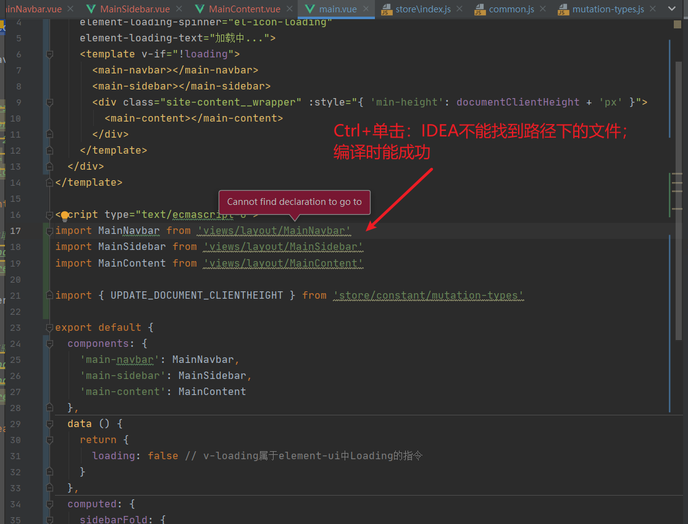

**解决办法：**在IDEA中指定webpack的配置文件（Vue CLI封装起来了，需要手动指定）。

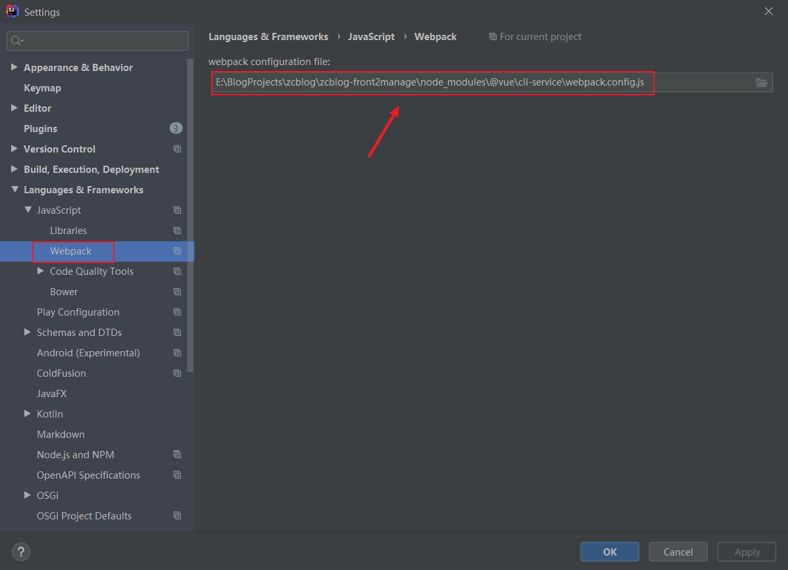

## 7.8 Vue的生命周期

在Vue项目中，经常会搞混mounted和created的执行时机。根据Vue官网的图解：

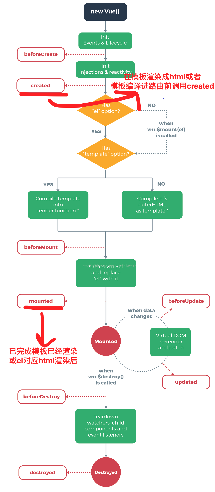

- **created：**在模板渲染成html前调用，即通常初始化某些属性值，然后再渲染成视图。
- **mounted：**在模板渲染成html后调用，通常是初始化页面完成后，再对html的DOM节点进行一些需要的操作。

通常created使用的次数多，而mounted通常是在一些插件的使用或者组件的使用中进行操作，比如插件chart.js的使用： `var ctx = document.getElementById(ID)`；通常会有这一步，而如果你写入组件中，你会发现在created中无法对chart进行一些初始化配置，一定要等这个html渲染完后才可以进行，那么mounted就是不二之选。

> 参考博客文章：[mounted和created的区别](https://blog.csdn.net/xdnloveme/article/details/78035065)

## 7.9 添加动态路由

利用vue中的addRoutes方法来添加动态路由。

`sys_menu`表的设计：

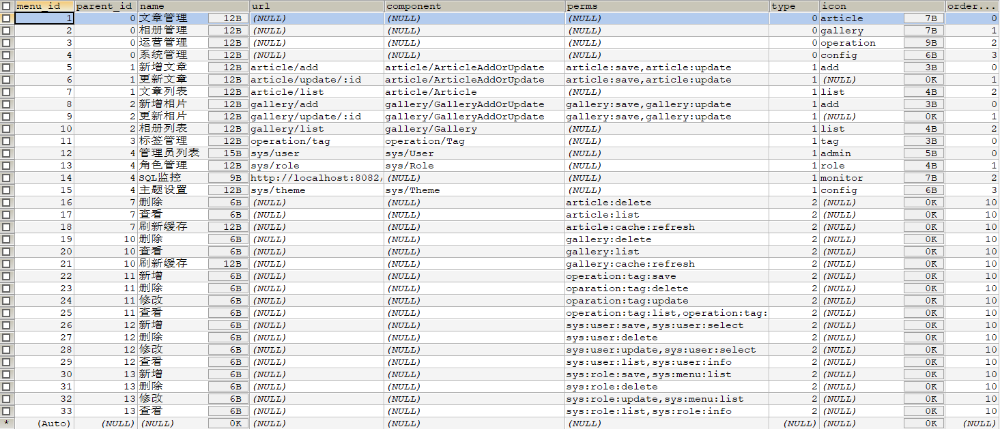

在`router/index.js`中设置动态路由：

```javascript
import Vue from 'vue'
import VueRouter from 'vue-router'
import { clearLoginInfo } from 'common/js/utils/login'
import { executeGetSysMenuNav } from 'network/api/route'
import { isURL } from 'common/js/utils/validate'

Vue.use(VueRouter)

const _import = require('./_import_' + process.env.NODE_ENV) // 智能懒加载：开发环境不采用懒加载，生产环境采用懒加载
// 配置全局路由
const globalRoutes = [
  { path: '/404', component: _import('common/404'), name: '404', meta: { title: '404未找到' } },
  { path: '/login', component: _import('common/login'), name: 'login', meta: { title: '登录' } }
]
// 配置主路由
const mainRoutes = {
  path: '/',
  component: _import('main'),
  name: 'main',
  redirect: { name: 'home' },
  meta: { title: '主入口整体布局' },
  children: [
    { path: 'home', component: _import('common/home'), name: 'home', meta: { title: '首页' } }
  ],
  // 设置路由前置守卫
  beforeEnter (to, from, next) {
    // 若token不存在，则跳转到登录界面
    const token = Vue.cookie.get('token')
    if (!token || !/\S/.test(token)) {
      clearLoginInfo()
      next({ name: 'login' })
    }
    // 若token存在，则放行
    next()
  }
}

const router = new VueRouter({
  mode: 'history',
  base: process.env.BASE_URL, // 路由跳转时的基路径
  routes: globalRoutes.concat(mainRoutes), // 合并全局路由和主路由
  scrollBehavior: () => ({ y: 0 }), // 每次访问滚动条都置零
  isAddDynamicMenuRoutes: false // 是否已添加动态菜单路由
})

// 设置全局前置守卫
router.beforeEach((to, from, next) => {
  // 如果动态路由已加载或当前访问路由是全局路由，则直接加载
  if (router.options.isAddDynamicMenuRoutes || isGlobalRoute(to)) {
    next()
  } else {
    executeGetSysMenuNav().then(data => {
      if (data && data.code === 200) {
        addDynamicMenuRoutes(data.menuList)
        router.options.isAddDynamicMenuRoutes = true
        sessionStorage.setItem('menuList', JSON.stringify(data.menuList || []))
        sessionStorage.setItem('perms', JSON.stringify(data.perms || []))
        // ...是es6中的扩展运算符，可以将数组转换为函数的参数，...to确保addRoutes已完成
        // 若replace设置为true，那么导航不会留下history记录，点击浏览器回退按钮不会再回到这个路由
        next({ ...to, replace: false })
      } else {
        sessionStorage.setItem('menuList', '[]')
        sessionStorage.setItem('perms', '[]')
        next()
      }
    })
  }
})

/**
 * 判断当前路由是否是全局路由
 * @param route
 * @returns {boolean}
 */
function isGlobalRoute (route) {
  for (let i = 0; i < globalRoutes.length; i++) {
    if (route.path === globalRoutes[i].path) {
      return true
    }
  }
  return false
}

/**
 * 添加动态路由
 * @param menuList
 * @param routes
 */
function addDynamicMenuRoutes (menuList = [], routes = []) {
  let temp = []
  for (let i = 0; i < menuList.length; i++) {
    if (menuList[i].list && menuList[i].list.length >= 1) {
      temp = temp.concat(menuList[i].list)
    } else if (menuList[i].url && /\S/.test(menuList[i].url)) { // 若url不为空
      // 替换url开头的"/"替换为""
      menuList[i].url = menuList[i].url.replace(/^\//, '')
      const route = {
        path: menuList[i].url,
        component: null,
        name: menuList[i].url,
        meta: {
          menuId: menuList[i].menuId,
          title: menuList[i].name,
          isDynamic: true, // 动态菜单
          isTab: true, // 一级菜单
          iframeUrl: ''
        }
      }
      // url以http[s]://开头，通过iframe展示
      if (isURL(menuList[i].url)) {
        route.path = `iframe/${menuList[i].menuId}`
        route.name = `iframe/${menuList[i].menuId}`
        route.meta.iframeUrl = menuList[i].url
      } else {
        try {
          route.component = _import(`content/${menuList[i].component}`) || null
        } catch (e) {
        }
      }
      routes.push(route)
    }
  }
  if (temp.length >= 1) {
    addDynamicMenuRoutes(temp, routes)
  } else {
    mainRoutes.name = 'main-dynamic'
    mainRoutes.children = routes
    router.addRoutes([
      mainRoutes,
      { path: '*', redirect: { name: '404' } }
    ])
    sessionStorage.setItem('dynamicMenuRoutes', JSON.stringify(mainRoutes.children || []))
    console.log('\n')
    console.log('%c!<-------------------- 动态(菜单)路由 s -------------------->', 'color:blue')
    console.log(mainRoutes.children)
    console.log('%c!<-------------------- 动态(菜单)路由 e -------------------->', 'color:blue')
  }
}
```

## 7.10 修饰符

### 7.10.1 .sync修饰符

**vue中.sync修饰符的作用**：当一个子组件改变了一个 prop 的值时，这个变化也会同步到父组件中所绑定。

**本质：**.sync是一种语法糖。

```vue
// 语法糖写法
// 父组件中的写法
<comp :foo.syn="bar"></comp>
// 当子组件需要更新 foo 的值时，它需要显式地触发一个更新事件
this.$emit('update:foo', newValue) // update:foo是约定的事件名写法


// 等价于
// 父组件中的写法
<comp :foo="bar" @setFoo="var => bar=var"></comp>
// 当子组件需要更新 foo 的值时，它需要显式地触发一个更新事件
this.$emit('setFoo', newValue)
```

> 参考博客文章：**[vue中的.sync修饰符用法及原理详解](https://blog.csdn.net/liushijun_/article/details/92426854)**

### 7.10.2 .native修饰符

**vue中.native修饰符的作用**：在父组件中给子组件绑定一个原生的事件，就将子组件变成了普通的HTML标签，不加`.native`事件是无法触发的。

> 参考博客文章：[vue中.native修饰符的使用](https://blog.csdn.net/qq_29468573/article/details/80771625)

### 7.10.3 .stop修饰符

**.stop修饰符：**阻止事件冒泡。

> 参考博客文章：[.stop阻止事件继续传播](https://www.cnblogs.com/dongyuezhuang/p/11527447.html)

## 7.11 方法

### 7.11.1 $nextTicks

**$nextTicks：**主要用于异步更新（重点理解DOM渲染的时机）。

**原理：**当设置 `vm.someData = 'new value'`后，该组件不会立即重新渲染。当刷新队列时，组件会在下一个事件循环"tick"中更新。多数情况我们不需要关心这个过程，但是如果你想基于更新后的 DOM 状态来做点什么，这就可能会有些棘手。虽然 Vue.js 通常鼓励开发人员使用“数据驱动”的方式思考，避免直接接触 DOM，但是有时我们必须要这么做。为了在数据变化之后等待 Vue 完成更新 DOM，可以在数据变化之后立即使用 `Vue.nextTick(callback)`。这样回调函数将在 DOM 更新完成后被调用。

```vue
// 理解DOM渲染的时机很重要
<div id="example">{{message}}</div>

var vm = new Vue({
  el: '#example',
  data: {
    message: '123'
  }
})
vm.message = 'new message' // 更改数据
vm.$el.textContent === 'new message' // false
Vue.nextTick(function () {
  vm.$el.textContent === 'new message' // true
})

// 另一种写法
Vue.component('example', {
  template: '<span>{{ message }}</span>',
  data: function () {
    return {
      message: '未更新'
    }
  },
  methods: {
    updateMessage: function () {
      this.message = '已更新'
      console.log(this.$el.textContent) // => '未更新'
      this.$nextTick(function () {
        console.log(this.$el.textContent) // => '已更新'
      })
    }
  }
})
```

> 参考博客文章：[理解$nextTick的作用](https://blog.csdn.net/sinat_17775997/article/details/71638144)、[vue官网-异步更新队列](https://cn.vuejs.org/v2/guide/reactivity.html#异步更新队列)

### 7.11.2 $refs

**$refs：**一个对象，持有注册过`ref属性`的所有DOM元素和组件实例。

```vue
<input title="手机号"  name="mobile" ref="mobile" placeholder="手机号" type="tel" is-type="china-mobile" required :min="11" :max="11"></input>
// 使用this.$refs.xxx获取DOM元素
this.$refs.mobile
```

## 7.12 watch路由

当使用路由参数时，例如从 /user/foo 导航到 /user/bar，原来的组件实例会被复用。因为两个路由都渲染同个组件，比起销毁再创建，复用则显得更加高效。不过，这也意味着组件的生命周期钩子不会再被调用。

复用组件时，若想对路由参数的变化作出响应的话，你可以简单地 watch (监测变化) `$route` 对象。

```javascript
const User = {
  template: '...',
  watch: {
    $route(to, from) {
      // 对路由变化作出响应...
    }
  }
}
```

或者使用`beforeRouteUpdate`导航守卫也可以实现同样的功能：

```js
const User = {
  template: '...',
  beforeRouteUpdate (to, from, next) {
    // react to route changes...
    // don't forget to call next()
  }
}
```

## 7.13 keep-alive缓存组件

**keep-alive概念：**keep-alive是Vue的内置组件，当它包裹动态组件时，会缓存不活动的组件实例，而不是销毁它们。和transition相似，keep-alive是一个抽象组件：它自身不会渲染成一个DOM元素，也不会出现在父组件链中。

**keep-alive作用：**在组件切换过程中将状态保留在内存中，防止重复渲染DOM，减少加载时间及性能消耗，提高用户体验性。

**keep-alive原理：**在created 函数调用时将需要缓存的VNode（虚拟DOM，其实就是一个js对象）节点保存在this.cache中／在render（页面渲染）时，如果VNode的name符合缓存条件（可以用include以及exclude控制），则会从this.cache中取出之前缓存的VNode实例进行渲染。

**keep-alive属性：**

1. include：字符串或正则表达式，只有名称匹配的组件会被缓存（采用LRU缓存策略）。
2. exclude：字符串或正则表达式，任何名称匹配的组件都不会被缓存。
3. max：数字，最多可以缓存多少组件实例。

**生命周期函数：**

1. **activated：**在keep-alive组件激活时调用，该钩子函数在服务器端渲染期间不被调用。

2. **deactivated：**在keep-alive组件停用时调用，该钩子在服务器端渲染期间不被调用。

   注意事项：

   - 被包含在keep-alive中创建的组件，会多出两个生命周期的钩子：activated与deactivated，使用keep-alive会将数据保留在内存中，如果要在每次进入页面的时候获取最新的数据，需要在activated阶段获取数据，承担原来created钩子函数中获取数据的任务。
   - 只有组件被keep-alive包裹时，这两个生命周期函数才会被调用，如果作为正常组件使用，是不会被调用的，以及在2.1.0版本之后，使用exclude排除之后，就算被包裹在keep-alive中，这两个钩子函数依然不会被调用！另外，在服务端渲染时，此钩子函数也不会被调用。

```vue
// 用法一：在动态组件中的应用
<keep-alive :include="whiteList" :exclude="blackList" :max="amount">
     <component :is="currentComponent"></component>
</keep-alive>

// 用法二：在vue-router中的应用
<keep-alive :include="whiteList" :exclude="blackList" :max="amount">
    <router-view></router-view>
</keep-alive>
```

**LRU算法策略：**一种缓存淘汰策略。计算机的缓存容量有限，如果缓存满了就要删除一些内容，给新内容腾位置。但问题是，删除哪些内容呢？我们肯定希望删掉哪些没什么用的缓存，而把有用的数据继续留在缓存里，方便之后继续使用。LRU 的全称是 **Least Recently Used**，也就是说我们认为最近使用过的数据应该是是「有用的」，很久都没用过的数据应该是无用的，内存满了就优先删那些很久没用过的数据。

**LRU算法的实现：**采用哈希链表（即双向链表和哈希表的结合体）。

> 参考博客文章：[LRU算法策略详解](https://blog.csdn.net/fdl123456/article/details/97623208)、[vue中keep-alive的使用及详解](https://blog.csdn.net/fu983531588/article/details/90321827)

## 7.14 插槽/具名插槽/作用域插槽

**匿名插槽：**单个vue组件只能有一个匿名插槽。

**具名插槽：**单个vue组件可以有多个具名插槽。

**作用域插槽：**父组件指示如何渲染，子组件提供数据。

**注意：**vue2.6以后使用v-slot替换slot-scope。

> 参考博客文章：[作用域插槽](https://cn.vuejs.org/v2/guide/components-slots.html#作用域插槽)、[作用域插槽总结](https://www.cnblogs.com/steamed-twisted-roll/p/10001512.html)

## 7.15 关于created和activated

**created()：**在创建vue对象时，当html渲染之前就触发；但是注意，**全局vue.js不强制刷新或者重启时只创建一次**，也就是说，created()只会触发一次。

**activated()：**在vue对象存活的情况下，进入当前存在activated()函数的页面时，**一进入页面就触发**；可用于初始化页面数据等。

**activated与keep-alive的关系：**

1. keep-alive包裹的动态组件会被缓存，它是一个抽象组件，它自身不会渲染一个dom元素,当组件在 keep-alive内被切换，组件里的 activated 和 deactivated 这两个生命周期钩子函数将会被对应执行。

2. 如keep-alive包裹两个组件：组件A和组件B。当第一次切换到组件A时，组件A的created和activated生命周期函数都会被执行。切换到组件B，这时组件A的deactivated的生命周期函数会被触发。在切换回组件A，组件A的activated生命周期函数会被触发，但是它的created生命周期函数不会被触发了。

> 参考博客文章：[created()与activated()的区别](https://blog.csdn.net/qq_36608921/article/details/82216617)、[vue的activated生命周期](https://blog.csdn.net/u012201879/article/details/103271831?utm_medium=distribute.pc_relevant_t0.none-task-blog-BlogCommendFromBaidu-1.control&depth_1-utm_source=distribute.pc_relevant_t0.none-task-blog-BlogCommendFromBaidu-1.control)

## 7.16 iframe父子页面通信

**问题描述：**Druid性能监控页面作为iframe内嵌在网页中，如何解决内嵌页面的登录问题？

**解决办法：**涉及到iframe的跨域请求。（问题暂未解决）

> 参考博客文章：[解决iframe跨域传参](https://blog.csdn.net/momdiy/article/details/101290144?utm_medium=distribute.pc_relevant.none-task-blog-title-2&spm=1001.2101.3001.4242)、[解决iframe跨域/跨端口报错 ](https://blog.csdn.net/Mo_Luffy/article/details/103994369?utm_medium=distribute.pc_relevant.none-task-blog-BlogCommendFromMachineLearnPai2-1.control&depth_1-utm_source=distribute.pc_relevant.none-task-blog-BlogCommendFromMachineLearnPai2-1.control)、

# 8 js相关技巧

## 8.1 JS生成随机UUID（模拟）

- 算法1：

  ```javascript
  function uuid() {
      var s = []
      var hexDigits = "0123456789abcdef"
      for (var i = 0; i < 36; i++) {
          s[i] = hexDigits.substr(Math.floor(Math.random() * 0x10), 1)
      }
      s[14] = "4"  // bits 12-15 of the time_hi_and_version field to 0010
      s[19] = hexDigits.substr((s[19] & 0x3) | 0x8, 1)  // bits 6-7 of the clock_seq_hi_and_reserved to 01
      s[8] = s[13] = s[18] = s[23] = "-"
      var uuid = s.join("")
      return uuid
  }
  ```
  
- 算法2（本项目所采用）：

  ```javascript
  function guid() {
      return 'xxxxxxxx-xxxx-4xxx-yxxx-xxxxxxxxxxxx'.replace(/[xy]/g, function(c) {
          var r = Math.random()*16|0, v = c == 'x' ? r : (r&0x3|0x8)
          return v.toString(16)
      })
  }
  ```

- 算法3：

  ```javascript
  function guid() {
      function S4() {
         return (((1+Math.random())*0x10000)|0).toString(16).substring(1)
      }
      return (S4()+S4()+"-"+S4()+"-"+S4()+"-"+S4()+"-"+S4()+S4()+S4())
  }
  ```

- 算法4：

  ```javascript
  function uuid(len, radix) {
      var chars = '0123456789ABCDEFGHIJKLMNOPQRSTUVWXYZabcdefghijklmnopqrstuvwxyz'.split('');
      var uuid = [], i;
      radix = radix || chars.length;
      if (len) {
        // Compact form
        for (i = 0; i < len; i++) uuid[i] = chars[0 | Math.random()*radix];
      } else {
        // rfc4122, version 4 form
        var r
        // rfc4122 requires these characters
        uuid[8] = uuid[13] = uuid[18] = uuid[23] = '-'
        uuid[14] = '4'
        // Fill in random data.  At i==19 set the high bits of clock sequence as
        // per rfc4122, sec. 4.1.5
        for (i = 0; i < 36; i++) {
          if (!uuid[i]) {
            r = 0 | Math.random()*16;
            uuid[i] = chars[(i == 19) ? (r & 0x3) | 0x8 : r]
          }
        }
      }
      return uuid.join('')
  }
  ```

## 8.2 localStorage与sessionStorage

- 相同点：
  1. 均只能存储字符串类型的对象。

> **注意事项**：JavaScript中的JSON对象提供的stringify方法将其他数据类型转化成字符串，再存储到storage中；JavaScript中的JSON对象提供的parse方法可以将storage中取出的字符串转化成对象。
>
> ```javascript
> // 存储
> var obj = {"name":"xiaoming","age":"16"}
> localStorage.setItem("userInfo",JSON.stringify(obj))
> // 读取
> var user = JSON.parse(localStorage.getItem("userInfo"))
> // 删除
> localStorage.remove("userInfo)
> // 清空
> localStorage.clear()
> ```

- 不同点：
  1. localStorage生命周期是永久，这意味着除非用户显示在浏览器提供的UI上清除localStorage信息，否则这些信息将永远存在；sessionStorage生命周期为当前窗口或标签页，一旦窗口或标签页被永久关闭了，那么所有通过sessionStorage存储的数据也就被清空了。
  2. 不同浏览器无法共享localStorage或sessionStorage中的信息；相同浏览器的不同页面间可以共享相同的 localStorage；不同页面或标签页间无法共享sessionStorage的信息

> **注意事项**：页面及标签页仅指顶级窗口，如果一个标签页包含多个iframe标签且他们属于同源页面（同源指相同的相同的协议、主机和端口），那么他们之间可以共享sessionStorage。

## 8.3 Lodash的extend/assign/merge

相似点：

- 均不能用于数组。
- extend和assign用法相同。

不同点：

- merge可以合并子对象。
- extend和assign会从根级别复写对象。

```javascript
// They all handle members at the root in similar ways.
_.assign      ({}, { a: 'a' }, { a: 'bb' }) // => { a: "bb" }
_.merge       ({}, { a: 'a' }, { a: 'bb' }) // => { a: "bb" }

// _.assign handles undefined but _.merge will skip it
_.assign      ({}, { a: 'a'  }, { a: undefined }) // => { a: undefined }
_.merge       ({}, { a: 'a'  }, { a: undefined }) // => { a: "a" }\

// They all handle null the same
_.assign      ({}, { a: 'a'  }, { a: null }) // => { a: null }
_.merge       ({}, { a: 'a'  }, { a: null }) // => { a: null }

// only _.merge will merge child objects
_.assign      ({}, {a:{a:'a'}}, {a:{b:'bb'}}) // => { "a": { "b": "bb" }}
_.merge       ({}, {a:{a:'a'}}, {a:{b:'bb'}}) // => { "a": { "a": "a", "b": "bb" }}

// none of them will merge arrays it seems
_.assign      ({}, {a:['a']}, {a:['bb']}) // => { "a": [ "bb" ] }
_.merge       ({}, {a:['a']}, {a:['bb']}) // => { "a": [ "bb" ] }

// All modify the target object
a={a:'a'}; _.assign      (a, {b:'bb'}); // a => { a: "a", b: "bb" }
a={a:'a'}; _.merge       (a, {b:'bb'}); // a => { a: "a", b: "bb" }

// None really work as expected on arrays.(Lodash treats arrays as objects where the keys are the index into the array.)
_.assign      ([], ['a'], ['bb']) // => [ "bb" ]
_.merge       ([], ['a'], ['bb']) // => [ "bb" ]
_.assign      ([], ['a','b'], ['bb']) // => [ "bb", "b" ]
_.merge       ([], ['a','b'], ['bb']) // => [ "bb", "b" ]
```

## 8.4 HTTPS加密机制及登录界面的实现

背景：HTTP（**未加密**） --> 对称加密（**秘钥**） --> 非对称加密 （**公钥+私钥**）--> HTTPS（**证书+数字签名**）

总结：HTTPS = HTTP + TLS/SSL

> 相关博客文章：[HTTPS加密机制](https://blog.csdn.net/akunshouyoudou/article/details/95184254)、[网站启用HTTPS加密传输协议](https://blog.csdn.net/weixin_30426065/article/details/97928605)

## 8.5 console.log的高级用法


> 参考博客文章：[console.log的高级用法](https://www.cnblogs.com/chris-oil/p/11988903.html)


## 8.6 ...运算符


> 参考博客文章：[es6之扩展运算符(...)](https://blog.csdn.net/astonishqft/article/details/82899965)

## 8.7 qs.stringify与JSON.stringify

**qs.stringify：**将对象序列化成URL的形式，以&进行拼接。

**JSON.stringify：**将对象序列化为json格式。

```js
var a = {name:'hehe',age:10};
qs.stringify(a) // 'name=hehe&age=10'
JSON.stringify(a) // '{"name":"hehe","age":10}'
```

### 8.7.1 qs的使用

- qs.parse：把一段格式化的字符串转换为对象格式。

```js
let url = 'http://item.taobao.com/item.htm?a=1&b=2&c=&d=xxx&e';
let data = qs.parse(url.split('?')[1]);
 
// data的结果：
{
    a: 1, 
    b: 2, 
    c: ‘‘, 
    d: xxx, 
    e: ‘‘
}
```

- qs.stringify：把一个参数对象格式化为一个字符串。

```js
// 1. 基本用法
let params = { c: 'b', a: 'd' };
qs.stringify(params)
// 结果是
'c=b&a=d'

// 2. 排序
qs.stringify(params, (a,b) => a.localeCompare(b))
// 结果是
'a=b&c=d'
```

### 8.7.2 JSON的使用

- JSON.parse()：将json字符串格式化为对象。
- JSON.stringify()：将对象转换为json字符串。

> 参考博客文章：[qs官网](https://www.npmjs.com/package/qs)、[qs.js处理url参数](https://blog.csdn.net/weixin_43417444/article/details/83060833?ops_request_misc=%257B%2522request%255Fid%2522%253A%2522160664028719724848188178%2522%252C%2522scm%2522%253A%252220140713.130102334.pc%255Fall.%2522%257D&request_id=160664028719724848188178&biz_id=0&utm_medium=distribute.pc_search_result.none-task-blog-2~all~first_rank_v2~rank_v28-3-83060833.pc_search_result_cache&utm_term=qs.js%E5%BA%93&spm=1018.2118.3001.4449)、[json.js/ json2.js/json3.js的使用区别](https://blog.csdn.net/chenchunlin526/article/details/78850996)

# 9 加密传输

针对用户登录时提交的用户名和密码，这里采用AES（CBC模式）对称加密。

## 9.1 前台加密解密

前台采用`crypto-js`实现加密和解密：

```javascript
// common/js/utils/encrypt.js
import CryptoJS from 'crypto-js'

const key = CryptoJS.enc.Hex.parse('6466326531633534343362323263623965323866373862323937613061666630')
const iv = CryptoJS.enc.Hex.parse('30313233343536373839616263646566')

/**
 * AES加密
 * @returns {string}
 * @param plaintext
 */
export function encryptAES (plaintext) {
  const ecrypted = CryptoJS.AES.encrypt(plaintext, key, {
    iv: iv,
    mode: CryptoJS.mode.CBC,
    padding: CryptoJS.pad.Pkcs7
  })
  return ecrypted.ciphertext.toString()
}

/**
 * AES解密
 * @returns {string}
 * @param ciphertext
 */
export function decryptAES (ciphertext) {
  ciphertext = CryptoJS.format.Hex.parse(ciphertext)
  const decrypted = CryptoJS.AES.decrypt(ciphertext, key, {
    iv: iv,
    mode: CryptoJS.mode.CBC,
    padding: CryptoJS.pad.Pkcs7
  })
  return CryptoJS.enc.Utf8.stringify(decrypted)
}
```

## 9.2 后台加密解密

后台采用java的原生API进行加密解密：

```java
@Slf4j
public class EncryptUtils {

    /**
     * 后台密钥
     * 对应前台密钥：6466326531633534343362323263623965323866373862323937613061666630
     */
    private static final String KEY = "df2e1c5443b22cb9e28f78b297a0aff0";
    /**
     *
     * 后台偏移量：偏移量字符串必须是16位，当模式是CBC的时候必须设置偏移量0123456789abcdef
     * 对应前台偏移量为：30313233343536373839616263646566
     */
    private static final String IV = "0123456789abcdef";
    private static final String ALGORITHM = "AES"; // 加密算法
    private static final String ALGORITHMPROVIDER = "AES/CBC/PKCS5Padding"; // 算法/模式/补码方式

    /**
     * AES加密
     * @param plaintext
     * @return
     */
    public static String encrypt(String plaintext){
        try {
            return byteToHexString(encrypt(plaintext, KEY.getBytes("utf-8")));
        } catch (UnsupportedEncodingException e) {
            log.error(ErrorEnum.ENCRYPT_FAILED.getMsg());
            throw new MyException(ErrorEnum.ENCRYPT_FAILED);
        }
    }

    /**
     * AES加密
     * @param plaintext
     * @param key
     * @return
     */
    public static byte[] encrypt(String plaintext, byte[] key) {
        SecretKey secretKey = new SecretKeySpec(key, ALGORITHM);
        try {
            IvParameterSpec ivParameterSpec = getIv();
            Cipher cipher = Cipher.getInstance(ALGORITHMPROVIDER);
            cipher.init(Cipher.ENCRYPT_MODE, secretKey, ivParameterSpec);
            return cipher.doFinal(plaintext.getBytes(Charset.forName("utf-8")));
        }catch (Exception e){
            log.error(ErrorEnum.ENCRYPT_FAILED.getMsg());
            throw new MyException(ErrorEnum.ENCRYPT_FAILED);
        }
    }

    /**
     * AES解密
     * @param ciphertext
     * @return
     */
    public static String decrypt(String ciphertext){

        try {
            return new String(decrypt(ciphertext, KEY.getBytes("utf-8")),"utf-8");
        } catch (UnsupportedEncodingException e) {
            log.error(ErrorEnum.DENCRYPT_FAILED.getMsg());
            throw  new MyException(ErrorEnum.DENCRYPT_FAILED);
        }
    }

    /**
     * AES解密
     * @param ciphertext
     * @param key
     * @return
     */
    public static byte[] decrypt(String ciphertext, byte[] key) {
        SecretKey secretKey = new SecretKeySpec(key, ALGORITHM);
        try {
            IvParameterSpec ivParameterSpec = getIv();
            Cipher cipher = Cipher.getInstance(ALGORITHMPROVIDER);
            cipher.init(Cipher.DECRYPT_MODE, secretKey, ivParameterSpec);
            byte[] hexBytes = hexStringToBytes(ciphertext);
            return cipher.doFinal(hexBytes);
        } catch (Exception e) {
            log.error(ErrorEnum.DENCRYPT_FAILED.getMsg());
            throw  new MyException(ErrorEnum.DENCRYPT_FAILED);
        }
    }

    /**
     * 生成随机key
     * @return
     * @throws NoSuchAlgorithmException
     */
    public static byte[] generatorKey() throws NoSuchAlgorithmException {
        KeyGenerator keyGenerator = KeyGenerator.getInstance(ALGORITHM);
        keyGenerator.init(256); //默认128，获得无政策权限后可为192或256
        SecretKey secretKey = keyGenerator.generateKey();
        return secretKey.getEncoded();
    }

    /**
     * 生成随机偏移量
     * @return
     * @throws UnsupportedEncodingException
     */
    public static IvParameterSpec getIv() throws UnsupportedEncodingException {
        IvParameterSpec ivParameterSpec = new IvParameterSpec(IV.getBytes("utf-8"));
        return ivParameterSpec;
    }

    /**
     * 将byte转换为16进制字符串
     * @param src
     * @return
     */
    private static String byteToHexString(byte[] src) {
        StringBuilder sb = new StringBuilder();
        for (int i = 0; i < src.length; i++) {
            int v = src[i] & 0xff;
            String hv = Integer.toHexString(v);
            if (hv.length() < 2) {
                sb.append("0");
            }
            sb.append(hv);
        }
        return sb.toString();
    }

    /**
     * 将16进制字符串装换为byte数组
     * @param hexString
     * @return
     */
    private static byte[] hexStringToBytes(String hexString) {
        hexString = hexString.toUpperCase();
        int length = hexString.length() / 2;
        char[] hexChars = hexString.toCharArray();
        byte[] b = new byte[length];
        for (int i = 0; i < length; i++) {
            int pos = i * 2;
            b[i] = (byte) (charToByte(hexChars[pos]) << 4 | charToByte(hexChars[pos + 1]));
        }
        return b;
    }

    private static byte charToByte(char c) {
        return (byte) "0123456789ABCDEF".indexOf(c);
    }

    @Test
    public void test() throws Exception{
        byte key[] = KEY.getBytes("utf-8");
        String plaintext = "admin123";
        System.out.println("密钥:" + byteToHexString(key)); // 6466326531633534343362323263623965323866373862323937613061666630
        System.out.println("偏移量：" + byteToHexString(getIv().getIV())); // 30313233343536373839616263646566
        System.out.println("原字符串:" + plaintext);
        String enc = byteToHexString(encrypt(plaintext, key));
        System.out.println("加密:" + enc);
        System.out.println("解密:" + new String(decrypt(enc, key), "utf-8"));

        System.out.println("-------------------------------------------");
        System.out.println("密钥:" + byteToHexString(key)); // 6466326531633534343362323263623965323866373862323937613061666630
        System.out.println("偏移量：" + byteToHexString(getIv().getIV())); // 30313233343536373839616263646566
        System.out.println("原字符串:" + plaintext);
        System.out.println("加密:" + encrypt(plaintext));
        System.out.println("解密:" + decrypt(encrypt(plaintext)));
    }
}
```

> 参考博客文章：[前后端AES加密解密](https://blog.csdn.net/lsvtogergo/article/details/80804312)

# 10 正则表达式

## 10.1 密码校验

**问题描述：**前端页面需要对密码进行校验。密码有如下要求：

1. 不能包含空格和中文字符。
2. 字母/数字以及标点符号至少包含2种。
3. 长度为8~16。

- 第1步：分布拆解

  - 不能包含空格和中文字符：

  ```javascript
  /^[^\s\u4e00-\u9fa5]+$/
  ```

  - 字母数/数字以及标点符号至少包含2种（默认第一个条件已经成立）：

  ```javascript
  // 思路：`数字/字母以及标点符号至少包含2种`拆解为以下几种情况
  // 1. 排除只包含数字的情况
  // 2. 排除只包含字母的情况
  // 3. 排除只包含标点符号的情况
  // 4. 排除数字/字母以及标点符号都不包含的情况
  /(?!^[0-9]+$)(?!^[A-Za-z]+$)(?!^[`~!@#$%^&*()\-_+={}\[\]|;:\\"'<>,.?/]+$)(?!^[^\x21-\x7e]+$)^.+$/
  ```

  - 长度为8~16：

  ```javascript
  /^.{8,16}$/
  ```

- 第2步：在https://regex101.com/上进行校验测试（测试通过）

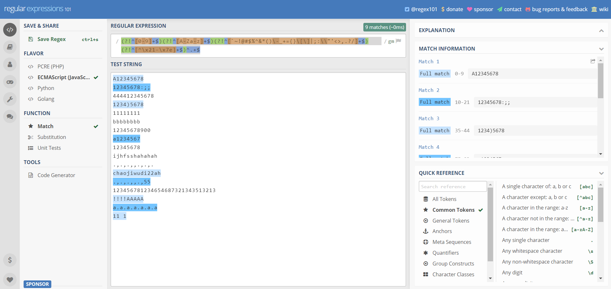

> 参考博客文章：[Github/learn-regex](https://github.com/ziishaned/learn-regex/blob/master/translations/README-cn.md)、[正则表达式测试网站](https://regex101.com/)

## 10.2 复用轮子

**复用轮子：**由于校验一般是由前端执行，正则表达式网站上大量使用。这里需要了解如何查询网页上的正则表达式进行复用。以百度首页为例：

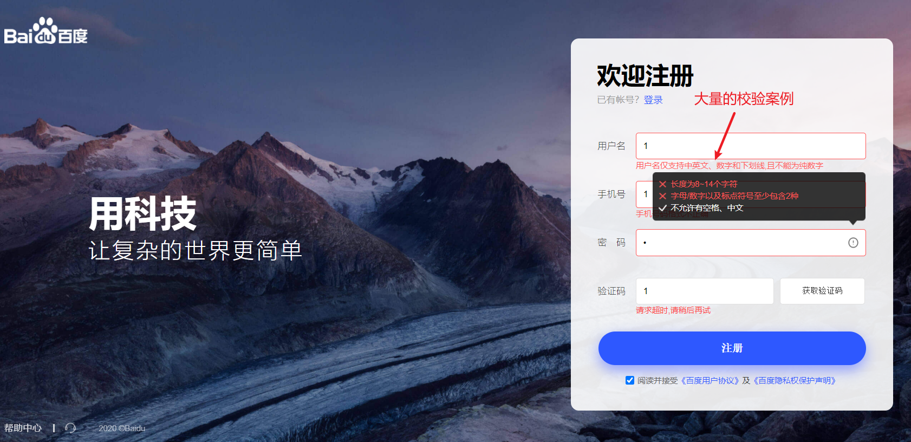

- 第1步：打开断点调式工具，根据DOM元素定位到源代码（使用浏览器可以将代码格式化，我个人习惯下载下来自己格式化）：

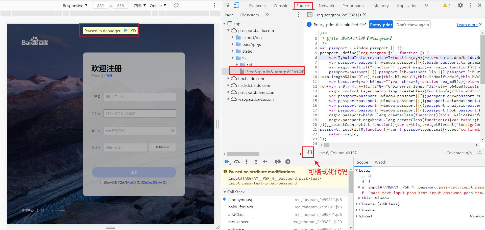

- 第2步：将源代码复制下来在NotePad++里进行格式化：


- 第3步：使用正则表达式进行搜索匹配：

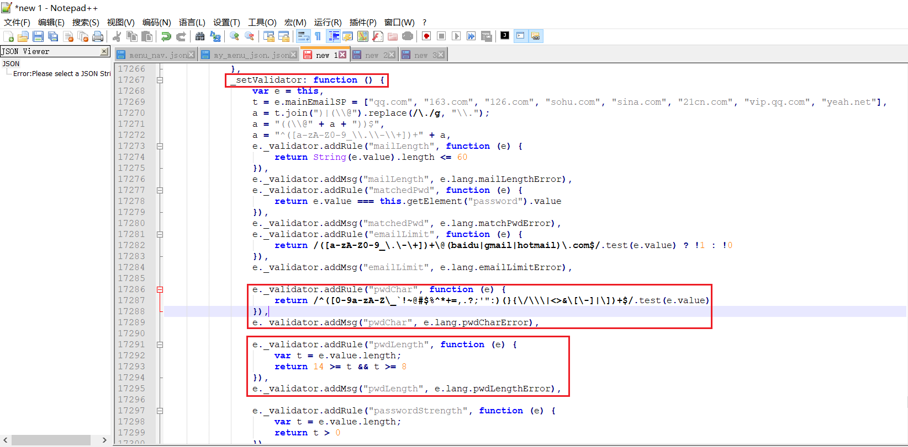

# 8 使用echarts

**echarts：**百度开源的一款图标制作的js插件。类似产品还有hightchart、v-chart（基于vue2.0和echarts封装，含词云、地图）。


# 9 使用vue-countTo

**vue-countTo：**动态化计数过程的一款js插件（借鉴于`countUp.js`）。

- 第1步：安装`vue-count-to`。

```bash
npm install vue-count-to
```

- 第2步：使用例子。

```vue
<template>
  <countTo :startVal='startVal' :endVal='endVal' :duration='3000'></countTo>
</template>

<script>
  import countTo from 'vue-count-to';
  export default {
    components: { countTo },
    data () {
      return {
        startVal: 0,
        endVal: 2017
      }
    }
  }
</script>
```

# 10 使用vue-cookie

本项目涉及到跨域登录问题，采取的解决方案是登录成功后生成一个token缓存到cookie中作为通行证。使用vue-cookie进行cookie的设置。


# 11 使用mavon-editor

## 11.1 引入方式

- 方式一：全局注册。

```vue
// 全局注册
// import with ES6
import Vue from 'vue'
import mavonEditor from 'mavon-editor'
import 'mavon-editor/dist/css/index.css'
// use
Vue.use(mavonEditor)
new Vue({
	'el': '#main',
	data() {
		return { value: '' }
	}
})

// require with Webpack/Node.js
...
var mavonEditor = require('mavon-editor')
import 'mavon-editor/dist/css/index.css'
...

// 使用
<div id="main">
    <mavon-editor v-model="value"/>
</div>
```

- 方式二：单组件引入。

```vue
<template>
	<div id="editor">
		<mavon-editor style="height: 100%"></mavon-editor>
    </div>
</template>
<script>
// Local Registration
import { mavonEditor } from 'mavon-editor'
import 'mavon-editor/dist/css/index.css'
export default {
	name: 'editor',
	components: {
		mavonEditor
		// or 'mavon-editor': mavonEditor
	}
}
</script>
<style>
#editor {
	margin: auto;
	width: 80%;
	height: 580px;
}
</style>
```

## 11.2 events事件绑定

- imgAdd：图片文件添加回调事件。
- imgDel：图片文件删除回调事件。
- change：将markdown文件转换为html。

### 11.2.1 图片上传

mavon-editor绑定imgAdd事件：

```js
// 文章内容图片上传
imgAdd (pos, $file) {
  const formData = new FormData()
  formData.append('file', $file)
  executeImgUpload(formData).then(data => {
    if (data && data.code === 200) {
      this.$message.success('图片上传成功')
      this.$refs.md.$img2Url(pos, data.resource.url)
    }
  })
}
```

### 11.2.2 图片删除

mavon-editor绑定imgDel事件：

```javascript
// 文章内容图片删除
imgDel (pos) {
  console.log(pos[0])
  const formData = new FormData()
  formData.append('url', pos[0])
  executeImgDelete(pos[0]).then(data => {
    if (data && data.code === 200) {
      this.$message.success('图片删除成功')
    }
  })
},
```

### 11.2.3 markdown转换为Html

mavon-editor绑定change事件：

```javascript
// markdown转换为html
markdownToHtml (content, render) {
  this.article.contentFormat = marked(content, { breaks: true })
}
```

## 11.3 本地/CDN加载样式

- 第1步：安装copy-webpack-plugin插件。

```bash
npm install copy-webpack-plugin -D
```

- 第2步：配置vue.config.js。

```javascript
const CopyWebpackPlugin = require('copy-webpack-plugin')
module.exports = {
  configureWebpack: {
    // 配置mavonEditor的本地高亮样式
    plugins: [
      new CopyWebpackPlugin({
        patterns: [{
          from: 'node_modules/mavon-editor/dist/highlightjs',
          to: path.resolve(__dirname, './dist/highlightjs') // 插件将会把文件导出于/dist/highlightjs之下
        }, {
          from: 'node_modules/mavon-editor/dist/markdown',
          to: path.resolve(__dirname, './dist/markdown') // 插件将会把文件导出于/dist/markdown之下
        }, {
          from: 'node_modules/mavon-editor/dist/katex',
          to: path.resolve(__dirname, './dist/katex') // 插件将会把文件导出/dist/katex之下
        }]
      })
    ]
  }
}
```

- 第3步：组件里配置mavon-editor。

```vue
<!--subfield:是否双栏；code_style：markdown样式；ishljs：是否开启代码高亮；-->
<template>
  <div id="app">
      <mavon-editor
      :subfield = "subfield"
      :code_style="code_style"
      :ishljs="true"
      :externalLink="externalLink"
      ></mavon-editor>
  </div>
</template>
<!--采用本地加载-->
<script>
export default {
    data () {
      return {
        subfield: true,
        code_style: 'solarized-dark',
        externalLink: {
            markdown_css: function() {
                return '/markdown/github-markdown.min.css'; // 这是你的markdown css文件路径
            },
            hljs_js: function() {
                return '/highlightjs/highlight.min.js'; // 这是你的hljs文件路径
            },
            hljs_css: function(css) {
                return '/highlightjs/styles/' + css + '.min.css'; // 这是你的代码高亮配色文件路径
            },
            hljs_lang: function(lang) {
                return '/highlightjs/languages/' + lang + '.min.js'; // 这是你的代码高亮语言解析路径
            },
            katex_css: function() {
                return '/katex/katex.min.css'; // 这是你的katex配色方案路径路径
            },
            katex_js: function() {
                return '/katex/katex.min.js'; // 这是你的katex.js路径
            }
        }
      }
    }
}
</script>
<!--采用cdnjs外链-->
<script>
export default {
    data () {
      return {
        subfield: true,
        code_style: 'solarized-dark',
        externalLink: {
            hljs_css: function () {
          		return '/highlightjs/styles/ir-black.min.css' // 这是你的代码高亮配色文件路径
        	},
            // false表示禁用自动加载，它也可以是个函数，如果它是个函数，那么这个函数应该返回一个可访问的katex的css路径字符串
        	katex_css: false
        	// 没有设置katex_js, hljs_js, hljs_lang, markdown_css, mavon-editor会认为它的值为true，它会默认使用cdnjs相关外链加载
        }
      }
    }
}
</script>
```

## 11.4 代码高亮样式的选择

代码高亮样式可以在[highlight官网](https://highlightjs.org/static/demo/)进行比对选择：

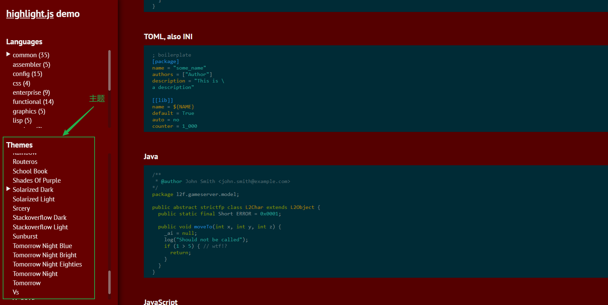

> 参考博客文章：[mavonEditor官网](https://github.com/hinesboy/mavonEditor)、[highlight官网](https://highlightjs.org/static/demo/)

# 12 使用js-xss阻止攻击

js-xss是一个阻止XSS攻击的插件。这里拟采用js-xss对前端提交的表单进行过滤操作。


> 参考博客文章：[js-xss](https://github.com/leizongmin/js-xss)


